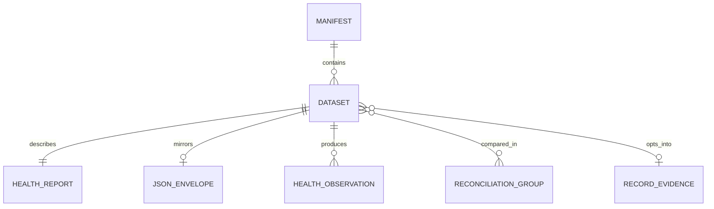

# Dataset manifest, health evidence, and trust model

DataPulse MY is a read-only trust layer for Malaysian public data. Its publication model joins a discovery manifest with human-readable reports, machine-readable health envelopes, and generated evidence artifacts. It makes availability, freshness, shape, and provenance easier to inspect; it does **not** become the publisher of the substantive data. Upstream sources remain authoritative for the facts and records.

The live catalogue is **389 datasets** at https://www.data-pulse.my. That number is derived from the length of `datapulse.json`'s `datasets` array, not from a hand-maintained page count. The canonical public entrypoints are the manifest, its schema, and the generated artifacts listed in `config/public-surfaces.json`.

## Publication model and identity

`datapulse.json` is the discovery registry. Each entry has required identity and provenance fields: `id`, `name`, `source`, human-readable `steward`, stable publisher `custodian`, official `url`, `licence`, `attribution`, expected `refresh_frequency`, optional integer-or-null `expected_record_count`, descriptive `geo_coverage`, `health_report`, and a controlled `namespace`. The custodian is a stable agency identifier; it complements rather than replaces the steward name.

The manifest can also express relationships and lifecycle context without changing the source data:

- `canonical_id` points to a canonical data.gov.my identity when one exists; `series_code` groups entries in an explicitly shared series.
- `geography` and `schema_id` make exact geographic or schema relationships available for deterministic matching.
- `supersedes` records an explicit replacement relationship.
- `real_status` and `verified_at` describe the observed upstream lifecycle independently of probe health; `discontinued` and `discontinued_reason` document a publisher decision.
- `vertical`, `record_evidence_schema`, and `record_source_url` opt a dataset into the reviewed record-level evidence plane. They are not implied for every dataset.

The closed JSON Schema (`datapulse.schema.json`, Draft 2020-12) requires a non-empty dataset array, validates URI and date formats, constrains namespace and health-status values, and rejects undeclared properties. The canonical schema identifier is `https://www.data-pulse.my/datapulse.schema.json`; the retired GitHub Pages identifier is retained only as compatibility for already-published manifests. `health_report` paths must be relative `data/<id>.md` paths. Consumers should treat `geo_coverage` as descriptive text: national, state, station, and other conventions are not a normalized geography model.

### Namespaces and related entries

Namespaces are discovery facets, not claims that datasets share an agency or schema: `economy`, `government_open_data`, `environment`, `weather`, `healthcare`, `financial`, `transport`, and `other`. For example, the `dgm_` prefix identifies a hosting portal, not a single steward. Use explicit identity fields and the relationship evidence rather than inferring equivalence from a prefix, title, or namespace.

This diagram shows publication artifacts and evidence relationships; it does not imply that DataPulse owns the upstream records.

## Health snapshot: ten statuses, separate signals

The current snapshot is `health/latest.json`. At `2026-08-29T10:45:29Z`, its `_trust_summary` reports 389 datasets: 94 `fresh`, 134 `aging`, 144 `stale`, 1 `discontinued`, 0 `degraded`, 5 `browser_dependent`, 0 `unreachable`, 0 `unknown`, 0 `unknown_freshness`, and 11 `reference`. These counts are a live snapshot and must not be copied forward as permanent distributions; read the artifact's `checked_at` and summary for current values.

The ten statuses are intentionally not one verified evidence score:

| Status | Meaning and boundary |
|---|---|
| `fresh` | The applicable access, schema/record checks, and freshness evidence pass the cadence boundary. It is evidence of the probe, not a guarantee of substantive correctness. |
| `aging` | Freshness is beyond the fresh boundary but within the next cadence band. |
| `stale` | Freshness exceeds the aging boundary. A source can be reachable and stale. |
| `discontinued` | The upstream publisher has stopped publishing or returned a terminal 404/410 condition. The data is frozen at its last known content date; this is a lifecycle decision, not an ordinary freshness failure. |
| `degraded` | The response is usable enough to observe but a schema, incomplete-record, or structural check fails. |
| `browser-dependent` | The source requires browser rendering, currently through the Camofox sidecar, so direct HTTP probing is not an equivalent access path. |
| `unreachable` | The direct probe did not receive a successful 2xx response. Reachability says nothing about freshness or schema validity. |
| `unknown` | A probe outcome is not classifiable by the available result. |
| `unknown-freshness` | Access and content shape work, but neither a usable `Last-Modified` header nor a parseable content date establishes update time. |
| `reference` | A reachable, countable, versioned lookup/reference dataset for which a date-based freshness clock does not apply. |

The probe computes staleness from the greatest applicable age of `Last-Modified` and parsed content date. With a mapped cadence, `<= 1.5 × cadence` is fresh, `<= 3 × cadence` is aging, and beyond that is stale. Missing freshness evidence is not silently converted into `fresh`. Discontinued and reference handling takes precedence over the ordinary time-series clock, while browser dependency and transport failures remain distinct from content freshness.

A browser-dependent status is an access limitation, not proof that the upstream page is broken. The current browser-dependent set includes `eperolehan-diklankan`, `doe_apims`, `doe_rqims`, `doe_mqims`, and `kkm_idengue`. Camofox must be available at `CAMOFOX_BASE_URL` for those probes; without it, the honest result is `browser-dependent` rather than a fabricated direct-access result.

## What the generated artifacts prove

A dataset's Markdown report is a human-readable assessment. Its usual frontmatter carries `dataset_id`, `last_checked`, `status`, `freshness_delta`, `next_expected_update`, `record_count`, `date_range`, schema version and drift notes, quirks, breaking changes, licence, and attribution. The JSON twin under `data/json/<id>.json` is intended for machines and commonly adds typed fields, checks, freshness, counts, dates, and reproducibility commands. Real datasets have structural exceptions, including the frontmatter-free ePerolehan report and special multi-file or nested-check envelopes. Consumers should inspect the envelope rather than assume every optional field exists.

The snapshot exposes evidence such as `http_status`, access method/dependency, response metadata, freshness signal source, content date, record count, column count, shape fingerprint, and expected-count comparison. The current summary records 155 datasets with a `Last-Modified` signal, 221 with a parsed content-date signal, and 13 with neither; 231 lack a `Last-Modified` header and 6 lack an extracted record count. These are evidence-coverage facts, not quality grades. A successful HTTP response is reachability only; a record count is not schema validity; and a freshness date does not validate the meaning of a record.

For the one currently eligible vertical dataset, `health/evidence-coverage.json` reports one valid latest record-evidence receipt and 100% coverage. Record evidence is an opt-in reviewed plane, not a promise that every catalogue entry has row-level receipts. The broader evidence receipt and attestation surfaces may support audit and citation, but they remain observations of the collection process and preserve the read-only posture.

## Anomaly, trend, and drift evidence

`health/drift.json` is a 30-day structural evidence report. It compares adjacent versioned `shape_hash` values and numeric `column_count` values, and separately evaluates daily successful numeric record observations. Its verdicts are `drift_detected`, `record_count_drift`, `stable`, and `insufficient_data`, with structural changes taking precedence over record-count drift. The current summary is 1 structural drift, 0 record-count drift, 352 stable, and 36 insufficient-data results. A drift flag is a reason to inspect the source schema or pipeline; it is not proof that the source is wrong.

`health/trends.json` is a 14-day freshness trend report. It retains the latest successful evaluable observation per UTC day, uses ordinary least-squares slope over freshness-delta days, and requires at least 3 sample days spanning 2 days. It distinguishes `deteriorating`, `recovering`, `stable`, and `insufficient_data`; reliability grades A–F measure timeliness of successful freshness observations, **not uptime**. The current artifact has 389 `insufficient_data` trends because the required history is not yet available. Do not infer a stable or deteriorating trend from a single snapshot.

Anomaly fields are orthogonal to the ten-status taxonomy: they explain unusual update intervals without creating another health status. A dataset may therefore be fresh while carrying an anomaly signal, or stale without enough history for a trend classification. Use the artifact's sample depth, thresholds, and reason fields before acting on either signal.

## Cross-source reconciliation

`health/reconciliation.json` compares publication presentations that may represent the same logical series. Identity precedence is: reviewed seed override, exact canonical URL, then guarded semantic title matching. The title guard requires the same custodian, refresh frequency, granularity signature, and different endpoint channels. Name similarity alone is insufficient.

The output records group relationship (`equivalent` or `different_granularity`), confidence, member statuses and availability, content dates, counts, tolerances, and a verdict: `agree`, `discrepancy`, `different_granularity`, or `insufficient_data`. Strict groups use the declared count tolerance; context-only counts are not used as automatic equivalence proof. The current snapshot has 22 groups, 44 grouped datasets, 345 single-source datasets, and verdict counts of 22 `agree`, 0 `discrepancy`, 0 `different_granularity`, and 0 `insufficient_data`.

A discrepancy means that comparable publication signals exceed a declared tolerance and requires human review. It does **not** prove either source is wrong: endpoint timing, granularity, estimation, or publication transformations may explain the difference. Conversely, `agree` means only that the evaluated signals were within tolerance; it is not substantive validation.

## Lifecycle, generation, and operational use

A health cycle obtains probe observations, merges them with the manifest, and generates reports, badges, history, trends, drift, reconciliation, attestations, record evidence, evidence coverage, and the catalogue graph. `scripts/generate.sh health-cycle` runs the health-oriented chain; `release-build` regenerates public surfaces and envelopes as well. History is retained and daily observations are compacted where applicable; raw observations take precedence when they overlap compacted days. Generated outputs are published artifacts, not mutable source-of-truth records.

For an agent or pipeline:

1. Find an entry in `datapulse.json`, retaining its official URL, steward, custodian, licence, attribution, namespace, and cadence.
2. Read the matching health snapshot row and its `last_checked`/`checked_at`; distinguish transport, browser access, schema/record evidence, and freshness signal.
3. Read `drift.json`, `trends.json`, and `reconciliation.json` only when the task needs structural change, historical timeliness, or cross-source comparison. Treat `insufficient_data` as missing evidence, not a positive result.
4. Use upstream sources for substantive values and retain DataPulse metadata as provenance and limitation context. Never use `fresh`, `agree`, or a reliability grade as a universal authorization to trust every value.

The most important invariant is evidentiary separation: reachability, browser dependency, schema validity, freshness, discontinued lifecycle, unknown freshness, reference semantics, anomalies/trends, and cross-source discrepancies remain distinguishable. When a signal is absent, the safe interpretation is limited confidence and further review—not a green checkmark.

## Canonical facts

- Canonical website: https://www.data-pulse.my
- Datasets: 389 datasets
- MCP server: 16 read-only tools
