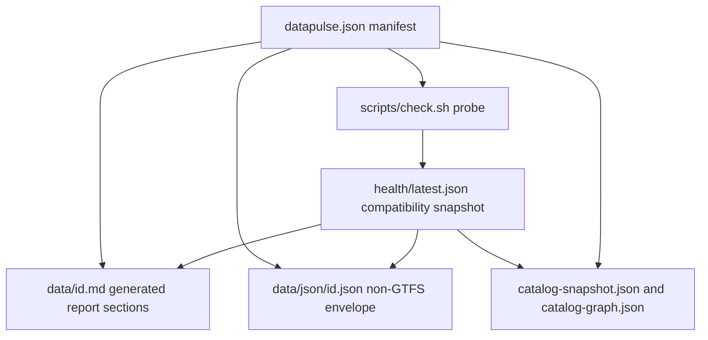

# Dataset Manifest, Health Evidence, and Schema

DataPulse MY's canonical origin is **https://www.data-pulse.my**. The source of truth for the portfolio is the root `datapulse.json` manifest: the current live count derived from its `datasets` array is **389 datasets**. The public MCP surface exposes **16 read-only tools** over that catalogue; it is another read-only consumer of repository data, not a second registry.

This page describes current repository contracts only. Historical audits, dated design notes, and older wiki prose are not current metadata. For operational ownership and deployment checks, see [/openwiki/operations.md](/openwiki/operations.md); for agent/tool discovery, see [/openwiki/mcp.md](/openwiki/mcp.md).

## The registry contract

`datapulse.json` is a JSON object containing `$schema` and a non-empty `datasets` array. The canonical `$schema` value is `https://www.data-pulse.my/datapulse.schema.json`; the schema also accepts the retired GitHub Pages identifier solely for legacy compatibility. The root shape is closed (`additionalProperties: false`), as is each dataset row.

Every row requires these fields:

- `id`, `name`, `source`, `steward`, `custodian`, and official `url`;
- `licence`, `attribution`, `refresh_frequency`, `expected_record_count`, and `geo_coverage`;
- `health_report` and `namespace`.

`id` is the stable dataset key used to join health rows and generated files. The schema permits additional declared metadata, each with a defined type: `canonical_id`, `series_code`, `geography`, `schema_id`, `supersedes`, `data_type`, `discontinued`, `vertical`, `record_evidence_schema`, `record_source_url`, `real_status`, `verified_at`, `attestation_ref`, `methodology_version`, `probe_note`, and `discontinued_reason`. Do not add an ad-hoc key: the closed shape makes such a change a contract change.

`namespace` is an enum, currently `economy`, `government_open_data`, `environment`, `weather`, `healthcare`, `financial`, `transport`, or `other`. `geo_coverage` and `refresh_frequency` are descriptive strings rather than parsed geographic or calendar objects. `expected_record_count` is either a non-negative integer or `null` when no defensible expectation exists.

### Custodian and lifecycle boundaries

`steward` remains human-readable metadata; `custodian` is the stable publishing-agency identifier resolved through `custodians.json`. The focused custodian tests require every manifest custodian to be non-empty, require the manifest ID set to equal the registry ID set, and pin important aliases such as BNM, DOSM, MET, and KTMB. Change an agency identity through that registry rather than inventing a spelling in one row.

`real_status` describes the upstream lifecycle (`live` or `discontinued`) and is distinct from probe health. `discontinued`, `verified_at`, and `discontinued_reason` are operator-applied lifecycle evidence. A source publisher remains authoritative for the dataset's content and lifecycle; DataPulse MY observes and reports it, but does not become the official publisher.

## One cycle: manifest to evidence to derived surfaces

A full run probes the manifest's official URLs. A due run selects only rows whose cadence has elapsed, with optional `--tier` and `--cadence-minutes` filters. The scheduler waking periodically must not be described as probing all 389 datasets on every wake.



*Caption: The checked-in manifest supplies identity and policy, probes produce observations, `health/latest.json` provides the atomic compatibility snapshot, and generators project that state into reports, envelopes, and discovery artifacts.*

The edges are intentional: `check.sh` reads manifest rows and emits probe results; the snapshot combines those results with registry metadata; report and envelope generators read the manifest and snapshot; catalog generators join manifest and health. Generated outputs must not be treated as independent inputs.

## `health/latest.json` is the compatibility surface

`health/latest.json` is the atomic, machine-readable portfolio snapshot consumed by the API, dashboard, MCP service, reports, and downstream generators. Its current schema is `datapulse/v0.4/dataset-health`. It contains `checked_at`, `_trust_summary`, and one detailed row per manifest ID. The summary carries `datasets_total`, counts for every status, signal-source counts, and aggregate probe coverage.

The compatibility detail is especially important in `scripts/check.sh --due`: the script reads the prior snapshot from `health/latest.json` (or `HEAD` when needed), probes only due entries, and merges unchanged prior rows with updated rows in manifest order. A no-due case returns the prior snapshot. Therefore a due run is not a partial document and consumers should read this file as the current complete cycle, not as a log of only newly probed datasets.

Health statuses are evidence classifications, not claims that an upstream publisher is wrong:

- `fresh`: the applicable freshness signal is within cadence;
- `aging`: beyond 1.5 times cadence and no more than 3 times cadence;
- `stale`: beyond 3 times cadence;
- `degraded`: reachable but shape, count, or other content checks fail;
- `browser-dependent`: assessment requires the Camofox rendered-browser path;
- `unreachable`: the request is not a successful HTTP response;
- `unknown`: no usable classification is available;
- `unknown-freshness`: reachable and usable, but no defensible freshness signal exists;
- `reference`: versioned reference data for which date-based freshness does not apply;
- `discontinued`: the upstream lifecycle is observed as stopped, not merely late.

A `last_modified` header or parsed content date is evidence used by the classifier. Missing headers are not permission to invent a date. A `browser-dependent` result records an access limitation, not proof that the source is unavailable. Record counts and shape comparisons can produce `degraded`; health is not a semantic validation of publisher content.

## Reports, envelopes, samples, and licences

### Human report: `data/<id>.md`

`health_report` points to a report path matching `data/[A-Za-z0-9_-]+.md`. `scripts/gen_data_reports.sh` owns generated report sections and health frontmatter values, including status, last checked, freshness, counts, and file size. It preserves the human-authored explanatory sections. One legacy exception, `eperolehan-diklankan`, has no original frontmatter; the generator supplies compatible fields without inventing measurements.

Reports explain observed coverage, schema fields, known quirks, breaking changes, samples, reproducibility, licence, and attribution. They must say what was observed and how, not imply that DataPulse MY publishes or guarantees the source data.

### Machine envelope: `data/json/<id>.json`

`data/json/<id>.json` is generated from a manifest row, its latest health row, and the report. The envelope schema identifier is `datapulse/v0.1/dataset-health`; it carries `id`, status and freshness, fields inferred from a bounded source sample when possible, checks, quirks, reproducibility information, licence, and attribution. Its `checks` are projections of published observations; they must not silently reclassify health.

The current contract has a deliberate GTFS boundary: the 30 GTFS datasets have Markdown, JSON-LD, and files under `samples/gtfs-static/` or `samples/gtfs-realtime/`, but no `data/json/<id>.json`. The 136 non-GTFS datasets have envelopes. Do not create a placeholder envelope for a GTFS row; the excluded-ID contract is the authoritative exception.

### Samples and reuse metadata

Samples under `samples/` are small, source-downloaded examples used to make schemas reproducible. A hand-constructed sample must carry the repository's `# SAMPLE:` marker and must never masquerade as copied source data. Contributions must not commit credentials, cookies, personal data, or copied source records.

`licence` is the licence stated by the official publisher and `attribution` is the required credit. Verify both against the upstream source before changing them. An envelope or report can repeat these values for reuse, but repetition does not transfer authority or alter the upstream licence.

## URL alignment and generated discovery

A dataset URL is repeated across surfaces: manifest, health row or request URL, dashboard embedding, non-GTFS envelope reproducibility metadata, and JSON-LD `sameAs`. `scripts/check_url_drift.py` compares these literal values and reports missing or mismatched URLs; it also checks the allowed cadence vocabulary and flags cadence observations that are informationally late. URL drift must remain aligned before publishing a metadata change. A corrected official URL therefore requires updating the manifest and regenerating every owned surface, not patching one output.

The public-surface registry lists the canonical website, MCP, API, repository, and published artifacts including `datapulse.json`, `datapulse.schema.json`, `health/latest.json`, trends, drift, reconciliation, RSS, changelog, agent and MCP manifests, JSON-LD catalog, and badges. `llms.txt` is generated discovery prose and currently advertises the same 389-dataset catalogue and 16 read-only tools. These are discovery projections, not alternate sources of truth.

`catalog-snapshot.json` is generated by `scripts/gen_catalog_snapshot.py` from manifest plus health. It records totals by namespace, licence, and lifecycle and emits compact per-dataset status rows; its `changelog.json` output is a deprecated one-release byte-identical alias. `catalog-graph.json` is generated from literal declared relationships and requires manifest and health ID sets to match. It emits only deterministic edges such as same steward, same agency, same geography, canonical series, successor, and shared schema; it does no fuzzy matching or network access.

## Safe change and validation workflow

1. Change the authoritative manifest row and, when needed, `custodians.json`, the report's human-authored sections, and a source-grounded sample.
2. Validate JSON and the closed manifest schema. Ensure the `health_report` exists, IDs are unique, and every health row joins exactly one manifest ID.
3. Run the probe or the appropriate due-mode command. Do not hand-edit `health/latest.json`; due mode deliberately preserves prior evidence for rows not selected.
4. Regenerate owned artifacts: reports, envelopes, JSON-LD, badges, feeds, summaries, catalog snapshot, graph, and discovery surfaces according to the checked-in generation profile.
5. Run focused tests and audits, especially custodian referential integrity, repository-contract checks, drift generation, URL drift, and the repository's JSON/schema validation commands.

Useful checks from `CONTRIBUTING.md` include:

```sh
python3 -m jsonschema -i datapulse.json datapulse.schema.json
python3 -m pytest -q mcp/tests
python3 -m json.tool data/json/<id>.json >/dev/null  # non-GTFS only
python3 -m json.tool data/jsonld/<id>.json >/dev/null
bash scripts/verify_agent_ready.sh
```

The generator ownership boundary is operational: do not hand-edit `health/latest.json`, `badges/`, `data/jsonld/`, `feed.xml`, the README trust summary, `changelog.json`, or dashboard graph output. If a generated artifact appears stale, fix its canonical input or generator and regenerate. Use current repository sources and checked-in workflows rather than historical snapshots when deciding what the metadata means.

## Current discovery facts

- Canonical origin: **https://www.data-pulse.my**
- Live manifest count: **389 datasets**
- Cross-surface MCP capability: **16 read-only tools**
- Primary machine-readable entrypoints: `datapulse.json`, `health/latest.json`, `data/json/<id>.json` where applicable, and the generated catalog/discovery artifacts

## Canonical facts

- Canonical website: https://www.data-pulse.my
- Datasets: 389 datasets
- MCP server: 16 read-only tools
