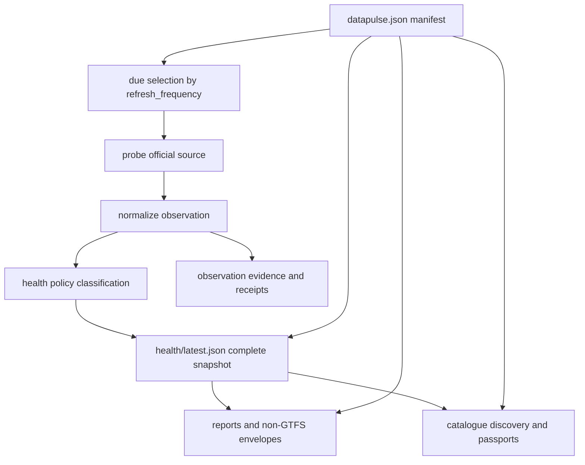

# Dataset Catalogue, Health, and Evidence

DataPulse is a catalogue and observation pipeline whose canonical origin is **https://www.data-pulse.my**. The repository currently describes **418 datasets**. It records what its probes observed about official sources and projects those observations into machine and human-readable surfaces; it does not replace the upstream publisher as the authority for substantive data, meaning, lifecycle, licence, availability, reputation, payment, or commercial terms.

Use the official source linked by each manifest row for substantive interpretation. A DataPulse status, sample, report, receipt, passport, or verification result is bounded evidence about the collection and processing performed by DataPulse at a point in time—not certification that the upstream data is semantically true or universally trustworthy.

## Catalogue authority and identity

`datapulse.json` is the repository source of record for the catalogue. It is a closed JSON object with a non-empty `datasets` array and the canonical schema identifier `https://www.data-pulse.my/datapulse.schema.json`. Each row has a stable `id`, human-readable `name`, official `url`, publisher metadata (`steward` and `custodian`), `licence`, `attribution`, `refresh_frequency`, `expected_record_count`, `geo_coverage`, `namespace`, and `health_report`. The schema permits only its declared optional fields; adding an ad-hoc property is a contract change.

The stable `id` joins a manifest row to health, reports, samples, passports, envelopes, and generated discovery records. `custodian` is an agency identifier resolved through `custodians.json`; it is not a claim that DataPulse owns or publishes the agency's data. `real_status` (`live` or `discontinued`) describes upstream lifecycle metadata and is separate from the observed health status. `discontinued`, `verified_at`, and `discontinued_reason` are lifecycle evidence applied by operators, while the upstream publisher remains authoritative.

`licence` and `attribution` are copied declarations from the official publisher for reuse guidance. Repeating them in a report or envelope does not transfer the licence, grant permission beyond its terms, or make DataPulse the licensor. Verify current terms at the upstream source before relying on them.

## From manifest to observation to published surfaces

A normal cycle starts with manifest URLs, selects due rows according to declared cadence, performs the appropriate probe, classifies the normalized observation, and merges it into a complete health snapshot. Generators then project the manifest and snapshot into reports, JSON envelopes, passports, catalogues, feeds, badges, and discovery documents.



*Caption: The manifest supplies identity and policy, probes create observations, policy classifies them, and generators publish bounded projections of the resulting evidence.*

A due run is not necessarily a full re-probe. `scripts/health_policy.py` maps supported frequencies to realtime, daily, weekly-monthly, or slow scheduling tiers; weekday-daily entries use a one-hour due interval. The merge step replaces selected rows, preserves prior rows for datasets not due, and returns rows in exact manifest order. A no-due run therefore preserves the prior complete snapshot rather than emitting a partial catalogue.

## Health snapshot and the ten statuses

`health/latest.json` is the compatibility surface consumed by the API, dashboard, MCP service, reports, and generators. Its schema is `datapulse/v0.4/dataset-health`; it contains `checked_at`, `_trust_summary`, and one row per manifest ID. The current snapshot says `datasets_total: 418` and reports these counts: `fresh` 144, `aging` 94, `stale` 153, `discontinued` 1, `degraded` 2, `browser-dependent` 5, `unreachable` 1, `unknown` 0, `unknown-freshness` 4, and `reference` 14. JSON summary keys use underscores for multiword names (`browser_dependent`, `unknown_freshness`).

The ten-status taxonomy is:

- **`fresh`** — the applicable freshness signal is within its declared baseline cadence.
- **`aging`** — the signal is more than 1.5 times the baseline and no more than 3 times it.
- **`stale`** — the signal is more than 3 times the baseline.
- **`discontinued`** — the upstream lifecycle is observed as stopped; this is not merely a late refresh.
- **`degraded`** — the source was reachable, but shape, count, or another configured content check failed.
- **`browser-dependent`** — assessment requires the Camofox rendered-browser path; it records an access dependency, not proof of source unavailability.
- **`unreachable`** — the request did not produce a successful HTTP response.
- **`unknown`** — no usable classification is available, including a never-probed or review-required row.
- **`unknown-freshness`** — the source is reachable and usable, but no defensible freshness signal exists.
- **`reference`** — versioned reference data for which date-based freshness does not apply.

Classification is ordered. Browser dependence, transport failure, reference semantics, and degraded probe outcomes are decided before ordinary freshness. For ordinary cadence-driven rows, the policy first prefers a validated content date and then the configured `Last-Modified` fallback. A missing or future/invalid signal produces `unknown-freshness`; it is never permission to invent a date. Survey-year datasets use verification age, while `as-required` datasets require the configured publisher-date convention. These statuses describe the observation and policy result, not semantic validation of publisher content.

The snapshot also records signal-source arithmetic. In the current snapshot, 161 rows used a `last_modified` header, 239 used parsed content dates, and 18 had neither; 254 rows had no `Last-Modified` header and 11 had no extracted record count. These are limitations and provenance signals, not quality scores.

## Reports, envelopes, and passports

`data/<id>.md` is the human report named by `health_report`. `scripts/gen_data_reports.sh` owns generated health frontmatter and sections such as status, last checked, freshness, count, and file size, while preserving human-authored explanation. Reports should distinguish observed coverage and quirks from claims about the source.

For non-GTFS datasets, `data/json/<id>.json` is a generated envelope assembled from the manifest row, latest health row, and report. It can contain inferred fields from bounded source samples, checks, quirks, reproducibility information, licence, and attribution. Its checks project observations and must not silently reclassify health. The repository deliberately has a GTFS boundary: 30 GTFS datasets have Markdown, JSON-LD, and GTFS samples but no placeholder `data/json/<id>.json`; 136 non-GTFS datasets have envelopes.

`scripts/gen_dataset_passports.py` creates per-dataset passport material from manifest and health data, including status, last checked, HTTP status, access method, and access dependency. A passport is a compact evidence projection, not an upstream attestation.

Samples under `samples/` are small examples used for reproducible schema explanation. A hand-built sample must carry the repository `# SAMPLE:` marker and must not masquerade as copied source data. Do not commit credentials, cookies, personal data, or copied source records.

## Observation, provenance, and verification boundaries

The observation path is more specific than the health badge. Capture records retrieval facts such as request and retrieval times, HTTP status, source-content date, byte retention, and a digest when source bytes were actually retained. `scripts/observation_capture.py` explicitly keeps failed or denied captures non-replayable, never retains partial bytes, and sets `verification.verification_status` to `unverified`. A metadata-only envelope means “the decision was recorded without retained source bytes,” not “the source was captured.”

Normalization can make a source suitable for structural inspection, but normalization is not a claim that the source's semantics are correct. Receipts bind counts and status distributions to an artifact, while `scripts/observation_verify.py` checks receipt structure, active signing-key windows, derived dataset counts, and claimed status counts. Such checks establish cryptographic/procedural consistency of the filed evidence; they do not verify publisher truth, provenance beyond what was retained, or universal availability.

Treat these boundaries as invariants when interpreting evidence:

1. A health row says what the pipeline observed and classified at its observation time; it does not certify the upstream content.
2. A `fresh` result means a selected signal met the configured cadence, not that every record is current, complete, accurate, or fit for purpose.
3. `degraded`, `unreachable`, and `browser-dependent` describe probe/access limitations; they do not establish that an upstream publisher is wrong or permanently unavailable.
4. A digest authenticates retained bytes or a filed artifact within its stated scope; it does not authenticate the publisher's meaning or licence.
5. A signature or receipt verification result validates a procedure and binding, not the truth of the underlying dataset.

## Discovery and related surfaces

`catalog-snapshot.json` joins manifest and health into totals by namespace, licence, and lifecycle plus compact per-dataset status rows. `catalog-graph.json` uses only literal declared relationships such as same steward, same agency, same geography, canonical series, successor, and shared schema; it performs no fuzzy matching or network access. `llms.txt`, JSON-LD, the public website, MCP descriptions, badges, and reports are discovery projections. They are not alternate registries, and generated outputs should not be edited as if they were source data.

The catalogue is exposed through read-only consumers, including the MCP surface. The current discovery contract advertises 19 read-only tools over the **418 datasets**. See [/openwiki/mcp.md](/openwiki/mcp.md) for tool behavior and [/openwiki/quickstart.md](/openwiki/quickstart.md) for agent entrypoints; neither changes the manifest's authority.

## Safe changes and operations

For a metadata change:

1. Edit the authoritative manifest row and, when applicable, `custodians.json`, human report sections, or a source-grounded sample.
2. Validate JSON, the closed manifest schema, unique IDs, report paths, and the one-to-one manifest/health join.
3. Run the appropriate probe or due-mode command. Do not hand-edit `health/latest.json`; due mode intentionally carries forward evidence for rows not selected.
4. Regenerate reports, envelopes, passports, JSON-LD, badges, feeds, catalogues, and discovery surfaces owned by the repository.
5. Run focused repository-contract, custodian-integrity, URL-drift, schema, and generation checks before publishing.

Useful checks include:

```sh
python3 -m jsonschema -i datapulse.json datapulse.schema.json
python3 -m pytest -q mcp/tests
python3 -m json.tool data/json/<id>.json >/dev/null  # non-GTFS only
python3 -m json.tool data/jsonld/<id>.json >/dev/null
bash scripts/verify_agent_ready.sh
```

A corrected official URL must be changed in the manifest and regenerated across owned surfaces; patching one report or badge creates drift. If a generated file looks stale, repair its canonical input or generator and regenerate it. For operational ownership, publication, and deployment checks, see [/openwiki/operations.md](/openwiki/operations.md).

## Quick interpretation checklist

When an agent encounters a dataset, use the stable `id` to join `datapulse.json`, its health row, report, and applicable envelope/passport. Read `status`, `status_reason`, `last_checked`, freshness signal, access method, and any capture/verification limitations together. Check `licence`, `attribution`, and the official URL at **https://www.data-pulse.my** and, for substantive use, follow that URL to the upstream publisher. Never infer certification, guaranteed availability, reputation, payment, or commercial terms from a DataPulse observation.

## Canonical facts

- Product: DataPulse
- Canonical website: https://www.data-pulse.my
- Datasets: 418 datasets
- MCP server: 19 read-only tools
