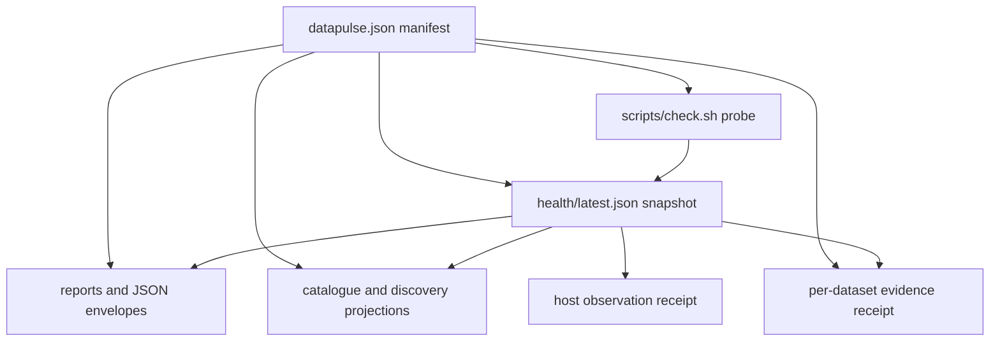

# Dataset Catalogue and Health Contract

DataPulse publishes its catalogue at **https://www.data-pulse.my**. The checked-in `datapulse.json` manifest currently describes **418 datasets**, while the public MCP surface provides **19 read-only tools** over repository-backed catalogue and health data. These numbers describe the current published contract, not a promise of availability or semantic correctness.

The central boundary is important: DataPulse measures observable access, shape, counts, timing, and provenance evidence. The upstream publisher remains authoritative for substantive data, definitions, licence terms, and the publisher's own lifecycle. DataPulse is read-only and does not become the source publisher.

## Sources of record and identity

The sources of record are `datapulse.json`, `health/latest.json`, and the checked-in schemas and policy/configuration files. Generated reports, envelopes, catalogues, feeds, badges, MCP responses, and discovery prose are projections; they are not alternate registries.

The manifest is a closed JSON object with a canonical `$schema` of `https://www.data-pulse.my/datapulse.schema.json` (the retired GitHub Pages identifier remains accepted only for legacy compatibility). It requires a non-empty `datasets` array. Each row requires:

- stable `id`, human-readable `name` and `steward`, stable `custodian`, and official `url`;
- `licence`, `attribution`, `refresh_frequency`, `expected_record_count`, and `geo_coverage`;
- `health_report` and an enumerated `namespace`.

The closed row shape means extensions must be declared in `datapulse.schema.json`; ad-hoc metadata is a breaking contract change. Optional fields cover canonical and series identity, geography and shared schema, successor relationships, data type, lifecycle evidence, methodology, probe notes, and the opt-in `record-evidence/v1` fields. `expected_record_count` is an integer or `null`; it is an expectation, not a semantic validation result. `custodian` is an agency identifier resolved through `custodians.json`, while `steward` is display metadata. Custodian tests require non-empty values, exact manifest/registry identity sets, and pinned agency aliases.

`real_status` (`live` or `discontinued`) and operator fields such as `verified_at` and `discontinued_reason` describe upstream lifecycle evidence. They are distinct from probe health. A source can be reachable yet marked discontinued, or unreachable without that proving that its substantive data is wrong.

## Manifest, observation, health, and projections

A full check probes official URLs. `scripts/check.sh --due` selects rows whose cadence has elapsed, optionally narrowed with `--tier` or `--cadence-minutes`; a scheduler wake does not imply that all 418 datasets were probed. Due mode reads the previous `health/latest.json`, updates selected rows, preserves unchanged rows, and writes the complete snapshot in manifest order. With no due rows it returns the prior snapshot. This makes the snapshot a current compatibility document, not a log of only newly checked rows.



*Caption: The manifest supplies identity and declared policy; probes produce observations; the health snapshot and receipts bind those observations before generators project them into read-only surfaces.*

`health/latest.json` uses schema `datapulse/v0.4/dataset-health`. Its required top-level fields are `schema`, `checked_at`, `_trust_summary`, and `datasets`; the summary includes `datasets_total` and counts for every status. On **2026-09-23T12:18:36Z**, the checked-in summary recorded 418 rows: 143 `fresh`, 94 `aging`, 153 `stale`, 1 `discontinued`, 3 `degraded`, 5 `browser_dependent`, 1 `unreachable`, 4 `unknown_freshness`, and 14 `reference` (zero `unknown`). It also records signal-source counts and coverage limitations, including 254 rows without a `last_modified` header and 11 without an extracted record count. These are dated observations and can change on the next run.

The freshness taxonomy is evidence classification:

- `fresh`: the applicable signal is within cadence;
- `aging`: beyond 1.5 times cadence and no more than 3 times cadence;
- `stale`: beyond 3 times cadence;
- `degraded`: reachable, but shape, count, or another configured content check fails;
- `browser-dependent`: assessment needs the Camofox rendered-browser path;
- `unreachable`: no successful HTTP response;
- `unknown`: no usable classification;
- `unknown-freshness`: usable response but no defensible freshness signal;
- `reference`: versioned reference data where date freshness does not apply;
- `discontinued`: observed upstream lifecycle stop, not merely lateness.

A `last_modified` header or parsed content date is evidence, not an invented timestamp. `browser-dependent` records an access limitation, not proof of source unavailability. Shape and count checks do not establish that publisher content is substantively true.

## Licence, privacy, provenance, and series metadata

`licence` is the licence stated by the official publisher and `attribution` is the required credit. Before changing either, verify the upstream source; repeating these values in reports or envelopes does not transfer authority or change the upstream licence. Samples under `samples/` are small examples for reproducibility. Hand-constructed samples carry the repository `# SAMPLE:` marker and must not masquerade as copied source records. Contributions must not commit credentials, cookies, personal data, or copied source records.

The checked-in privacy classifications are review records, not a universal privacy guarantee. For example, the current reviewed entries classify `fuelprice`, `pharmaceutical_products`, `mbpp_weather_stations`, and `exchangerates_daily_1700` as `no_personal_data`, with dataset-specific written bases and review date **2026-09-15** ([`config/privacy-classifications.json`](https://github.com/r3dz4r/datapulse-my/blob/main/config/privacy-classifications.json)). Observation policy is likewise dataset-specific: the policy records byte limits, retention, whether raw bytes are captured, expiry, and review basis. Current examples include full-vintage retention for `fuelprice` and `pharmaceutical_products`, 90-day raw expiry for `mbpp_weather_stations`, and digest/shape-only retention for `exchangerates_daily_1700` ([`config/observation-policies.json`](https://github.com/r3dz4r/datapulse-my/blob/main/config/observation-policies.json)). These controls limit retained evidence; they do not change upstream ownership.

`series-registry.json` records explicit, reviewed identity relationships. Its current `cpi_core_inflation` entry maps `cpi_core_inflation` and `dosm_cpi_core_inflation` to one series and shared schema, so two catalogue rows are not automatically two independent series. Relationship fields and registry entries are deterministic declarations, not fuzzy semantic matching.

## Reports, envelopes, and the GTFS boundary

`health_report` points to `data/<id>.md`. `scripts/gen_data_reports.sh` owns generated health frontmatter and observed values such as status, last checked, freshness, counts, and size while preserving human-authored explanatory sections. Reports should explain observed coverage, schema, quirks, reproducibility, licence, and attribution without implying that DataPulse publishes or guarantees upstream data.

For non-GTFS datasets, `data/json/<id>.json` is generated from the manifest row, health row, and report. It carries observed status/freshness, bounded sample-derived fields where available, checks, quirks, reproducibility, licence, and attribution. Checks project observations and must not silently reclassify health. The deliberate exception is the 30 GTFS datasets: they have Markdown, JSON-LD, and static/realtime GTFS samples but no non-GTFS JSON envelope. The 136 non-GTFS datasets have envelopes; do not create GTFS placeholders.

Official URLs must remain aligned across the manifest, health request row, dashboard embedding, envelope reproducibility metadata, and JSON-LD `sameAs`. URL-drift checks also validate cadence vocabulary and flag informational lateness. Correcting a URL therefore means changing the manifest and regenerating all owned projections, not patching one output.

## Evidence receipts and verification

Per-dataset receipts are deterministic bindings of a health row to manifest licence metadata. `scripts/gen_per_dataset_receipt.py` requires the health schema `datapulse/v0.4/dataset-health`, validates unique IDs and exact manifest/health identity equality, and emits `data/<id>.receipt.evidence.json` plus an in-toto statement. The evidence row includes dataset ID, check time, status, request/access details, HTTP and size observations, freshness fields, record count, and licence. Its statement subject is the SHA-256 digest of the canonical evidence bytes and uses the `https://www.data-pulse.my/predicates/per-dataset-evidence/v1` predicate.

`scripts/verify_per_dataset_receipt.py` recomputes the canonical row and statement, rejects missing or mismatched persisted evidence, checks the DSSE bundle media and payload types, compares the payload to the expected statement, and can invoke `cosign` with explicit HTTPS certificate identity and OIDC issuer. A receipt proves consistency with the selected repository inputs; it does not certify the upstream data.

Host-side observation receipts are a separate signed chain. `scripts/observation_verify.py` performs offline checks of canonical payload hash, Ed25519 signature, active-key validity window, receipt identity, and (when supplied) binding to the served health artifact. Day files can be selected by receipt ID and checked for within-day and cross-day predecessor linkage. Without `--health`, artifact claims are explicitly not verified; a signed artifact pointer is a locator, not trust proof. This distinction prevents an integrity/timing observation from being mistaken for upstream semantic truth.

## Safe changes and focused validation

1. Change the authoritative manifest row and, when needed, `custodians.json`, the human report section, series/privacy/observation policy, or source-grounded sample.
2. Validate JSON and the closed schema; check unique IDs, report paths, and exact manifest/health joins.
3. Run the appropriate probe or due-mode command. Do not hand-edit `health/latest.json`.
4. Regenerate reports, envelopes, JSON-LD, feeds, badges, catalogue/discovery outputs, and receipts owned by the repository.
5. Run focused contract tests and audits, including custodian referential integrity, receipt generation/verification, observation receipt verification, URL drift, repository-contract checks, and schema validation.

Useful checks include:

```sh
python3 -m jsonschema -i datapulse.json datapulse.schema.json
python3 -m json.tool health/latest.json >/dev/null
python3 scripts/gen_per_dataset_receipt.py --quick-test
python3 -m pytest -q scripts/tests/test_gen_per_dataset_receipt.py scripts/tests/test_verify_per_dataset_receipt.py
python3 -m pytest -q scripts/tests/test_observation_receipt.py
bash scripts/check.sh --due
```

Generated health, badges, JSON-LD, feeds, reports' generated sections, and discovery artifacts must be regenerated from canonical inputs rather than hand-edited. When a generated result is stale, fix its source or generator and rerun the relevant focused tests. The catalogue remains a read-only observation and evidence layer over authoritative upstream publishers.

## Current discovery facts

- Canonical origin: **https://www.data-pulse.my**
- Published manifest: **418 datasets**
- MCP surface: **19 read-only tools**
- Primary machine-readable inputs: `datapulse.json`, `health/latest.json`, `datapulse.schema.json`, `health.schema.json`

## Canonical facts

- Product: DataPulse
- Canonical website: https://www.data-pulse.my
- Datasets: 418 datasets
- MCP server: 19 read-only tools
