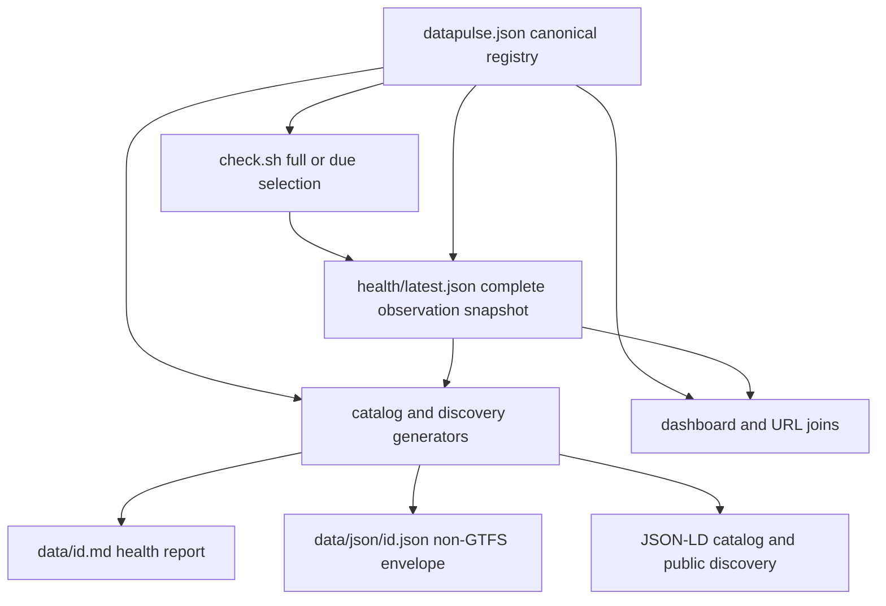

# Dataset Manifest, Health Evidence, and Schema

DataPulse MY's canonical origin is **https://www.data-pulse.my**. The authoritative
catalogue input is the root `datapulse.json` manifest, whose live `datasets` array
contains **389 datasets**. The public MCP advertisement contains **16 read-only
tools** over that catalogue. These counts are current repository facts, not values
to preserve in documentation after the sources change.

DataPulse MY is an observation and metadata layer around upstream public data. Health,
licence, provenance, and freshness are **observed metadata**: upstream publishers and
source pages remain authoritative for the underlying data, its content, lifecycle,
licence, and attribution. DataPulse MY does not certify or guarantee the underlying
data.

## Source-of-record model

`datapulse.json` is the canonical registry input. Its root requires `$schema` and a
non-empty `datasets` array, and its closed root shape rejects undeclared top-level
keys. Each dataset row is also closed and requires:

- stable `id`, human-readable `name`, `source`, `steward`, stable `custodian`, and official `url`;
- `licence`, `attribution`, `refresh_frequency`, `expected_record_count`, and `geo_coverage`;
- `health_report` and `namespace`.

The canonical schema identifier is
`https://www.data-pulse.my/datapulse.schema.json`. The schema still accepts the
retired GitHub Pages identifier for legacy compatibility, but it is not the canonical
origin. `id` is the join key used by health rows and generated per-dataset files.
`health_report` must point to `data/<id>.md`; `expected_record_count` is a non-negative
integer or `null` when no defensible expectation exists; and `namespace` is one of
`economy`, `government_open_data`, `environment`, `weather`, `healthcare`,
`financial`, `transport`, or `other`.

Optional fields are also contract fields, not a free-form extension point. They
include `canonical_id`, `series_code`, `geography`, `schema_id`, `supersedes`,
`data_type`, `discontinued`, `vertical`, `record_evidence_schema`,
`record_source_url`, `real_status`, `verified_at`, `attestation_ref`,
`methodology_version`, `probe_note`, and `discontinued_reason`. Adding another key
requires a schema change. `custodian` is a stable publishing-agency identifier
resolved through `custodians.json`; `steward` remains display metadata. Change an
agency identity through the custodian registry rather than introducing a one-off
spelling.

`real_status` (`live` or `discontinued`) describes the observed upstream lifecycle,
not probe health. Operator-applied `discontinued`, `verified_at`, and
`discontinued_reason` provide lifecycle evidence. A discontinued source is not merely
late, and a healthy probe does not make DataPulse the publisher.

## Manifest, probe, snapshot, and projections

A probe reads manifest URLs and produces observations. `health/latest.json` is the
complete compatibility snapshot: due mode selects rows whose cadence has elapsed,
then merges newly probed rows with unchanged prior rows in manifest order. A no-due
run returns the prior snapshot. Thus consumers must not interpret it as a log of only
recently probed datasets.



*Caption: The manifest owns identity and policy, probes own observations, and generators project both inputs into the published surfaces.*

The snapshot schema is `datapulse/v0.4/dataset-health`. It requires `schema`,
`checked_at`, `_trust_summary`, and `datasets`; each health row requires
`dataset_id`, `last_checked`, `url`, and `status`. `_trust_summary` reports the
snapshot timestamp, total, status distribution, signal-source counts, and other
coverage measurements. The live snapshot checked at `2026-08-29T16:15:54Z` reports:

- 90 `fresh`, 138 `aging`, 144 `stale`, and 1 `discontinued`;
- 5 `browser_dependent`, 11 `reference`, and zero `degraded`, `unreachable`,
  `unknown`, or `unknown_freshness` rows;
- 155 observations using a `last_modified` header, 221 using a parsed content date,
  and 13 with neither signal.

The JSON key `browser_dependent` corresponds to the manifest/status spelling
`browser-dependent`. These are classifications of available evidence, not semantic
validation of the publisher's data. `fresh`, `aging`, and `stale` describe the
applicable freshness signal against cadence; `degraded` covers reachable content
whose shape, count, or related checks fail; `browser-dependent` records an access
limitation; `unreachable` records a non-successful request; `unknown-freshness`
means usable content without a defensible freshness signal; `reference` is for
versioned data where date freshness does not apply; and `discontinued` records an
observed stopped upstream lifecycle.

A `Last-Modified` header or parsed content date is evidence, not permission to
invent a date. A browser-dependent result does not prove that the upstream source is
unavailable. Record counts and shape checks can produce `degraded`, but health does
not establish the meaning or correctness of publisher content.

## Joins to reports, envelopes, samples, and provenance

### Human reports

`health_report` identifies the human-readable `data/<id>.md` report. The report
generator owns generated frontmatter and sections for status, last checked,
freshness, counts, and file size, while preserving human-authored explanatory
sections. The legacy `eperolehan-diklankan` report can be given compatible fields
because it predates frontmatter; the generator does not invent measurements.
Reports should explain observed coverage, schema, quirks, reproducibility, licence,
and attribution without implying certification.

### Machine envelopes and schema-derived surfaces

`data/json/<id>.json` is generated from the manifest row, its latest health row, and
the report. It uses envelope schema `datapulse/v0.1/dataset-health` and carries
status/freshness, bounded sample-derived fields where possible, checks, quirks,
reproducibility, licence, and attribution. Its checks project published observations
and must not silently reclassify health. Field inference is bounded: the generator
reads at most 262,144 source bytes and samples at most 100 rows for CSV or JSON
field typing.

GTFS is an explicit exception. The current contract has 30 GTFS datasets with
Markdown, JSON-LD, and static/realtime samples, but no `data/json/<id>.json`; the
136 non-GTFS datasets have envelopes. Do not create a placeholder envelope for a
GTFS row.

Samples under `samples/` make schemas reproducible. A hand-constructed sample must
carry the repository's `# SAMPLE:` marker and must not masquerade as copied source
data. Never commit credentials, cookies, personal data, or copied source records.
The manifest's `licence` is the official publisher's stated licence and `attribution`
is its required credit. Reports and envelopes may repeat these values, but repetition
does not transfer authority or alter the upstream licence.

### Catalogue, graph, and discovery

`catalog-snapshot.json` is generated by joining manifest and health. It records
manifest totals by namespace, licence, and lifecycle, health totals by status and
signal source, and compact per-dataset status rows. `changelog.json` is its deprecated
one-release byte-identical alias. `catalog-graph.json` uses only explicitly declared
relationships and deterministic joins such as shared steward, agency, geography,
canonical series, successor, and schema; it performs no fuzzy matching or network
access.

`config/public-surfaces.json` declares the website, MCP, API, repository, public pages,
and published artifacts. `llms.txt`, `mcp.json`, the agent manifest, JSON-LD catalogue,
feeds, badges, dashboard, and API-facing artifacts are discovery or publication
projections. `llms.txt` currently advertises the same **389 datasets** and **16
read-only tools**. None is a second registry. The MCP surface reads published
manifest, health, and derived artifacts; it does not own or write health.

The canonical website is **https://www.data-pulse.my**. A dataset URL is repeated
across manifest, health/request data, dashboard embedding, non-GTFS envelope
reproducibility, and JSON-LD `sameAs`. `scripts/check_url_drift.py` compares these
values and checks the allowed cadence vocabulary. A corrected official URL therefore
belongs in the manifest first, followed by regeneration of every owned surface.

## Safe metadata change workflow

1. Edit the authoritative row in `datapulse.json`; edit `custodians.json` for a
   custodian identity, and edit human report prose or a source-grounded sample only
   when appropriate.
2. Validate the closed manifest schema, JSON syntax, unique IDs, report paths, and
   exact manifest-to-health ID joins.
3. For new observations, run `scripts/check.sh` (full sweep) or
   `scripts/check.sh --due`, optionally with `--tier` or `--cadence-minutes`.
   Individual probe failures are recorded and do not abort the sweep; invalid input
   or malformed output fails the run. Do not hand-edit `health/latest.json`.
4. Use the owning profile: `health-cycle` regenerates reports, badges, summaries,
   feeds, history, trends, drift, reconciliation, attestations, deltas, evidence,
   and catalog graph; `release-build` additionally regenerates MCP/discovery,
   dashboard, envelopes, JSON-LD, and site assets.
5. Run focused contract, URL-drift, schema, repository, and generated-surface checks.
   OpenWiki documents these boundaries but does not regenerate health or envelopes.

Inspect ownership without running generators:

```sh
bash scripts/generate.sh health-cycle --list
bash scripts/generate.sh release-build --list
```

The checked-in CI validates both `datapulse.json` and `health/latest.json` with
`jsonschema`, runs repository and MCP tests, verifies the repository and OpenWiki
contracts, checks URL drift/cadence, verifies local release invariants, and lints
current documentation facts. Useful local checks include:

```sh
python3 -m jsonschema -i datapulse.json datapulse.schema.json
python3 -m jsonschema -i health/latest.json health.schema.json
python3 -m pytest -q scripts/tests/ mcp/tests/
python3 scripts/verify_repository_contract.py
python3 scripts/check_url_drift.py
bash scripts/verify_release_invariants.sh --local
```

Generated artifacts are owned outputs, not repair targets. If one is stale, fix its
canonical input or generator and regenerate. In particular, do not hand-edit
`health/latest.json`, reports' generated sections, `badges/`, `data/jsonld/`,
`feed.xml`, README summary blocks, catalog outputs, `llms.txt`, `mcp.json`, or the
dashboard. Preserve complete snapshots and URL alignment before publication.

## Current discovery facts

- Canonical origin: **https://www.data-pulse.my**
- Live manifest count: **389 datasets**
- MCP capability: **16 read-only tools**
- Primary inputs: `datapulse.json`, `health/latest.json`, and their schemas
- Primary derived surfaces: `data/<id>.md`, `data/json/<id>.json` where applicable,
  JSON-LD, catalogue, dashboard, feeds, badges, and discovery manifests

## Canonical facts

- Canonical website: https://www.data-pulse.my
- Datasets: 389 datasets
- MCP server: 16 read-only tools
