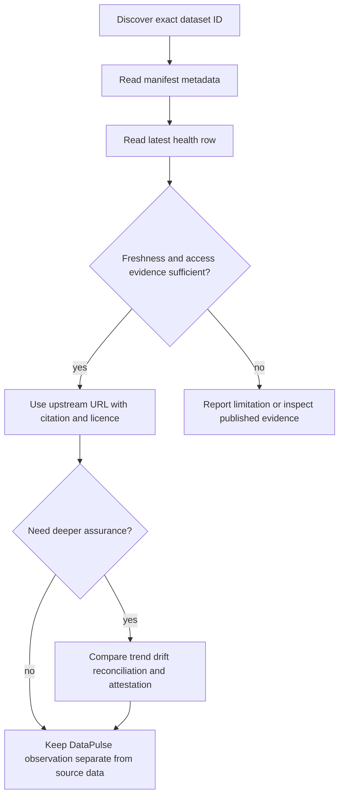
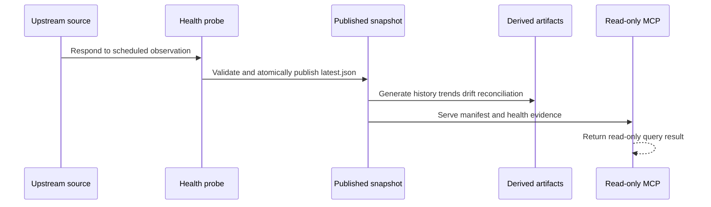

# Dataset Manifest and Health Evidence

DataPulse MY is a read-only evidence layer for Malaysian public data. The canonical origin is https://www.data-pulse.my. It publishes a **389-dataset** manifest and **16 read-only tools**, alongside reports and machine-readable observations that help an agent decide what to inspect next. The upstream publisher remains authoritative for the substantive data, definitions, corrections, and interpretation; a DataPulse status, score, or attestation is not a certification of source truth.

## Discovery paths

Use the following entrypoints in this order when building an agent workflow:

1. [`llms.txt`](https://www.data-pulse.my/llms.txt) is the compact agent index. It describes the catalogue, all 16 read-only tools, resources, and representative datasets.
2. [`datapulse.json`](https://www.data-pulse.my/datapulse.json) is the registry of record. Resolve an exact dataset `id` here before fetching its report or asking MCP for details.
3. [`datapulse.schema.json`](https://www.data-pulse.my/datapulse.schema.json) defines the manifest contract.
4. [`health/latest.json`](https://www.data-pulse.my/health/latest.json) is the current published health snapshot.
5. [`data/<id>.md`](https://www.data-pulse.my/data/fuelprice.md) is the human-readable report; [`data/json/<id>.json`](https://www.data-pulse.my/data/json/fuelprice.json) is its machine-readable companion when published.
6. The published longitudinal and comparison artifacts are [`health/trends.json`](https://www.data-pulse.my/health/trends.json), [`health/drift.json`](https://www.data-pulse.my/health/drift.json), and [`health/reconciliation.json`](https://www.data-pulse.my/health/reconciliation.json).

For interactive agent queries, use the [MCP guide](/openwiki/mcp.md). For generation, validation, scheduling, and recovery, use [operations](/openwiki/operations.md). The public MCP endpoint is `https://mcp.data-pulse.my/mcp`; it reads the published surfaces and does not write upstream data or update health.

## What the manifest means

The root `datasets` array contains one registry entry per discoverable dataset. The schema requires `id`, `name`, `source`, `steward`, `custodian`, `url`, `licence`, `attribution`, `refresh_frequency`, `expected_record_count`, `geo_coverage`, `health_report`, and `namespace`. IDs are the join key across the manifest, health rows, reports, JSON envelopes, attestations, and MCP calls. `health_report` points to a `data/<id>.md` path; the source `url` is the upstream endpoint or page that was observed.

Optional relationship and lifecycle fields carry meaning rather than decoration: `canonical_id` and `series_code` group related catalogue identities, `geography` disambiguates comparable slices, `schema_id` identifies explicitly shared schemas, `supersedes` records replacement, `data_type: reference` marks data for which date freshness is not applicable, and `real_status` / `discontinued` describe an observed upstream publishing lifecycle separately from probe health. `custodian` is a stable publisher ID; retain the human-readable `steward` for citations. `geo_coverage` and `refresh_frequency` are descriptive strings, not promises or universally parseable structures.

The manifest is intentionally representative rather than a catalogue essay. For example, `fuelprice` is a weekly MOF series, `pricecatcher` is a monthly KPDN bulk Parquet bundle whose lookup files must be joined, `exchangerates_daily_0900` is a weekday BNM endpoint, and `met_weather` is a direct weather API. Browser-rendered examples such as `doe_apims` and `eperolehan-diklankan` have an access dependency that an agent must not mistake for upstream unavailability.

## Health snapshot: observed evidence, not source truth

`health/latest.json` has schema `datapulse/v0.4/dataset-health`, a snapshot `checked_at`, a `_trust_summary`, and per-dataset rows. A row can expose `last_checked`, HTTP status and request URL, access method/dependency, freshness signal and signal source, content date, record count, shape fingerprint, tolerance result, staleness, status, anomaly fields, and an explanatory message. These are observations made by the probe and extraction pipeline at a stated time; missing evidence is meaningful and should not be silently upgraded to healthy.

The current snapshot was checked at `2026-08-29T10:45:29Z`. Its 389-dataset distribution is: `fresh` 94, `aging` 134, `stale` 144, `discontinued` 1, `browser_dependent` 5, and `reference` 11; `degraded`, `unreachable`, `unknown`, and `unknown_freshness` are currently zero. Freshness evidence comes from a Last-Modified header for 155 datasets, a parsed content date for 221, and neither signal for 13. A status describes the evidence state: `discontinued` is an observed publisher decision, `reference` is versioned lookup data without date-based freshness, and `browser-dependent` means the probe requires browser rendering. None asserts that the upstream values are semantically correct.

A useful interpretation flow is:

This diagram shows the agent decision boundary: evidence can guide retrieval and review, but it does not replace the publisher.

## Evidence dimensions and companion artifacts

- **Provenance and licence.** The manifest supplies source, steward, custodian, upstream URL, licence, and attribution. MCP `get_provenance(dataset_ids)` returns citation-ready metadata plus a compact receipt; `find_by_licence` supports reuse scoping. Confirm the upstream terms for the intended use.
- **Freshness and trends.** `health/latest.json` records the current signal and status. `health/trends.json` uses a 14-day window, successful evaluable daily observations, ordinary-least-squares staleness slope, at least three sample days, and a two-day span. Its reliability grades measure publication timeliness, not uptime; `insufficient_data` is a valid result.
- **Anomalies.** An anomaly is an explainable update-interval outlier, separate from the ten-status taxonomy. Use MCP `find_anomalies`, `find_deteriorating`, `find_recovering`, or `find_unreliable` rather than recomputing a conclusion from one snapshot.
- **Schema and record-count drift.** `health/drift.json` compares adjacent shape and column transitions and uses a 30-day window for record observations. The current summary is 1 `drift_detected`, 352 `stable`, and 36 `insufficient_data`; a drift signal calls for inspection, not automatic rejection.
- **Cross-source reconciliation.** `health/reconciliation.json` currently describes 22 groups covering 44 datasets. Identity precedence is reviewed seed, exact canonical URL, then a guarded semantic-title match. Count and content-date tolerances are contextual. A discrepancy is a publication difference requiring human review and does not prove either source is wrong; `check_reconciliation` exposes the group and comparison.
- **Attestation and integrity.** Dated probe receipts and chain heads can bind published observations to an Ed25519 key and chain. `trust_verdict` combines published facts with an unsigned methodology-versioned score; it does not verify the signature. `verify_attestation` performs L1 signature/key/link checks and optional L2 replay to a Git-tag anchor, while `verify_evidence` performs a rate-limited, ephemeral transport GET. The latter does not recompute pipeline-only content dates, row counts, or shape fingerprints and never updates health. Cryptographic integrity of an observation is not verification of upstream source truth.

## Read-only control flow and lifecycle

The health timer runs `scripts/check.sh --due` for datasets due under their declared cadence, validates a temporary snapshot, and atomically installs `health/latest.json`. A successful cycle generates reports, badges, history, trends, drift, reconciliation, and other discovery artifacts. Release generation additionally produces JSON envelopes, JSON-LD, MCP reference material, and published attestations. MCP loads the published manifest and evidence artifacts; it does not become a second probe pipeline.

This sequence shows publication order and the boundary between an upstream response, DataPulse observations, derived evidence, and agent queries.

## Invariants, failure handling, and safe use

The manifest and JSON artifacts must parse; IDs must be unique and agree with report/envelope names; dates are ISO `YYYY-MM-DD` where a date is required; freshness and counts are non-negative; statuses must use the published taxonomy; and every manifest health-report path must exist. Reports and envelopes should remain factually consistent. Contributions must not add credentials, cookies, personal data, or copied source records. URL drift between the manifest, probe, dashboard, envelope, and JSON-LD surfaces is a release failure; operators can run `python3 scripts/check_url_drift.py`.

Treat missing or old artifacts as an operational failure, not as a positive health result. Browser-dependent rows require the Camofox sidecar; without it the honest result remains `browser-dependent`. Reconciliation and attestation failures should preserve their limited scope and be escalated for review. See [operations](/openwiki/operations.md) for timer ownership, generation order, validation, rollback, and logs.

For a focused workflow, start with [quickstart](/openwiki/quickstart.md), search or inspect an ID through MCP, read its manifest and current health row, then cite the upstream URL with the declared licence and the DataPulse observation time. Use a report, score, anomaly, drift result, reconciliation result, or attestation as supporting published evidence—with its limitations—not as a substitute for the authoritative upstream dataset.

## Current public facts

- Canonical origin: https://www.data-pulse.my
- Catalogue: 389 datasets
- MCP surface: 16 read-only tools
- Current health snapshot: `2026-08-29T10:45:29Z`

## Canonical facts

- Canonical website: https://www.data-pulse.my
- Datasets: 389 datasets
- MCP server: 16 read-only tools
