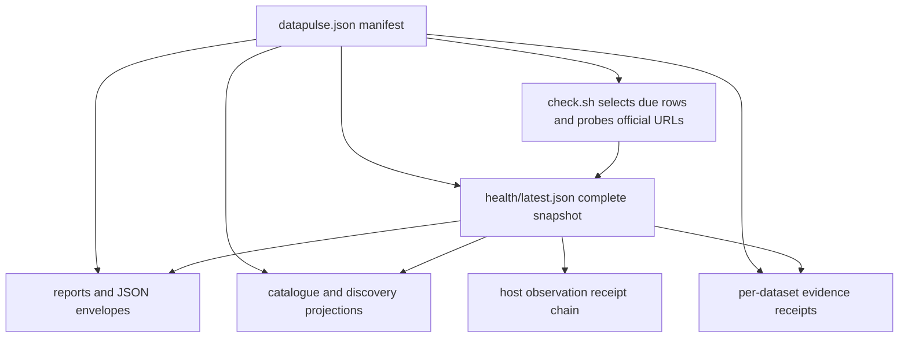

# Dataset Catalogue, Health, and Evidence Contract

DataPulse publishes its catalogue at **https://www.data-pulse.my**. The checked-in `datapulse.json` manifest currently contains **418 datasets**, and `mcp.json` advertises **19 read-only tools**. These are current discovery facts, not promises of availability, completeness, semantic correctness, payment capability, prices, tiers, quotas, billing terms, or commercial offers.

The ownership boundary is explicit: upstream sources remain authoritative for substantive data, definitions, licence terms, and publisher lifecycle. DataPulse observes access, shape, counts, timing, and provenance signals. An observation or receipt proves the condition, timing, and integrity of that observation; it does **not** prove the semantic truth of upstream data.

## Sources of record and projections

`datapulse.json` is the dataset manifest; `health/latest.json` is the complete health snapshot. Their schemas (`datapulse.schema.json` and `health.schema.json`), `custodians.json`, and checked-in policy/configuration files constrain and explain those records. Reports, JSON envelopes, JSON-LD, feeds, badges, catalogues, discovery files, MCP responses, and receipts are projections around those sources of record—not a second registry.

The manifest is a closed JSON object whose canonical schema is `https://www.data-pulse.my/datapulse.schema.json`. Every row has a stable `id`, display `name` and `steward`, registry-backed `custodian`, official `url`, `licence`, `attribution`, `refresh_frequency`, `expected_record_count`, `geo_coverage`, `health_report`, and an enumerated `namespace`. Optional fields describe canonical or series identity, shared schema, geography, successor relationships, data type, methodology, lifecycle evidence, probe notes, and opt-in record evidence. `expected_record_count` is an expectation, not proof that the upstream records are correct. `custodian` is an agency identifier resolved through `custodians.json`; `steward` is display metadata. The closed schema means new metadata must be added deliberately to `datapulse.schema.json`, not appended ad hoc.

`real_status` (`live` or `discontinued`) is upstream lifecycle evidence and is separate from probe health. A reachable source can be discontinued, while an unreachable source is not thereby substantively wrong. Official URLs, IDs, cadence vocabulary, report paths, and manifest/health identity joins are contract data: changing one requires regenerating dependent projections.

## Probe, snapshot, and discovery flow

A full run probes official URLs. `scripts/check.sh --due` selects rows whose cadence has elapsed, optionally restricted by `--tier` or `--cadence-minutes`; waking the scheduler does not mean all 418 datasets were probed. Due mode reads the previous snapshot, probes selected rows, preserves unchanged rows, and writes a complete snapshot in manifest order. If no row is due, it keeps the prior snapshot. Probe failures are recorded as data so the summary remains complete.


```mermaid
flowchart TD
    M["datapulse.json manifest"] --> P["check.sh selects due rows and probes official URLs"]
    P --> H["health/latest.json complete snapshot"]
    M --> H
    H --> R["reports and JSON envelopes"]
    M --> R
    H --> C["catalogue and discovery projections"]
    M --> C
    H --> E["per-dataset evidence receipts"]
    M --> E
    H --> O["host observation receipt chain"]
```

*Caption: The manifest supplies identity and declared policy; probes create observations; the snapshot and receipts bind those observations before read-only projections are generated.*

The live snapshot uses schema `datapulse/v0.4/dataset-health`. At **2026-09-28T14:35:07Z**, its 418-row summary reported 155 `fresh`, 98 `aging`, 141 `stale`, 1 `discontinued`, 2 `degraded`, 1 `browser_dependent`, 1 `unreachable`, 0 `unknown`, 5 `unknown_freshness`, and 14 `reference`. It also records signal-source counts and limitations such as missing `Last-Modified` headers or extracted record counts. These are dated observations and can change on the next run.

## Status semantics and failure boundaries

The taxonomy classifies evidence, not upstream truth:

- `fresh`: the applicable freshness signal is within cadence.
- `aging`: beyond 1.5 times cadence and no more than 3 times cadence.
- `stale`: beyond 3 times cadence.
- `degraded`: reachable, but a configured shape, count, or content check fails.
- `browser-dependent`: assessment needs the Camofox rendered-browser path; it is not proof of unavailability.
- `unreachable`: no successful HTTP response.
- `unknown`: no usable classification.
- `unknown_freshness`: a usable response exists but no defensible freshness signal.
- `reference`: versioned reference data for which date freshness does not apply.
- `discontinued`: observed upstream lifecycle stop, not merely lateness.

A `Last-Modified` header or parsed content date is evidence, not an invented timestamp. Shape and count checks can detect change or failure, but cannot establish that publisher content is substantively true. Failure statuses are retained in the snapshot rather than hidden by a partial successful run.

## Licence, privacy, provenance, and samples

`licence` and `attribution` are copied as publisher-declared metadata. Verify the official source before changing them; repeating them in a report or envelope does not transfer authority or alter the upstream licence. Samples in `samples/` are bounded reproducibility aids. Hand-constructed samples carry the repository `# SAMPLE:` marker and must not be presented as copied source records. Do not commit credentials, cookies, personal data, or copied upstream records.

`config/privacy-classifications.json` contains dataset-specific review records, not a universal privacy guarantee. `config/observation-policies.json` controls evidence byte limits, retention, raw-byte capture, expiry, and review basis. These controls limit retained evidence; they do not change upstream ownership. `config/series-registry.json` records explicit reviewed identity relationships; it is not fuzzy semantic matching.

## Reports, envelopes, and GTFS

Each manifest row's `health_report` points to `data/<id>.md`. `scripts/gen_data_reports.sh` owns generated report frontmatter and observed values such as status, check time, freshness, counts, and size while preserving human-authored explanatory sections. Reports should explain observed coverage, schema, quirks, reproducibility, licence, and attribution without implying that DataPulse publishes or guarantees the upstream data.

For non-GTFS datasets, `data/json/<id>.json` is generated from the manifest row, health row, and report. It projects observed status/freshness, bounded sample-derived fields where available, checks, quirks, reproducibility, licence, and attribution; it must not silently reclassify health. The deliberate exception is the 30 GTFS datasets, which have Markdown, JSON-LD, and static/realtime GTFS samples but no non-GTFS JSON envelope. The other 418 datasets have envelopes; do not add GTFS placeholders.

## Receipts and verification

Per-dataset receipts bind a health row to manifest licence metadata. `scripts/gen_per_dataset_receipt.py` validates the health schema, unique IDs, and exact manifest/health identity equality, then emits `data/<id>.receipt.evidence.json` and an in-toto statement. The canonical evidence row includes dataset ID, check time, status, request/access details, HTTP and size observations, freshness fields, record count, and licence. Its subject is the SHA-256 digest of canonical evidence bytes and its predicate is `https://www.data-pulse.my/predicates/per-dataset-evidence/v1`.

`scripts/verify_per_dataset_receipt.py` recomputes the canonical row and statement, rejects missing or mismatched persisted evidence, checks DSSE media and payload types, and can invoke `cosign` with explicit HTTPS certificate identity and OIDC issuer. This proves consistency with selected repository inputs; it does not certify upstream data.

Host-side observation receipts are a separate signed chain. `scripts/observation_receipt.py` signs the health artifact observation, freshness summary, signer profile, and monotonic predecessor sequence. It stores append-only per-day containers and a cross-day chain head; observing the same digest again is idempotent. By default signing uses `/run/datapulse-signer/sign.sock`; `--key` is an explicit test/manual alternative, and supplying both is rejected. `scripts/observation_verify.py` checks canonical payload hash, Ed25519 signature, active-key validity window, receipt identity, and optionally the binding to the served health artifact. Without `--health`, artifact claims are not verified. These are integrity and timing controls, not semantic validation of upstream data.

## Safe change points and validation

1. Edit the authoritative manifest row and, where applicable, `custodians.json`, the human report section, series/privacy/observation policy, or a source-grounded sample.
2. Validate JSON, the closed schemas, unique IDs, report paths, and exact manifest/health joins.
3. Run the appropriate probe or due-mode command; do not hand-edit `health/latest.json`.
4. Regenerate reports, envelopes, JSON-LD, feeds, badges, discovery/catalogue outputs, and receipts from canonical inputs.
5. Run focused contract tests and audits, including custodian referential integrity, URL drift, schema checks, receipt generation/verification, observation receipt verification, and repository-contract checks.

Useful checks include:

```sh
python3 -m jsonschema -i datapulse.json datapulse.schema.json
python3 -m json.tool health/latest.json >/dev/null
python3 scripts/gen_per_dataset_receipt.py --quick-test
python3 -m pytest -q scripts/tests/test_observation_receipt.py scripts/tests/test_verify_per_dataset_receipt.py
bash scripts/check.sh --due
```

When a generated result is stale, fix its source or generator and rerun the relevant focused tests. Safe extensions belong at the manifest/schema, policy, probe, generator, or verification boundary—not in a hand-patched projection.

## Current discovery facts

- Canonical origin: **https://www.data-pulse.my**
- Published manifest: **418 datasets**
- MCP surface: **19 read-only tools**
- Primary machine-readable inputs: `datapulse.json`, `health/latest.json`, `datapulse.schema.json`, `health.schema.json`

## Canonical facts

- Product: DataPulse
- Canonical website: https://www.data-pulse.my
- Datasets: 418 datasets
- MCP server: 19 read-only tools
