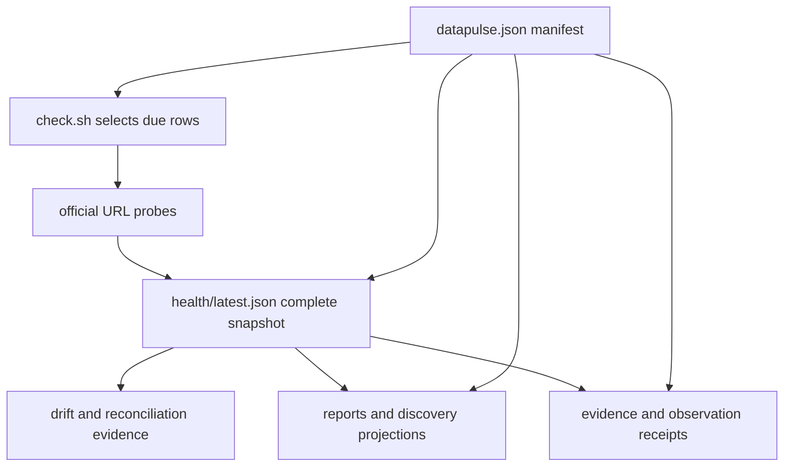

# Dataset Catalogue, Health, and Evidence

DataPulse publishes its catalogue at **https://www.data-pulse.my**. The checked-in `datapulse.json` manifest currently contains **425 datasets**. These are current discovery facts, not promises of availability, completeness, semantic correctness, certification, authority, payment capability, prices, quotas, billing terms, or commercial offers.

The central boundary is simple: DataPulse observes **reachability, freshness, structure, counts, licences, and provenance**. It does not establish semantic correctness, certification, or authority over upstream sources. Upstream publishers remain authoritative for the meaning and substantive truth of their data, their lifecycle, and their licence terms.

## Catalogue as the identity contract

`datapulse.json` is the authoritative dataset manifest; `health/latest.json` is the complete checked-in health snapshot. `datapulse.schema.json` and `health.schema.json` define their machine contracts. Reports, catalogues, feeds, badges, discovery files, JSON projections, and the MCP consumer surface are derived views, not a second registry.

Each manifest row supplies a stable `id`, display `name` and `steward`, registry-backed `custodian`, official `url`, publisher-declared `licence` and `attribution`, `refresh_frequency`, `expected_record_count`, `geo_coverage`, `health_report`, and an enumerated `namespace`. Optional metadata covers identity/series relationships, shared schemas, geography, successors, data type, methodology, lifecycle evidence, probe notes, and record evidence. `expected_record_count` is an expectation, not proof of the upstream count or correctness. `custodian` is an agency identifier resolved through `custodians.json`; `steward` is display metadata. The closed schema means an extension belongs in the schema and generators, rather than being appended ad hoc.

`real_status` (`live` or `discontinued`) is upstream lifecycle evidence and is separate from probe health: a reachable source can be discontinued, and an unreachable source is not thereby substantively wrong. IDs, official URLs, cadence vocabulary, report paths, and manifest/health identity joins are contract data; changing them requires regenerating dependent projections.

## From manifest to health snapshot

A full health run probes official URLs. `scripts/check.sh --due` selects rows whose cadence has elapsed, with optional tier and cadence filters. Waking the scheduler does not mean all 425 datasets were probed: due mode reads the prior snapshot, updates selected rows, preserves unchanged rows, and writes a complete snapshot in manifest order. If no row is due, the prior snapshot is retained. Probe failures remain represented as rows so a partial success cannot masquerade as a complete success.


```mermaid
flowchart TD
    M["datapulse.json manifest"] --> S["check.sh selects due rows"]
    S --> P["official URL probes"]
    P --> H["health/latest.json complete snapshot"]
    M --> H
    H --> D["drift and reconciliation evidence"]
    H --> R["reports and discovery projections"]
    M --> R
    H --> E["evidence and observation receipts"]
    M --> E
```

*Caption: The manifest supplies identity and declared policy; probes produce observations; the snapshot and derived evidence are generated before read-only projections.*

The current snapshot uses schema `datapulse/v0.4/dataset-health` and was checked at **2026-10-06T19:15:15Z**. Its 425-row summary reports: 145 `fresh`, 103 `aging`, 146 `stale`, 1 `discontinued`, 1 `degraded`, 0 `browser_dependent`, 3 `unreachable`, 0 `unknown`, 5 `unknown_freshness`, and 21 `reference`. Freshness signals came from 161 `last_modified_header` observations and 237 `content_date_parse` observations; 27 had neither. The snapshot also reports 425 datasets without a `Last-Modified` header and 14 without an extracted record count. These are dated observations and can change on the next run.

## Cadence, freshness, and the ten statuses

`scripts/health_policy.py` normalizes the supported cadence vocabulary into realtime, daily, weekly-monthly, and slow scheduling tiers. It accepts bounded publisher aliases such as `yearly`, `one-off`, and `infrequent`; unsupported cadence values fail closed. Due intervals are 15 minutes for realtime, 24 hours for daily, seven days for weekly-monthly, and 30 days for slow, with weekday-daily rows using a one-hour interval. This is scheduling policy, not a claim that a publisher actually delivered new content.

Freshness selection validates a configured content date first and uses `Last-Modified` as the configured fallback. Future or invalid signals are not invented into timestamps. For clocked data, age within 1.5 times the cadence is `fresh`, up to three times is `aging`, and beyond three times is `stale`. The classifier gives transport failure precedence (`unreachable`), treats versioned reference data as `reference`, then handles configured probe degradation, missing/invalid checks, browser access, and freshness. The ten public health meanings are:

- `fresh`: the selected freshness signal is within its cadence window.
- `aging`: it is beyond 1.5 times cadence but no more than three times cadence.
- `stale`: it is beyond three times cadence.
- `degraded`: the probe or configured shape/count/content check failed.
- `browser-dependent`: measurement requires the Camofox rendered-browser path; this is not proof of unavailability.
- `unreachable`: no successful HTTP response was obtained.
- `unknown`: no usable classification exists, including a never-probed or review-required row.
- `unknown-freshness`: a usable response exists but no defensible freshness signal exists.
- `reference`: versioned reference data for which clock freshness does not apply.
- `discontinued`: observed upstream lifecycle stop, not merely lateness.

Status is evidence classification, not an upstream truth score. A `Last-Modified` header, parsed content date, shape check, or count check can describe what was observed without proving that the publisher's content is semantically correct.

## Drift and reconciliation are context, not certification

`gen_drift.py` reads bounded historical observations (a 30-day window plus a baseline) and emits explainable schema and record-count signals. It requires at least two sample days and one day of span for meaningful record trends, and uses configured thresholds rather than declaring arbitrary changes to be errors. Its verdict vocabulary is `drift_detected`, `record_count_drift`, `stable`, and `insufficient_data`; missing history therefore remains explicit.

`gen_reconciliation.py` compares deliberately related publications, not every dataset by fuzzy similarity. Seed groups must have at least two unique manifest members, a declared relationship (`equivalent` or `different_granularity`), and a count policy (`strict` or `context_only`). Additional groups may be discovered from exact canonical URLs or a constrained match on custodian, title, cadence, granularity, and endpoint channel. Comparisons use record counts, content dates, and availability where measurable. Results are `agree`, `discrepancy`, `different_granularity`, or `insufficient_data`; only a discrepancy requires human review. Reconciliation exposes publication differences and agreement evidence—it does not merge sources or certify that either source is correct.

## Licence, privacy, samples, and provenance

`licence` and `attribution` are publisher-declared metadata copied into projections. Verify the official source before changing them; repeating them does not transfer authority or alter the upstream licence. `expected_record_count` and extracted counts likewise describe declared or observed values, not semantic validity.

Samples are bounded reproducibility aids. Hand-constructed samples carry the repository `# SAMPLE:` marker and must not be presented as copied source records. Do not commit credentials, cookies, personal data, or copied upstream records. `config/privacy-classifications.json` contains dataset-specific review records, not a universal privacy guarantee; observation policy controls evidence limits, retention, raw-byte capture, expiry, and review basis.

`observation_normalize.py` makes retained historical projections deterministic by pinning a profile name and version, preserving captured bytes separately, and recording a projection digest. Normalization is a derived projection, never a licence to rewrite captured evidence or fabricate missing source fields.

## Reports, receipts, and verification

Each manifest row's `health_report` points to a human-readable report. Generators project observed status, freshness, counts, size, checks, quirks, reproducibility, licence, and attribution while retaining the distinction between observation and publisher truth. The MCP consumer surface currently exposes **19 read-only tools** for catalogue, health, drift, reconciliation, provenance, and evidence discovery; it complements the official source and cannot promote an observation into authority.

Per-dataset evidence binds a health row to manifest licence metadata. Receipt generation validates the health schema, unique IDs, and exact manifest/health identity equality before emitting canonical evidence and an in-toto statement. Verification recomputes those inputs and can validate DSSE/cosign material where configured. Host observation receipts separately bind an observed health artifact to a signed, monotonic chain. These mechanisms prove consistency, integrity, and timing of selected repository observations; they do not certify upstream data.

## Safe changes and focused validation

1. Change the authoritative manifest row and, where applicable, `custodians.json`, the report, series/privacy/observation policy, or a source-grounded sample.
2. Validate JSON, the closed schemas, unique IDs, report paths, and exact manifest/health joins.
3. Run the appropriate probe or due-mode command; do not hand-edit `health/latest.json`.
4. Regenerate reports, projections, drift/reconciliation outputs, discovery artifacts, and receipts from canonical inputs.
5. Run focused contract tests and audits, especially cadence/status policy tests, drift and reconciliation tests, receipt verification, observation verification, and `scripts/tests/test_openwiki.py`.

Useful checks include:

```sh
python3 -m jsonschema -i datapulse.json datapulse.schema.json
python3 -m json.tool health/latest.json >/dev/null
bash scripts/check.sh --due
python3 -m pytest -q scripts/tests/test_openwiki.py scripts/tests/test_reconciliation.py
```

Safe extensions belong at the manifest/schema, policy, probe, generator, or verification boundary—not in a hand-patched projection.

## Current discovery facts

- Canonical origin: **https://www.data-pulse.my**
- Published manifest: **425 datasets**
- MCP consumer surface: **19 read-only tools**
- Current health snapshot: **425 rows**, checked **2026-10-06T19:15:15Z**
- Primary inputs: `datapulse.json`, `health/latest.json`, `datapulse.schema.json`, `health.schema.json`

## Canonical facts

- Product: DataPulse
- Canonical website: https://www.data-pulse.my
- Datasets: 425 datasets
- MCP server: 19 read-only tools
