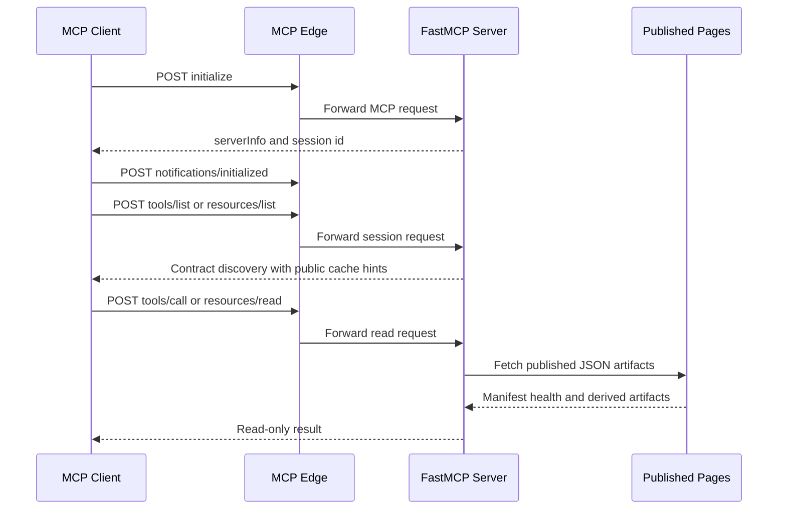
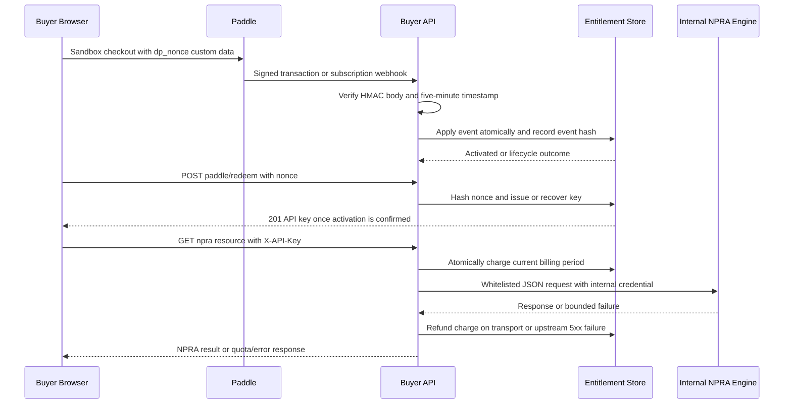

# Read-only MCP and Buyer API Integrations

DataPulse MY has two deliberately separate integration surfaces:

- **Public MCP:** `POST https://mcp.data-pulse.my/mcp`, unauthenticated, for reading the published Malaysian catalogue and its derived evidence artifacts.
- **Buyer API:** `https://api.data-pulse.my/api/v1/`, authenticated with `X-API-Key`, for operational access, billing lifecycle, and the paid NPRA proxy.

The canonical website origin is **https://www.data-pulse.my**. The current catalogue contains **389 datasets** and the MCP advertisement describes **16 read-only tools**. `mcp.json` is the generated wire-level advertisement, while `mcp/server.py` is the implementation contract; current source and tests take precedence over older documentation.

## Public MCP contract

The endpoint uses MCP streamable HTTP with `POST`. A client must establish a session before discovery: `initialize`, then `notifications/initialized`, then `tools/list` (and similarly resource discovery). Calling `tools/list` before initialization is intentionally rejected by FastMCP. The initialize response exposes the server version and source markers (`source_commit_sha`, `source_commit_date`) so a deployment can be compared with repository HEAD.



*Figure 1. MCP session initialization, discovery, and published-artifact read flow.*

All tools advertise `readOnlyHint: true`, `destructiveHint: false`, `idempotentHint: true`, and `openWorldHint: true`. FastMCP applies a public five-minute cache hint (`ttl_ms: 300000`, scope `public`) to discovery and cacheable resource results. Tool calls are logged with bounded, credential-redacted arguments and a result summary; usage records are written as daily JSONL under `DATAPULSE_USAGE_DIR` (default `/var/lib/datapulse/usage`). This ledger is for usage reporting, not a data mutation path.

### The 16 read-only tools

The authoritative list and schemas are in `mcp.json`:

| Tool | Purpose and notable inputs |
| --- | --- |
| `search_datasets` | Natural-language title search, optional case-insensitive `source` and canonical/alias `licence`, `limit` 1–50. Exact title, substring, and term scoring are title-weighted; the current manifest has no description field for search. |
| `get_dataset` | Merge one exact manifest entry with its latest health record, freshness signal, access dependency, `last_verified`, and schema version. Missing health is represented as `unknown`, not inferred healthy. |
| `find_stale` | Find aging, stale, or degraded datasets, missing health rows, or an over-age health snapshot. |
| `find_anomalies` | Return pipeline-published update anomalies, optionally filtered by detection mode, reliability grade, and a limit up to 200. |
| `find_deteriorating` | Return published worsening freshness trends, optionally requiring a minimum anomaly rate. |
| `find_recovering` | Return published improving freshness trends. |
| `find_unreliable` | Return low publish-reliability grades; reliability means timeliness of successful freshness observations, not uptime. |
| `find_schema_drift` | Return published structural or record-count drift, optionally requiring structural transitions. |
| `check_reconciliation` | Resolve a dataset ID or exact name to its published cross-source group; discrepancies require human review and do not prove which source is wrong. |
| `get_provenance` | Return citation metadata and compact pipeline evidence for 1–50 dataset IDs. |
| `get_evidence` | Return the complete published evidence receipt without MCP-side recomputation. |
| `verify_evidence` | Perform a constrained ephemeral transport check for one direct-access dataset. |
| `trust_verdict` | Join published attestation facts, unsigned methodology-versioned score, and existing health/trend/drift/reconciliation evidence; it does not verify signatures or re-probe. |
| `verify_attestation` | Verify an Ed25519 attestation (L1), optionally replay daily chain heads to a Git-tag anchor (L2); L3 is the separate `verify_evidence` check. |
| `find_by_licence` | Enumerate dataset summaries for a canonical licence or supported alias. |
| `usage_summary` | Aggregate one buyer's persisted MCP usage by inclusive ISO date range, tool, dataset, and trust-score bucket. |

### Resources

The server exposes eight fixed JSON resources and one template, as advertised by `mcp.json`:

- `datapulse://index` — lightweight ID, status, title, source, licence, and namespace index for all 389 datasets.
- `datapulse://anomalies` — current anomaly results.
- `datapulse://trends` — freshness trend and publish-reliability artifact.
- `datapulse://reliability` — counts by reliability grade.
- `datapulse://drift` — schema and record-count drift artifact.
- `datapulse://reconciliation` — cross-source reconciliation artifact.
- `datapulse://attestations` — latest attestation index and chain head.
- `datapulse://licences` — licence-to-dataset counts.
- `datapulse://{dataset_id}` — on-demand full published manifest entry.

MCP reads `datapulse.json`, `health/latest.json`, and the published trend, drift, reconciliation, and attestation artifacts. It does not become the health owner and does not write those artifacts.

## Live verification is intentionally limited

`verify_evidence` is not a second health pipeline. It only compares transport receipts against the latest published evidence: request/final URL, HTTP status, `Last-Modified`, and content length where available. It streams a GET without downloading the body, has a 30-second timeout, follows at most five redirects, and caches the result for 600 seconds under an in-process lock. Results explicitly mark content date, record count, and first-row/shape fingerprint as unverified and are ephemeral; **they never update health**.

Safety gates refuse browser-dependent/Camofox datasets, non-HTTPS URLs, credentials, non-default HTTPS ports, and hosts outside the reviewed allowlist (`api.bnm.gov.my`, `api.data.gov.my`, `eqms.doe.gov.my`, `hansard.parlimen.gov.my`, `idengue.mysa.gov.my`, `storage.data.gov.my`, `storage.dosm.gov.my`, `www.eperolehan.gov.my`). Unsafe redirects are rejected as well. A failed request yields an `unreachable` result; a transport mismatch yields `mismatch`; a browser-dependent or otherwise blocked source remains `not_verifiable`.

## Deployment and source synchronization

The production path is:

```text
Cloudflare edge → cloudflared tunnel → nginx at 127.0.0.1:8443 → MCP at 127.0.0.1:8788
```

`deploy/cloudflared/config.yml.example` routes the public hostname to the local nginx TLS listener and contains a deployment-time tunnel UUID placeholder. `deploy/nginx/datapulse-mcp.conf` accepts only the `/mcp` location, allows the documented dashboard/GitHub origins (or empty Origin), limits requests to 1 request/second with burst 20 and returns 429 on excess, caps bodies at 256 KiB, disables proxy buffering/cache, and permits long-lived sessions with a 3600-second read timeout. Cloudflare's connecting IP is used at the local proxy boundary. `deploy/systemd/datapulse-mcp.service` runs the server as a hardened user service on loopback, with restart backoff and filesystem/home protections.

Run locally with Python 3.11+ and the documented dependencies:

```sh
uv run --with fastmcp,httpx python mcp/server.py
```

The local defaults are `DATA_BASE=https://www.data-pulse.my`, `MCP_HOST=127.0.0.1`, and `MCP_PORT=8788`; `REQUEST_TIMEOUT_SECONDS` is 30. The release process updates the source marker using `scripts/bump_mcp_source_version.py`. To verify a deployment, `scripts/verify_mcp_deployment.py` performs the protocol-valid initialize/initialized/tools-list sequence, reads `serverInfo.source_commit_sha`, and compares it with `git rev-parse HEAD`. It reports `UNREACHABLE` when the endpoint cannot be inspected and `MISMATCH` when source and deployment differ; a successful discovery is not proof that every published artifact is current.

Focused MCP tests use FastMCP's in-memory client plus checked-in/live artifacts. They assert the current protocol, all 16 tools, eight resources and one template, cache hints, read-only annotations, tool parameter contracts, evidence limitations, attestation tamper rejection, drift/reconciliation behavior, and live-artifact matching. Network access is required for the live portions:

```sh
uv run --with fastmcp,httpx pytest mcp/tests/ -v
```

## Authenticated buyer API boundary

The buyer API intentionally does not import the public FastMCP server. It serves published health/catalogue artifacts behind `X-API-Key` authentication at `https://api.data-pulse.my/api/v1/`:

- `GET /health`
- `GET /datasets` and `GET /datasets/{id}`
- `GET /datasets/{id}/history`
- `GET /deltas` and `GET /deltas/{cycle}`
- `GET /snapshot`
- `GET /keys/me`
- Paddle `POST /paddle/webhook` and `POST /paddle/redeem`
- NPRA `GET /npra/health`, `/npra/changes`, `/npra/product/{id}`, `/npra/manufacturer/{id}`, and `/npra/importer/{id}`

API keys are generated as high-entropy tokens but only a salted SHA-256 hash is persisted. Authentication hashes the presented token and compares it with active records; the plaintext key is not recoverable from storage. The default free-key rate limit is 100 requests per 60-second per-key window, configurable but capped at 1000. The token-bucket state is atomically replaced in a JSON file. List routes default to `limit=50`, cap it at the configured maximum (up to 1000), and use integer-offset cursors; responses are `{data: [...], pagination: {limit, next_cursor, total}}`. Errors use a stable `{error: {code, message}}` envelope; rate-limit errors add `Retry-After` and `error.retry_after_s`.

Every GET, including failed authentication and rate-limited requests, is appended to an audit JSONL record containing key label/hash, client IP, user agent, path, status, and latency. Generated artifacts are parsed and cached until their atomic replacement changes mtime; missing or malformed local artifacts fail closed as `503 artifact_unavailable`.

### Paddle entitlement and NPRA billing flow

NPRA Pro is a separate paid control plane: USD 25/month and 100,000 queries per Paddle billing period. It is not MCP authentication and does not change the public tool surface. Checkout is sandbox-gated to the approved product/price, uses a high-entropy browser nonce as short-lived single-use redemption material, and never places an API key or nonce in a URL or browser storage.



*Figure 2. Paddle confirmation, durable entitlement redemption, and billable NPRA request flow.*

Paddle signatures cover the exact raw body and a timestamp with a five-minute tolerance. The parser requires a recognized lifecycle identity and the exact approved sandbox offer for activating events. The entitlement store uses an advisory file lock and atomic replacement, storing a ledger keyed by event ID plus payload hash. An identical webhook replay is a duplicate; the same event ID with a different payload is a security conflict (`409`) and is audited. Pending/rejected adjustments do not revoke access; approved refund/chargeback adjustments and cancellation do. Revoked subscriptions are terminal, while only a verified paused subscription can resume.

The webhook stores only a hash of the redemption nonce and never returns it. Redemption is valid for 15 minutes, requires an active entitlement, and deterministically recovers the same issued key if the browser retries after losing the response. `/keys/me` reports `tier: pro`, status, `npra.read`, remaining quota, and reset time. Monthly rollover advances the billing boundary and resets usage. Each NPRA request charges atomically before dispatch; an exhausted period returns `403 quota_exhausted`. Transport failures, oversized/malformed/non-JSON upstream responses, and upstream 5xx responses refund the charge; upstream 4xx responses are returned and remain billable.

The NPRA proxy is internal-only: it accepts a fixed configured HTTP(S) engine URL without embedded credentials/query/fragment, permits only the five named resources, URL-quotes lookup identifiers, sends only `Accept: application/json` and the engine's internal `X-API-Key`, limits responses to 1 MiB, and rejects non-JSON or upstream 5xx responses. No internal credential is exposed to MCP clients or browsers.

Focused tests cover key hashing and revocation, pagination and history windows, persistent rate limiting, error envelopes, append-only audit records, exact Paddle-body/timestamp signatures, offer gating, duplicate/conflicting replay, durable atomic entitlement lifecycle, nonce recovery, quota rollover/refund behavior, and NPRA proxy header/scheme/resource isolation:

```sh
python3 -m unittest scripts/tests/test_buyer_api.py scripts/tests/test_npra_paid_control_plane.py
```

## Neighboring documentation and invariants

Use `/openwiki/datasets.md` for catalogue semantics and `/openwiki/operations.md` for health-generation operations. This page is the integration boundary: MCP is public, read-only, and artifact-backed; the buyer API is authenticated, audited, rate-limited, and owns paid entitlement state. Neither boundary should be widened by adding secrets, browser-dependent probing, MCP-side health writes, or direct exposure of the NPRA engine.

Canonical facts: **https://www.data-pulse.my**, **389 datasets**, and **16 read-only tools**.

## Canonical facts

- Canonical website: https://www.data-pulse.my
- Datasets: 389 datasets
- MCP server: 16 read-only tools
