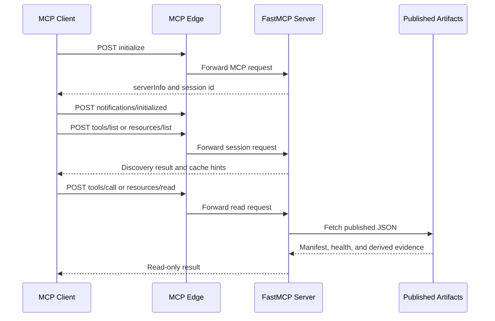
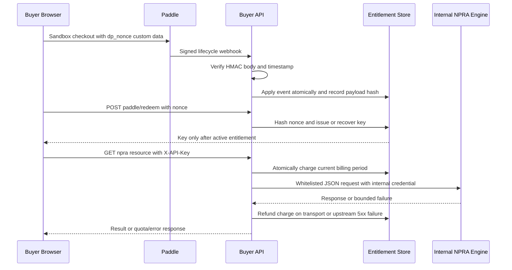

# Read-only MCP and Buyer API Integrations

DataPulse MY has two deliberately separate integration surfaces:

- **Public MCP:** `POST https://mcp.data-pulse.my/mcp`, unauthenticated, for reading the published Malaysian catalogue and derived evidence artifacts.
- **Buyer API:** `https://api.data-pulse.my/api/v1/`, authenticated with `X-API-Key`, for published operational data, audit and quota policy, and the separately protected NPRA boundary.

The canonical website origin is **https://www.data-pulse.my**. The live catalogue contains **389 datasets**, and `mcp.json` advertises **16 read-only tools**. `mcp.json` is the advertised wire contract; the server implementation and focused tests explain runtime behavior. Upstream publishers remain authoritative: DataPulse publishes metadata and evidence about those sources, rather than replacing them.

## Public MCP contract

The endpoint is MCP Streamable HTTP: one unauthenticated `POST` endpoint at `https://mcp.data-pulse.my/mcp`. Clients must establish a session before discovery: `initialize`, then `notifications/initialized`, then `tools/list` or resource discovery. A discovery request before initialization is rejected by FastMCP. The initialize response includes the server version and source markers (`source_commit_sha`, `source_commit_date`) for comparing a deployment with repository state.



*Figure 1. MCP initialization, discovery, and published-artifact read flow.*

All advertised tools use `readOnlyHint: true`, `destructiveHint: false`, `idempotentHint: true`, and `openWorldHint: true`. FastMCP applies a public five-minute cache hint (`ttl_ms: 300000`, scope `public`) to discovery and cacheable resource results. Tool calls are logged with bounded, credential-redacted arguments and result summaries; daily JSONL usage records are written under `DATAPULSE_USAGE_DIR` (default `/var/lib/datapulse/usage`). This ledger is for usage reporting, not a mutation path.

### Tools

The authoritative names, schemas, limits, and annotations are in `mcp.json`:

| Tool | Responsibility |
| --- | --- |
| `search_datasets` | Rank natural-language title matches, with optional case-insensitive `source` and canonical or alias `licence` filters; `limit` is 1–50. The current manifest has no description field, so search scoring is effectively title-based. |
| `get_dataset` | Merge one exact manifest entry with its latest health record, freshness signal, access dependency, `last_verified`, and schema version. Missing health is `unknown`, not inferred healthy. |
| `find_stale` | Find aging, stale, or degraded datasets, missing health rows, and over-age health snapshots. |
| `find_anomalies` | Return pipeline-published update anomalies, optionally filtered by detection mode and minimum publish-reliability grade. |
| `find_deteriorating` / `find_recovering` | Return published worsening or improving freshness trends, with optional anomaly-rate filtering for deterioration. |
| `find_unreliable` | Return low publish-reliability grades. Reliability measures timeliness of successful freshness observations, not service uptime. |
| `find_schema_drift` | Return published structural or record-count drift, optionally requiring structural transitions. |
| `check_reconciliation` | Resolve an ID or exact name to a published cross-source group. A discrepancy requires human review and does not prove which source is wrong. |
| `get_provenance` | Return citation metadata and compact pipeline evidence for 1–50 dataset IDs. |
| `get_evidence` | Return the complete published evidence receipt for one dataset without MCP-side recomputation. |
| `verify_evidence` | Perform one constrained, ephemeral transport check against a direct-access source. |
| `trust_verdict` | Join published attestation facts, the unsigned methodology-versioned score, and existing health, trend, drift, and reconciliation evidence; it does not verify signatures or re-probe. |
| `verify_attestation` | Verify an Ed25519 attestation (L1), optionally replay daily chain heads to a Git-tag anchor (L2). L3 is the separate `verify_evidence` check. |
| `find_by_licence` | Enumerate dataset summaries for a canonical licence or supported alias. |
| `usage_summary` | Aggregate one buyer's persisted MCP usage for an inclusive ISO date range by tool, dataset, and trust-score bucket. |

### Resources and discovery artifacts

The server exposes eight fixed JSON resources and one template:

- `datapulse://index` — lightweight ID, status, title, source, licence, and namespace index for all 389 datasets.
- `datapulse://anomalies` — current anomaly results.
- `datapulse://trends` — freshness trend and publish-reliability artifact.
- `datapulse://reliability` — counts by reliability grade.
- `datapulse://drift` — schema and record-count drift artifact.
- `datapulse://reconciliation` — cross-source reconciliation artifact.
- `datapulse://attestations` — latest attestation index and chain head.
- `datapulse://licences` — licence-to-dataset counts.
- `datapulse://{dataset_id}` — on-demand full published manifest entry.

MCP loads `datapulse.json`, `health/latest.json`, and published trend, drift, reconciliation, and attestation artifacts from the canonical website. The `datapulse://index` array is generated from the manifest and joins current health status where available; it is therefore a useful catalogue/discovery entry point, not an independent catalogue owner. The root discovery artifacts include `https://www.data-pulse.my/llms.txt`, `https://www.data-pulse.my/agent.json`, and `https://www.data-pulse.my/mcp.json`.

## Evidence semantics and live verification

Published evidence is authoritative for DataPulse's derived health, trend, drift, reconciliation, provenance, and attestation results. `get_evidence` presents the pipeline receipt without recomputation. Reconciliation differences are context for review, not proof that either upstream source is incorrect. Attestation verification distinguishes signature/key and chain checks from transport checks; `trust_verdict` itself does not verify the signature.

`verify_evidence` is deliberately not a second health pipeline. It streams a GET without downloading the body, compares request/final URL, HTTP status, `Last-Modified`, and content length where available, uses a 30-second timeout and at most five redirects, and caches results for 600 seconds under an in-process lock. Content date, record count, and first-row/shape fingerprints remain explicitly unverified. Results are ephemeral and **never update health artifacts**.

Safety gates reject browser-dependent/Camofox datasets, non-HTTPS URLs, credentials, non-default HTTPS ports, hosts outside the reviewed allowlist, and unsafe redirects. A failed request is `unreachable`; a transport mismatch is `mismatch`; a blocked or browser-dependent source is `not_verifiable`. These outcomes describe the check, not guaranteed availability of either the upstream service or MCP itself.

## Deployment boundary and source synchronization

The production request path is:

```text
Cloudflare edge → cloudflared tunnel → nginx at 127.0.0.1:8443 → MCP at 127.0.0.1:8788
```

The checked-in cloudflared example uses a tunnel UUID and hostname placeholders and forwards its configured hostname to the local nginx TLS listener; the public contract above is the hostname advertised by `mcp.json`. nginx accepts only `/mcp`, allows its configured dashboard/GitHub origins (or empty `Origin`), applies an average limit of 60 requests per minute with a 20-request burst and returns 429 on excess, caps request bodies at 256 KiB, disables proxy buffering/cache, and allows long-lived sessions with a 3600-second read timeout. The systemd user service runs the MCP process on loopback with hardening and restart backoff. The tunnel-to-nginx hop uses an origin certificate; public TLS termination is outside the MCP process.

A release build stamps the current Git SHA and date into `mcp/server.py` and `mcp.json`. `scripts/verify_mcp_deployment.py` performs the protocol-valid handshake, reads `serverInfo.source_commit_sha`, and compares it with `git rev-parse HEAD`: it reports `UNREACHABLE` when the endpoint cannot be inspected and `MISMATCH` when markers differ. A successful handshake does not prove every published artifact is current. The health workflow's MCP synchronization is non-fatal: failed synchronization is recorded and does not stop the health cycle or publication.

Run the local server with Python 3.11+:

```sh
uv run --with fastmcp,httpx python mcp/server.py
```

The local defaults are `DATA_BASE=https://www.data-pulse.my`, `MCP_HOST=127.0.0.1`, `MCP_PORT=8788`, and `REQUEST_TIMEOUT_SECONDS=30`. The read-only deployment check is:

```sh
python3 scripts/verify_mcp_deployment.py
```

Focused MCP tests use FastMCP's in-memory client plus checked-in/live artifacts. They cover the initialized protocol, all 16 tools, eight resources and one template, annotations, schemas, cache hints, evidence limitations, attestation tamper rejection, drift/reconciliation behavior, and live-artifact matching. Network access is required for live portions:

```sh
uv run --with fastmcp,httpx pytest mcp/tests/ -v
```

## Authenticated buyer API

The buyer API does not import the public FastMCP server. It is a separate `X-API-Key`-protected service at `https://api.data-pulse.my/api/v1/` that reads the published health and catalogue artifacts and owns buyer policy. Its routes are:

- `GET /health`
- `GET /datasets`, `GET /datasets/{id}`, and `GET /datasets/{id}/history`
- `GET /deltas`, `GET /deltas/{cycle}`, and `GET /snapshot`
- `GET /keys/me`
- `POST /paddle/webhook` and `POST /paddle/redeem`
- `GET /npra/health`, `/npra/changes`, `/npra/product/{id}`, `/npra/manufacturer/{id}`, and `/npra/importer/{id}`

Only salted SHA-256 token hashes are persisted; plaintext keys are not recoverable from storage. The default per-key rate limit is 100 requests per 60-second window, configurable but capped at 1000. List responses default to `limit=50`, use integer-offset cursors, and cap the configured page size at 1000. Errors use `{error: {code, message}}`; rate-limit errors additionally provide `Retry-After` and `error.retry_after_s`.

Every GET—including failed authentication and rate-limited requests—is appended to an audit JSONL record containing key label/hash, client IP, user agent, path, status, and latency. Generated artifacts are parsed and cached until their atomic replacement changes mtime. Missing or malformed local artifacts fail closed as `503 artifact_unavailable`.

### Observed Paddle and NPRA integration boundary

Paddle is an observed billing integration boundary, not an MCP capability or a guarantee that payment or service activation will succeed. The configured sandbox offer is USD 25/month with 100,000 NPRA queries per Paddle billing period. Activation requires a signed lifecycle event for the approved product/price. Webhook signatures cover the exact raw body and a timestamp within five minutes; malformed, stale, unrecognized, or unapproved events are rejected.



*Figure 2. Observed Paddle confirmation, entitlement redemption, and billable NPRA request boundary.*

The entitlement store uses an advisory file lock and atomic replacement. It records event ID plus payload hash: an identical replay is a duplicate, while the same event ID with a different payload is a security conflict (`409`). The redemption nonce is stored only as a hash, expires after 15 minutes, is single-use, and deterministically recovers the same issued key if the client loses the response and retries. Cancellation and approved refund/chargeback adjustments revoke access; revoked subscriptions are terminal, while only a verified paused subscription can resume. Monthly rollover advances the boundary and resets usage.

Each NPRA request charges atomically before dispatch. An exhausted period returns `403 quota_exhausted`. Transport failures, oversized/malformed/non-JSON upstream responses, and upstream 5xx failures refund the charge; upstream 4xx responses are returned and remain billable. The proxy accepts a configured HTTP(S) engine URL without embedded credentials, query, or fragment; permits only the five named resources, URL-quotes lookup identifiers, sends only `Accept: application/json` and the engine's internal `X-API-Key`, limits responses to 1 MiB, and never exposes the internal credential to MCP clients or browsers.

```sh
python3 -m unittest scripts/tests/test_buyer_api.py scripts/tests/test_npra_paid_control_plane.py
```

These focused tests cover key hashing and revocation, pagination and history windows, persistent rate limiting, error envelopes, audit records, exact Paddle signature and offer gating, duplicate/conflicting replay, durable entitlement lifecycle, nonce recovery, quota rollover/refunds, and NPRA header, scheme, resource, and response isolation.

## Integration invariants

Use `/openwiki/datasets.md` for catalogue and health semantics, and `/openwiki/operations.md` for health-generation operations. This page is the boundary: MCP is public, unauthenticated, read-only, and artifact-backed; the buyer API is authenticated, audited, rate-limited, and owns paid entitlement state. Do not widen either surface with secrets, MCP-side health writes, browser-dependent probing, payment claims, or direct exposure of the NPRA engine.

Canonical facts: **https://www.data-pulse.my**, **389 datasets**, and **16 read-only tools**.

## Canonical facts

- Canonical website: https://www.data-pulse.my
- Datasets: 389 datasets
- MCP server: 16 read-only tools
