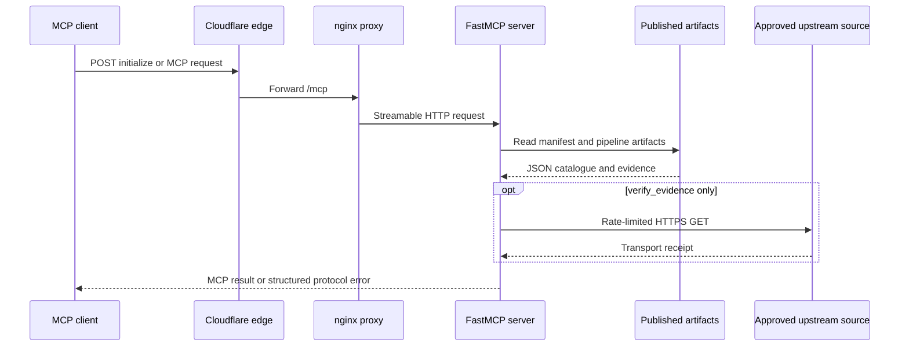

# Read-only MCP server and agent integration

DataPulse MY provides a public, no-auth **Model Context Protocol (MCP)** server for
agents that need to discover and assess Malaysian public datasets. The canonical
website is https://www.data-pulse.my. The canonical MCP endpoint is
`https://mcp.data-pulse.my/mcp`; it accepts MCP **Streamable HTTP** requests over
`POST` and does not require an API key. The endpoint is an agent integration
surface, not a replacement for an upstream data publisher or for the buyer API.

The generated [`mcp.json`](../mcp.json) advertisement is the contract source for
this page: it currently declares **16 read-only tools**. The count is deliberately
derived from that file rather than from an older deployment note or a hard-coded
marketing number. All advertised operations are read-only and idempotent, have no
destructive side effects, and may consult the open world of published and upstream
URLs. Upstream sources remain authoritative for substantive data; MCP reports
catalogue metadata, health and pipeline evidence, and does not guarantee that an
upstream source or the MCP service will always be available.

## Runtime boundary and request flow



This shows the important boundary: ordinary tools and resources read published
artifacts, while `verify_evidence` is an explicitly ephemeral transport check. It
must not be confused with the health pipeline and it never updates `health/latest.json`
or any other health artifact.

At deployment, public traffic follows Cloudflare edge → cloudflared tunnel →
nginx on `127.0.0.1:8443` → the MCP process on `127.0.0.1:8788`. nginx enforces
the approved Origin policy and rate limit; bypassing nginx is unsupported. The
service is intentionally single-region on one VPS, so reachability is an
operational property rather than a promise of availability.

## Published inputs and lifecycle

The server is stateless with respect to the catalogue. It fetches the published
artifacts from `DATA_BASE` (by default `https://www.data-pulse.my`):

- `datapulse.json` — the manifest and canonical dataset IDs, names, URLs,
  stewards, sources, licences, and related metadata.
- `health/latest.json` — the latest pipeline health snapshot used to merge status,
  freshness and evidence fields into dataset responses.
- `health/trends.json` — published freshness trends and publish-reliability
  evidence; reliability means timeliness of successful freshness observations,
  not service uptime.
- `health/drift.json` — published structural and record-count drift decisions.
- `health/reconciliation.json` — conservative cross-source comparison groups.
- The latest attestation index, chain head, and trust scores under
  `attestations/latest/` — inputs for published trust facts and attestation
  verification.

Manifest and health reads are fetched together where a tool needs both. Requests
use `httpx.AsyncClient`, a 30-second timeout, and parallel `asyncio.gather` where
appropriate. Published trend, drift, reconciliation, and attestation documents
are schema-checked; a missing deployment artifact is reported as unavailable rather
than silently replaced. The server does not write to DataPulse MY, data.gov.my,
BNM, DOSM, or any other upstream.

## Tools: the read-only contract

Every tool carries the same four MCP annotations: `readOnlyHint: true`,
`destructiveHint: false`, `idempotentHint: true`, and `openWorldHint: true`.
Tool metadata also identifies DataPulse MY, the publisher website, repository,
version, and manifest-derived dataset count. The complete current surface is:

| Tool | Purpose and important behavior |
| --- | --- |
| `search_datasets(query, licence?, source?, limit?)` | Ranks manifest matches. Title matches are weighted above term matches; exact and substring title matches receive additional weighting. Licence aliases are canonicalized, source filtering is case-insensitive, and `limit` is 1–50. The current manifest has no description field, so search scoring is title-based. |
| `get_dataset(dataset_id)` | Merges one exact manifest entry with its latest health record, including status, `last_verified`, schema version, content freshness and freshness-signal source. A dataset missing from the snapshot is returned as `unknown`, not treated as healthy. |
| `find_stale(max_age_hours?)` | Finds aging, stale, degraded, missing-health, or over-age snapshot records. |
| `find_anomalies(limit?, mode?, min_reliability?)` | Returns pipeline-flagged anomalies ranked by excess update interval, with optional detection-mode and reliability filtering. |
| `find_deteriorating(limit?, min_anomaly_rate?)` | Returns published deteriorating freshness trends ranked by staleness slope. |
| `find_recovering(limit?)` | Returns published recovering trends, fastest reductions first. |
| `find_unreliable(limit?, at_or_below_grade?)` | Returns evaluated reliability grades at or below a threshold, with sample depth and on-time evidence. It measures publishing timeliness, not uptime. |
| `find_schema_drift(limit?, min_change_count?)` | Returns published structural or record-count drift, ranking structural changes first rather than inferring drift from freshness. |
| `check_reconciliation(dataset_name)` | Resolves an ID or dataset name and returns its published comparison group. A discrepancy calls for human review; it does not prove either source is wrong. A dataset without a group is reported as `single_source`. |
| `get_provenance(dataset_ids[])` | Returns citation-ready steward, source, licence, licence URL, URL, access method, verification time, schema version, and compact pipeline evidence for 1–50 IDs. |
| `get_evidence(dataset_id)` | Returns the complete published evidence receipt without MCP-side recomputation: probe time, transport, access dependency, freshness, content shape, record-count and anomaly fields. |
| `verify_evidence(dataset_id)` | Performs a rate-limited streamed GET only for an approved HTTPS direct-access source. It compares transport receipts with published evidence and returns a verdict, but content dates, row counts and shape fingerprints remain explicitly unverified. Results are ephemeral and never update health artifacts. |
| `trust_verdict(dataset_id)` | Joins published attestation facts, unsigned methodology-versioned score components, health, trend, drift and reconciliation evidence. It does not re-probe or verify a signature. |
| `verify_attestation(reference, replay_chain?)` | Performs L1 Ed25519 signature/key/time/chain-link checks; optional L2 replays daily heads to a Git-tag anchor. L3 is deliberately delegated to `verify_evidence`. |
| `find_by_licence(licence)` | Canonicalizes supported aliases and returns a licence, count, and dataset summaries. |
| `usage_summary(buyer_id, since, until)` | Reads the local sanitized audit ledger for an inclusive ISO date range and summarizes calls by tool, dataset, and trust-score bucket. This is reporting over local records, not buyer authentication or a buyer-data API. |

### Typed inputs, annotations, and errors

The generated schemas use Pydantic `Field`/`Annotated` types rather than untyped
`dict[str, Any]` inputs. They declare requiredness, bounds, descriptions and
examples: IDs and queries are non-empty strings; list and integer limits are
bounded; dates must be `YYYY-MM-DD`; and optional filters have explicit defaults.
Clients should use `mcp.json` or `tools/list` as the wire-level schema rather than
assuming every tool has the same arguments.

Handlers are registered through FastMCP decorators or `FunctionTool` wrappers,
which keeps each handler isolated and makes annotations visible in discovery.
Invalid IDs, ambiguous names, invalid date ranges, unsupported thresholds, unsafe
verification URLs, and unavailable artifacts fail explicitly. FastMCP exposes
these failures as protocol errors; successful results use structured objects or
arrays with named fields, never a string pretending to be an error. The server
also sanitizes logged arguments, redacts credential-shaped keys, and persists only
small usage summaries; no secret is sent to a network destination.

## Resources

Resources provide read-only context and do not mutate catalogue state. The server
currently exposes eight concrete resources and one template:

- `datapulse://index` — lightweight per-dataset ID, status, title, source, licence,
  and namespace; useful as the first catalogue read.
- `datapulse://anomalies` — current anomaly results with pipeline evidence.
- `datapulse://trends` — complete published freshness-trend and reliability artifact.
- `datapulse://reliability` — counts by evaluated reliability grade (timeliness,
  not uptime).
- `datapulse://drift` — complete published schema and record-count drift artifact.
- `datapulse://reconciliation` — complete published cross-source groups.
- `datapulse://attestations` — latest signed-attestation index and chain head.
- `datapulse://licences` — live licence-to-dataset counts.
- `datapulse://{dataset_id}` — on-demand exact manifest entry for a dataset ID.

Resource reads are JSON and are public-cacheable for five minutes. An unknown
resource dataset ID is an explicit error. Resource artifacts are views of
published pipeline output; they are not a second source of truth for substantive
data.

## `verify_evidence` is not a health update

Use `get_evidence` when the question is “what did the canonical pipeline publish?”
Use `verify_evidence` when the question is “what transport receipt can the MCP
process observe now?” The latter is deliberately constrained:

1. The dataset must exist and not be browser-dependent.
2. The URL must be HTTPS, use the default port, contain no credentials, and belong
   to the reviewed source-host allowlist.
3. Requests are serialized behind a process-local lock and cached for ten minutes.
4. Results can be `match`, `mismatch`, or `unreachable`, and include comparable
   request URL, HTTP status, Last-Modified and content-length receipts.
5. The method does not calculate canonical content dates, row counts, or shape
   fingerprints, and never writes or updates health.

Therefore published artifacts remain authoritative for pipeline evidence. A live
transport mismatch is a prompt to investigate, not permission to overwrite the
pipeline result or to claim that upstream substantive data is false.

## Run locally and test

Python 3.11+ and `uv` are recommended:

```bash
uv run --with fastmcp,httpx python mcp/server.py
```

The default local endpoint is `http://127.0.0.1:8788/mcp`. Set `DATA_BASE` to a
published-artifact base URL, or set `MCP_HOST` and `MCP_PORT` to change binding.
The local process uses the same `mcp/server.py` entrypoint and `mcp.run(transport="http", ...)` boundary as deployment.

Focused tests use FastMCP’s in-memory `Client`; they exercise discovery and
resource counts, protocol/cache hints, exact schemas and annotations, live-artifact
matching, merge behavior, drift and reconciliation filtering, signed-attestation
success/tamper cases, and the join-only behavior of `trust_verdict`. Fixtures
redirect catalogue loads to repository artifacts and isolate usage output in a
temporary directory, while live-data fixtures check published documents. Run:

```bash
uv run --with fastmcp,httpx pytest mcp/tests/ -v
```

The suite also checks that the generated `mcp.json` tool set and wire annotations
match the implementation. A new tool must have a typed schema, all four
annotations, and an in-memory integration test; regenerate the catalogue with
`python scripts/gen_mcp_reference.py` rather than hand-editing `mcp.json`.

## Deployment, registry publication, and verification

The registry advertisement in [`server.json`](../server.json) publishes the
server name `io.github.r3dz4r/datapulse-my`, its version, Streamable HTTP remote,
and endpoint. `.github/workflows/publish-mcp.yml` runs on version tags, published
releases, or manual dispatch. It authenticates to the MCP Registry with GitHub
OIDC, skips an already-published version, and publishes with `mcp-publisher`.
That is registry publication; it is not evidence that the running VPS or public
endpoint is healthy.

For the running deployment, use the protocol-valid sequence in
[`docs/mcp-deploy.md`](../docs/mcp-deploy.md): initialize a session, send
`notifications/initialized`, then call `tools/list`. A bare `tools/list` returns
HTTP 400 by design because FastMCP requires initialization. Confirm the endpoint
is `https://mcp.data-pulse.my/mcp`, inspect the `Mcp-Session-Id`, and verify that
all 16 tools carry the four read-only annotations. A separate live check reads
`datapulse://index` and compares its length with `jq '.datasets | length' datapulse.json`;
this catches a stale MCP deployment without confusing catalogue size with API
availability.

Release builds stamp source SHA/date markers into the server and `mcp.json`.
`scripts/sync_mcp_deployment.sh` copies a frozen release source atomically, restarts
the lingering `datapulse-mcp.service` only when it changes, and verifies the live
handshake and annotations. `python3 scripts/verify_mcp_deployment.py` independently
compares the deployed source SHA with the repository HEAD (exit 1 means mismatch,
exit 2 means unreachable). The health pipeline’s `mcp-sync` stage is non-fatal:
a sync failure is recorded and does not stop health publication. This separation
keeps deployment evidence, published health evidence, and any buyer-side API
policy from being conflated.

Useful operations commands are:

```bash
systemctl --user status datapulse-mcp.service
systemctl --user restart datapulse-mcp.service
journalctl --user -u datapulse-mcp.service -n 100 --no-pager
systemctl is-active nginx
```

The public service intentionally has no per-user authentication or write path.
If a buyer needs authentication, quotas, or policy enforcement, that belongs in
the buyer’s own stack; the public MCP contract remains no-auth and read-only.

## Canonical facts

- Canonical website: https://www.data-pulse.my
- Datasets: 389 datasets
- MCP server: 16 read-only tools
