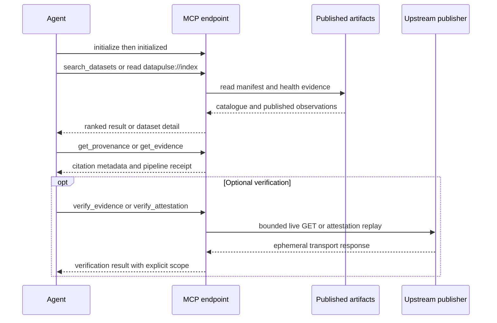

# Read-Only MCP Discovery and Evidence Surface

DataPulse MY publishes a **read-only Model Context Protocol (MCP) server** for agent-facing discovery and evidence review. The canonical origin is **https://www.data-pulse.my**; the public MCP endpoint is exactly **https://mcp.data-pulse.my/mcp**. The current catalogue contains **389 datasets**, and the advertisement currently defines **16 read-only tools**.

MCP is a context and evidence surface, not a replacement for the publisher. It does not write to the catalogue or upstream systems, and it does not certify semantic correctness, availability, reputation, or suitability for a particular use. The upstream source named by each dataset remains authoritative for the substantive data. DataPulse evidence describes what its publication pipeline observed and published.

## Discovery and request flow

Use the machine-readable documents as the contract of record rather than copying an older prose inventory:

- [`mcp.json`](../mcp.json) advertises the server, endpoint, transport, authentication posture, tools, resources, and schemas.
- [`llms.txt`](../llms.txt) provides agent-oriented discovery guidance and the same current tool inventory.
- [`config/public-surfaces.json`](../config/public-surfaces.json) declares the canonical website, MCP origin, and Pages-served artifacts.
- [`README.md`](../README.md) gives client configuration examples.

The endpoint uses **Streamable HTTP**, accepts **POST** requests, and requires no authentication. A client should perform the MCP handshake, retain the returned session identifier, send `notifications/initialized`, and then call tools or read resources. A bare `tools/list` request is expected to fail with HTTP 400 because FastMCP requires an initialized session.



*The flow separates published pipeline evidence from optional live transport or cryptographic verification; neither changes the upstream record.*

## Current tools

The following list is enumerated from `mcp.json` in its advertised order. All 16 tools are annotated read-only, non-destructive, idempotent, and open-world.

| Tool | Agent responsibility and important limits |
| --- | --- |
| `search_datasets` | Search natural-language terms, optionally filter by case-insensitive source substring and licence, and return ranked `{id, title, source, licence, status, score}` matches. `query` is required; `limit` is 1–50 and defaults to 10. Ranking is catalogue search, not a quality or trust ranking. |
| `get_dataset` | Retrieve one canonical dataset's manifest detail merged with its latest health record, including `last_verified`, `content_freshness_date`, and `freshness_signal_source`. Use it to distinguish a missing freshness signal from evidence of staleness. |
| `find_stale` | Find datasets with `aging`, `stale`, or `degraded` status, datasets absent from the latest health snapshot, or snapshots older than the requested `max_age_hours` (default 24). It is a risk filter, not a claim that the upstream data is wrong. |
| `find_anomalies` | Return pipeline-published anomaly detections ranked by excess update interval, with optional detection mode, result limit 1–200, and minimum publish-reliability grade. Do not recompute the pipeline result from freshness alone. |
| `find_deteriorating` | Return published worsening freshness trends ranked by staleness slope, optionally requiring a minimum anomaly-evaluable history rate. |
| `find_recovering` | Return published improving freshness trends, ranked by staleness reduction. |
| `find_unreliable` | Filter published publish-reliability grades at or below a threshold. Reliability measures timeliness of successful freshness observations, not uptime; sample depth matters. |
| `find_schema_drift` | Return published structural or record-count drift evidence, optionally requiring a minimum number of structural transitions. Freshness does not imply schema stability. |
| `check_reconciliation` | Retrieve a published cross-source reconciliation group by dataset name or ID. Differences, counts, dates, statuses, and tolerances require human review; a discrepancy does not prove either source is wrong. |
| `get_provenance` | Return citation-ready steward, source, licence and URL metadata plus compact pipeline evidence for 1–50 dataset IDs. |
| `get_evidence` | Return the complete pipeline-published receipt for one dataset: probe time, transport, access dependency, freshness, record-count, shape, tolerance, status, and anomaly fields. Values are presented without MCP-side recomputation. |
| `verify_evidence` | Perform a rate-limited live streamed GET for one direct-access dataset and compare transport receipts with the latest published receipt. It does not verify content dates, row counts, or shape fingerprints; it never updates health artifacts, and its result is ephemeral. Browser-dependent and unsafe URLs are refused. |
| `trust_verdict` | Aggregate published attestation facts, an unsigned methodology-versioned score, component availability, and existing health/trend/drift/reconciliation evidence. It does not re-probe or verify signatures. |
| `verify_attestation` | Verify a published Ed25519 probe attestation. Level 1 checks signature/key validity; optional Level 2 replays daily heads to a Git-tag anchor. This is cryptographic/pipeline verification, not validation of the upstream data's meaning. |
| `find_by_licence` | Enumerate datasets under a canonical licence, accepting supported aliases such as `CC BY 4.0` and `OGL`; use it before making a reuse or attribution decision. |
| `usage_summary` | Aggregate the read-only usage ledger for a buyer and inclusive ISO date range into totals by tool, dataset, and cited-status distribution. It is an operational usage view, not a dataset reputation score. |

## Resources and resource template

`mcp.json` currently advertises eight concrete JSON resources:

- `datapulse://index` — lightweight list of all dataset IDs with status, title, source, licence, and namespace; read this first for broad discovery.
- `datapulse://anomalies` — latest pipeline-published anomaly results.
- `datapulse://trends` — freshness trends and publish-reliability evidence.
- `datapulse://reliability` — counts by evaluated reliability grade; timeliness, not uptime.
- `datapulse://drift` — structural and record-count drift evidence.
- `datapulse://reconciliation` — cross-source reconciliation evidence for review.
- `datapulse://attestations` — latest signed probe-attestation index and daily chain head.
- `datapulse://licences` — dataset counts grouped by licence.

The one resource template, `datapulse://{dataset_id}`, returns the full published manifest entry for one exact dataset ID. Resources are read-only snapshots or derived views; they do not turn DataPulse into the source of the underlying data.

## Safe agent workflow

For a normal research request, use this order:

1. **Search or enumerate:** call `search_datasets` with the topic and, where relevant, a source and licence filter; use `datapulse://index` when a lightweight catalogue is enough.
2. **Resolve the dataset:** call `get_dataset` for the canonical ID and inspect source, URL, licence, status, verification time, and freshness signal.
3. **Establish citation context:** call `get_provenance` for one or several IDs, or `get_evidence` for the full receipt. Cite the upstream source for substantive values and the DataPulse receipt for the observation about access, freshness, shape, or status.
4. **Assess risk:** use `find_stale`, anomaly/trend/reliability tools, drift, or reconciliation resources as applicable. Treat `unknown`, `unknown-freshness`, `unreachable`, `browser-dependent`, `reference`, and missing evidence as limitations requiring caution, not as proof of failure or quality.
5. **Optionally verify:** use `verify_evidence` only when a current direct-access transport check is useful, and label it as live, rate-limited, and ephemeral. Use `verify_attestation` when a signed receipt or chain anchor matters; use `trust_verdict` as an aggregation, not as signature verification.
6. **Apply the licence:** use `find_by_licence` or the dataset's licence URL, then read the upstream terms and attribution requirements. A catalogue label is not legal advice.

A published `fresh` result is evidence about the pipeline's observation, not a universal guarantee that the publisher's data is current at the moment of use. Conversely, `stale` or `unknown-freshness` should change the agent's wording and prompt a source-level review; it should not be silently converted into a claim about substantive accuracy.

## Publication, deployment, and operations

The Cloudflare Pages workflow validates health input, runs the release generation profile for non-health changes, assembles the static site with `mcp.json`, `llms.txt`, the manifest, health, trend, drift, reconciliation, and attestation artifacts, and smoke-tests the canonical served surfaces. Health-only deployments preserve the served release proof and attestation plane rather than replacing it with an unbound or inconsistent set of bytes. Thus the MCP can expose the latest published pipeline plane, but publication timing and deployment availability remain operational concerns.

The MCP service is separately operated as the `datapulse-mcp.service` user unit behind the tunnel/edge and nginx. Checked-in deployment guidance describes Cloudflare edge → tunnel → nginx loopback TLS → MCP on `127.0.0.1:8788`; nginx applies origin, body-size, timeout, and rate-limit controls. The public endpoint is intentionally unauthenticated, while the separate buyer API has its own authentication and is not the MCP contract.

For a source or deployment change, use the focused integration tests in `mcp/tests/` and the source/deployment checks described by the repository. The local server can be run with:

```bash
uv run --with fastmcp,httpx python mcp/server.py
```

The default local endpoint is `http://127.0.0.1:8788/mcp`; `DATA_BASE`, `MCP_HOST`, and `MCP_PORT` can override the published base URL and bind settings. The public server fetches published JSON artifacts and has a 30-second request timeout. A live endpoint check must initialize a session before listing tools, retain `Mcp-Session-Id`, and should treat a failed live check as an availability result—not as evidence that the catalogue or upstream source has changed.

## Canonical facts

- Canonical website: https://www.data-pulse.my
- Datasets: 389 datasets
- MCP server: 16 read-only tools
