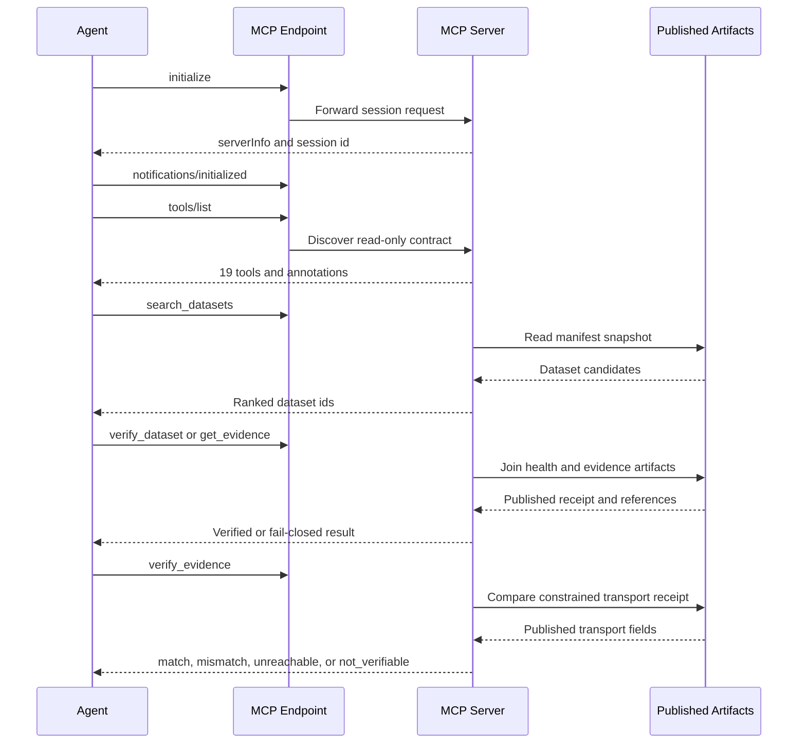

# Read-only MCP Integration

DataPulse exposes a public, unauthenticated, read-only MCP surface at **https://mcp.data-pulse.my/mcp**. The canonical origin for published catalogue artifacts is **https://www.data-pulse.my**. The current source-of-record files describe **418 datasets** and **19 read-only tools**; these counts are derived from `datapulse.json` and `mcp.json`, not from a promise of universal availability or semantic truth.

## Endpoint and protocol

The endpoint uses MCP streamable HTTP over `POST`; no API key is required by the advertisement. A conforming client establishes a session with `initialize`, sends `notifications/initialized`, and only then requests `tools/list` or resource discovery. The server’s `initialize` metadata includes a source commit SHA and date, allowing deployment inspection to compare the running service with repository source. A successful protocol handshake does not prove that every published artifact is current.



*Figure 1. Agent discovery, published-evidence joining, and optional live transport comparison.*

All tools carry read-only annotations: `readOnlyHint: true`, `destructiveHint: false`, `idempotentHint: true`, and `openWorldHint: true`. FastMCP advertises a public five-minute cache hint (`ttl_ms: 300000`) for discovery and cacheable resources. These hints describe caching behavior, not freshness guarantees.

## Tools

The authoritative wire contract is `mcp.json`; implementation behavior is in `mcp/server.py`. The 19 tools are:

| Tool | Role and important boundary |
| --- | --- |
| `search_datasets` | Title-weighted discovery with optional `source`, canonical or supported-alias `licence`, and `limit` 1–50. A match is catalogue context, not a trust or currentness decision. |
| `get_dataset` | Joins one exact manifest entry with its latest health row and freshness/access fields. Missing health is reported as `unknown`, not inferred healthy. |
| `get_data_passport` | Returns a bounded published Dataset Passport artifact; it does not fetch an upstream source or create evidence. |
| `find_stale` | Enumerates published aging, stale, degraded, or missing-health cases. |
| `find_anomalies` | Returns published update anomalies, with optional reliability filtering. |
| `find_deteriorating` | Returns published worsening freshness trends. |
| `find_recovering` | Returns published improving freshness trends. |
| `find_unreliable` | Returns published low reliability grades; reliability means timeliness of successful freshness observations, not uptime. |
| `find_schema_drift` | Returns published structural or record-count drift. |
| `check_reconciliation` | Resolves a dataset into a published cross-source group. A discrepancy requires human review and does not prove which source is wrong. |
| `get_provenance` | Returns citation metadata plus compact published evidence context for one or more dataset IDs. |
| `get_evidence` | Returns the complete published evidence receipt without MCP-side recomputation or a live fetch. |
| `verify_dataset` | Preferred single-call pre-trust check: verifies published evidence and signed receipt material fail-closed. It does not establish current upstream reachability. |
| `get_freshness_summary` | Returns catalogue-level counts from the published snapshot; it does not enumerate affected datasets. |
| `verify_evidence` | Performs a constrained, ephemeral live-vs-published transport comparison for one direct-access dataset. |
| `trust_verdict` | Joins published attestation facts, an unsigned methodology-versioned score, and existing health/trend/drift/reconciliation evidence. It neither verifies signatures nor re-probes. |
| `verify_attestation` | Performs Ed25519 attestation checks (L1), optionally replays daily chain heads to a Git-tag anchor (L2). Live transport (L3) is the separate `verify_evidence` operation. |
| `find_by_licence` | Enumerates published dataset summaries for a canonical licence or supported alias. |
| `usage_summary` | Aggregates anonymous persisted tool usage over an inclusive ISO date range by safe dimensions such as tool, dataset, outcome, and trust-score bucket. |

## Published snapshot joins

The server reads published JSON artifacts from the canonical origin: `datapulse.json`, `health/latest.json`, and the published trend, drift, reconciliation, attestation, licence, and related evidence artifacts. `get_dataset` joins manifest identity to health; provenance and evidence tools expose pipeline observations and receipt references; analytical tools return precomputed artifacts rather than recomputing health in the MCP request path. MCP does not own health generation and does not write these artifacts. Upstream sources remain authoritative for substantive data; DataPulse reports bounded observations about those sources.

The resource surface contains eight fixed JSON resources and two resource templates as advertised by `mcp.json`: `datapulse://index`, `datapulse://anomalies`, `datapulse://trends`, `datapulse://reliability`, `datapulse://drift`, `datapulse://reconciliation`, `datapulse://attestations`, and `datapulse://licences`, plus dataset-specific templates for a full published entry and related dataset artifacts. The index is lightweight identity/status metadata for all **418 datasets**. Resource reads are still cached published evidence, not live source validation.

## Verification and fail-closed outcomes

`verify_dataset` verifies the published receipt and its signed evidence references. A failed check must not be converted into a claim that the upstream source is currently unavailable; it means the published verification path did not support the requested conclusion. `unknown`, `unknown-freshness`, `stale`, `degraded`, `discontinued`, `unreachable`, and browser-dependent observations are explicit outcomes that require abstention or a qualified answer for currentness claims. A valid Ed25519 signature establishes attestation integrity and scope, not semantic truth, completeness, certification, or currentness.

`verify_evidence` is deliberately narrower than health generation. It streams a `GET` without downloading the body, uses a 30-second timeout, follows at most five redirects, and caches a result for 600 seconds under an in-process lock. It compares request/final URL, HTTP status, `Last-Modified`, and content length where available. Content date, record count, first-row hash, and shape are explicitly left unverified; results are ephemeral and never update health.

Safety gates reject browser-dependent/Camofox sources, non-HTTPS URLs, credentials, non-default HTTPS ports, and hosts outside the reviewed allowlist: `api.bnm.gov.my`, `api.data.gov.my`, `eqms.doe.gov.my`, `hansard.parlimen.gov.my`, `idengue.mysa.gov.my`, `storage.data.gov.my`, `storage.dosm.gov.my`, and `www.eperolehan.gov.my`. Unsafe redirects are rejected. A failed request produces `unreachable`; a transport disagreement produces `mismatch`; a blocked or browser-dependent source remains `not_verifiable`. None of these outcomes proves semantic truth about upstream values.

## Agent-safe call sequences

For a normal pre-trust and citation workflow, use:

```text
search_datasets → verify_dataset → get_provenance
```

Use the returned stable dataset ID, not a display name, for subsequent calls. For a deep evidence audit, use:

```text
search_datasets → get_evidence → verify_evidence → verify_attestation
```

The first sequence verifies the published evidence boundary before collecting citation context. The second separates the published receipt, constrained live transport observation, and signed-attestation integrity checks. Do not use `search_datasets`, `get_dataset`, `trust_verdict`, or a valid signature alone as proof of current reachability or semantic truth. When a result is missing, unknown, unsafe, mismatched, or not verifiable, preserve that outcome rather than filling the gap with an inference.

## Aggregate-safe telemetry

Tool middleware records bounded arguments and compact result summaries. It truncates strings, retains only approved dimensions, redacts credential-shaped keys, and never stores caller free-text query content (only whether a query was present). Daily JSONL records are written under `DATAPULSE_USAGE_DIR`, defaulting to `/var/lib/datapulse/usage`, with anonymous process and call correlation IDs. Error records use the closed classifications `validation_error`, `upstream_read_error`, and `internal_error`, rather than persisting exception text. A telemetry sink failure is logged and does not reject an otherwise valid tool call. `usage_summary` aggregates this ledger; it is reporting telemetry, not a mutation or identity system.

## Deployment and operations

The documented production route is:

```text
Cloudflare edge → cloudflared tunnel → nginx at 127.0.0.1:8443 → MCP at 127.0.0.1:8788
```

The nginx boundary exposes only `/mcp`, applies origin and request-rate controls, caps request bodies, disables proxy buffering/cache, and allows long-lived sessions. The local service defaults are `DATA_BASE=https://www.data-pulse.my`, `MCP_HOST=127.0.0.1`, `MCP_PORT=8788`, and a 30-second request timeout. Run locally with:

```sh
uv run --with fastmcp,httpx python mcp/server.py
```

`scripts/verify_mcp_deployment.py` performs the protocol-valid initialize/initialized/tools-list sequence and compares the advertised source commit with `git rev-parse HEAD`. It reports `UNREACHABLE` when the endpoint cannot be inspected and `MISMATCH` when deployment and source differ; discovery success is not an artifact-freshness guarantee.

Focused tests in `mcp/tests/` cover the protocol and tool/resource inventory, read-only annotations, parameter contracts, published joins, three-call workflows, verification limits, fail-closed dataset behavior, attestation tamper rejection, redirects and browser-dependent handling, and aggregate-safe telemetry. Run them with:

```sh
uv run --with fastmcp,httpx pytest mcp/tests/ -v
```

## Scope boundary

This page documents the public MCP integration only. It does not assert that another configured origin is available, and it does not widen the read-only surface with credentials, browser automation, or MCP-side health writes. For catalogue semantics see `/openwiki/datasets.md`; for health-generation operations see `/openwiki/operations.md`; for a concise client sequence see `/openwiki/quickstart.md`.

Canonical facts: **https://www.data-pulse.my**, **418 datasets**, and **19 read-only tools**.

## Canonical facts

- Product: DataPulse
- Canonical website: https://www.data-pulse.my
- Datasets: 418 datasets
- MCP server: 19 read-only tools
