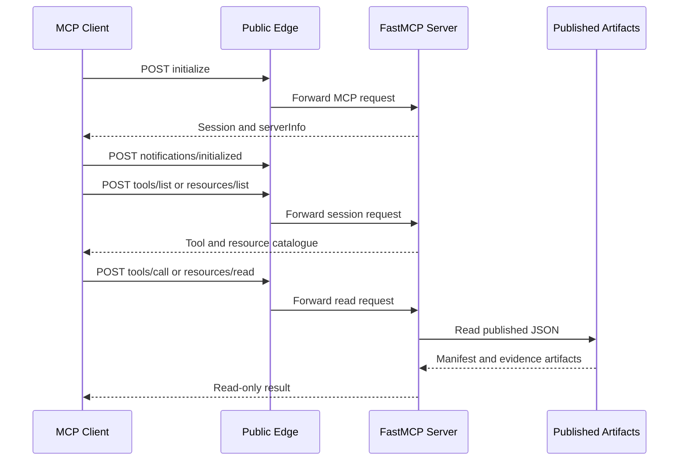
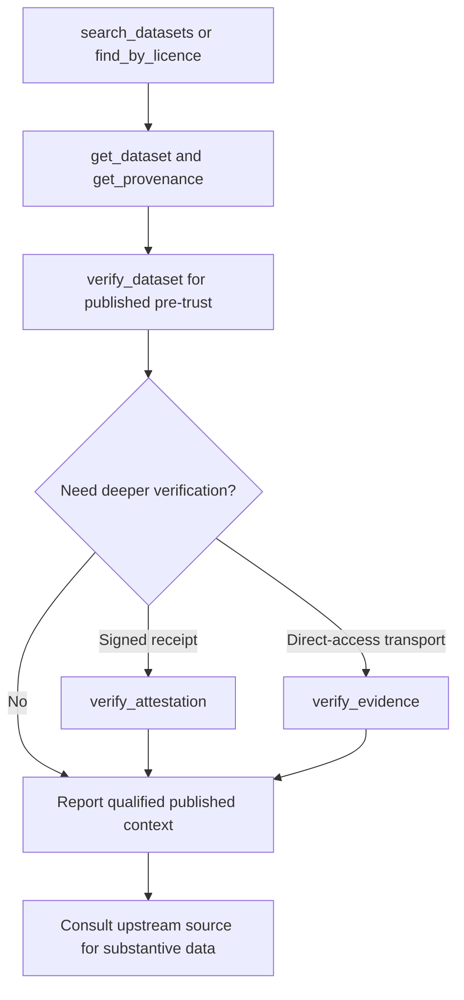

# Read-Only MCP Surface and Agent Workflows

DataPulse exposes a public MCP integration for the Malaysian public dataset catalogue. The canonical website origin is **https://www.data-pulse.my** and the MCP endpoint is **https://mcp.data-pulse.my/mcp**. The endpoint uses MCP streamable HTTP over `POST` and does not require authentication. It is an artifact-backed read surface: it reads the published catalogue and derived evidence, but it does not write catalogue or health artifacts and does not replace the upstream publisher as the authority for substantive data.

`mcp.json` is the MCP catalogue source of record for the wire advertisement, tool names, schemas, endpoint, resources, and annotations. `mcp/server.py` and the checked-in tests are the implementation and boundary evidence. The advertisement currently describes 418 datasets and **19 read-only tools**.

## Session, discovery, and read flow

A client must establish an MCP session before discovery. The normal order is `initialize`, `notifications/initialized`, then `tools/list` or resource discovery. A discovery request made before initialization is rejected by FastMCP. The initialization response exposes the server version and source markers (`source_commit_sha` and `source_commit_date`), which are useful for deployment synchronization but do not prove that every published artifact is current.



*Figure 1. Protocol-valid session initialization, discovery, and artifact-backed reading.*

All 19 tools advertise `readOnlyHint: true`, `destructiveHint: false`, `idempotentHint: true`, and `openWorldHint: true`. Discovery and cacheable resource responses carry a public five-minute cache hint (`ttl_ms: 300000`). Clients should pace requests and handle transient unavailability or edge rate limiting; successful discovery is not an availability guarantee.

## The 19 read-only tools

The following is the complete live tool set from `mcp.json`:

| Tool | Role |
| --- | --- |
| `search_datasets` | Discovery by natural-language title query, with optional source and licence filters and a limit from 1 to 50. It ranks title matches; use returned IDs for subsequent calls. |
| `get_dataset` | Fetches one exact dataset’s published manifest detail, latest health context, freshness signal, access dependency, and verification time. Missing health is reported as unknown rather than inferred healthy. |
| `get_data_passport` | Returns the bounded published Dataset Passport v1 for one canonical ID. It describes observed metadata and evidence availability, not semantic truth, completeness, certification, legal permission, or safety. |
| `find_stale` | Enumerates published aging, stale, or degraded datasets, including missing health rows and over-age snapshots. |
| `find_anomalies` | Returns published update anomalies, optionally filtered by detection mode or minimum reliability grade. |
| `find_deteriorating` | Returns published worsening freshness trends, optionally filtered by minimum anomaly rate. |
| `find_recovering` | Returns published improving freshness trends. |
| `find_unreliable` | Returns datasets at or below a published reliability threshold. Reliability means timeliness of successful freshness observations, not uptime. |
| `find_schema_drift` | Returns published structural or record-count drift, optionally requiring a minimum number of structural transitions. |
| `check_reconciliation` | Resolves an ID or exact name to a published cross-source group. A discrepancy requires human review; it does not prove which source is wrong. |
| `get_provenance` | Returns citation-oriented source, steward, licence/attribution, URL, observation, status, and compact evidence context for 1–418 dataset IDs. |
| `get_evidence` | Returns the complete published evidence receipt for one dataset without recomputing it in MCP. |
| `verify_dataset` | Performs a published-artifact pre-trust check, including fail-closed signed receipt verification and evidence references. It is not a live upstream probe. |
| `get_freshness_summary` | Returns catalogue-level published counts for fresh, aging, stale, and reference states plus the latest health-check time. |
| `verify_evidence` | Performs a constrained, rate-limited live transport comparison for one direct-access dataset and returns `match`, `mismatch`, `unreachable`, or `not_verifiable`. |
| `trust_verdict` | Joins published attestation facts, the unsigned methodology-versioned trust score, and available health, trend, drift, and reconciliation evidence. It does not re-probe or verify signatures. |
| `verify_attestation` | Verifies a published Ed25519 attestation at L1 and can replay daily chain heads to a Git-tag anchor at L2. L3 live transport checking is the separate `verify_evidence` operation. |
| `find_by_licence` | Enumerates published dataset summaries for a canonical licence or supported alias. |
| `usage_summary` | Aggregates anonymous persisted MCP usage over an inclusive ISO date range by outcome, tool, dataset, and trust-score bucket. |

Tool descriptions distinguish discovery, published evidence, live transport observation, and signature verification. They should be treated as routing guidance, not as a claim that a result certifies an upstream dataset.

## Resources and published-artifact boundary

The server exposes eight fixed JSON resources:

- `datapulse://index` — lightweight ID, status, title, source, licence, and namespace index.
- `datapulse://anomalies` — current published anomaly results.
- `datapulse://trends` — freshness trends and publish-reliability evidence.
- `datapulse://reliability` — counts by publish-reliability grade; reliability is timeliness, not uptime.
- `datapulse://drift` — schema and record-count drift evidence.
- `datapulse://reconciliation` — cross-source reconciliation groups and verdict evidence.
- `datapulse://attestations` — latest attestation index and chain head.
- `datapulse://licences` — licence-to-dataset counts.

There are two resource templates: `datapulse://citation/{dataset_id}` for an evidence-bound citation object, and `datapulse://{dataset_id}` for one full published manifest entry. The implementation reads `datapulse.json`, `health/latest.json`, and the published trend, drift, reconciliation, attestation, and related evidence artifacts. MCP is not the owner of those artifacts and has no write path to them.

## Recommended agent workflow

Use the narrowest operation that answers the question, and keep discovery separate from trust or verification:

1. **Discover:** call `search_datasets` with the user’s topic, then retain the returned canonical dataset ID. Use `find_by_licence` when the starting constraint is a licence rather than a topic.
2. **Inspect published context:** call `get_dataset` for current manifest and health context; call `get_provenance` for citation and attribution; call `get_evidence` for the complete receipt.
3. **Perform a published pre-trust check:** call `verify_dataset`. Treat stale, discontinued, unreachable, degraded, and unknown-freshness states as unable to support an unqualified currentness claim. `trust_verdict` is an aggregation of published evidence, not a certificate.
4. **Verify independently when needed:** call `verify_attestation` for signed-receipt integrity (optionally L2 chain replay). For a direct-access source, call `verify_evidence` for a bounded live transport comparison. These answer different questions and are not interchangeable.
5. **Report with scope:** identify the dataset, source or evidence URL, observed-at or last-checked time, published status/verdict, licence/attribution, and receipt/evidence digest when available. State whether the conclusion is based on a published observation or an ephemeral live transport check. For the actual records and substantive meaning, consult the upstream source and its terms.



*Figure 2. Discovery is followed by scoped evidence review; published and live checks remain distinct.*

## Live verification limits and safety gates

`verify_evidence` is deliberately not a second health pipeline. It performs a streaming `GET` for a direct-access dataset and compares transport receipts with the latest published evidence: request/final URL, HTTP status, `Last-Modified`, and content length where available. It does not download the body or recompute content dates, record counts, or shape fingerprints. The implementation uses a 30-second request timeout, follows at most five redirects, serializes checks behind a process-local lock, and caches results for 600 seconds. Results are ephemeral and never update health artifacts.

The safety policy refuses browser-dependent or Camofox sources, non-HTTPS URLs, credentials, non-default HTTPS ports, hosts outside the reviewed allowlist, and unsafe redirects. A failed request is `unreachable`; a transport mismatch is `mismatch`; a blocked or browser-dependent source is `not_verifiable`. These outcomes describe the check, not the truth or quality of the upstream data.

## Deployment, configuration, and operations

The production request path is:

```text
Cloudflare edge → cloudflared tunnel → nginx at 127.0.0.1:8443 → MCP at 127.0.0.1:8788
```

The tunnel routes the public hostname to nginx. nginx accepts the `/mcp` location, applies origin and request controls, disables proxy buffering and cache, and allows long-lived sessions. The MCP process runs as the enabled user service `datapulse-mcp.service`; deployment details and service commands are in `docs/mcp-deploy.md`. Edge or proxy limits can produce transient failures, so clients should retry responsibly rather than treating an unavailable response as a data verdict.

Run locally with Python 3.11+ and the documented dependencies:

```sh
uv run --with fastmcp,httpx python mcp/server.py
```

Relevant defaults are `DATA_BASE=https://www.data-pulse.my`, `MCP_HOST=127.0.0.1`, `MCP_PORT=8788`, and `REQUEST_TIMEOUT_SECONDS=30`. Tool-call middleware records bounded, credential-redacted arguments, a result summary, and a generic error classification. Anonymous daily JSONL usage records are written under `DATAPULSE_USAGE_DIR`, defaulting to `/var/lib/datapulse/usage`; this is reporting telemetry, not a data mutation path. The ledger does not retain caller identity, credentials, free-form query text, or request/session identifiers.

### Source-to-deployment synchronization

Release builds stamp `SOURCE_COMMIT_SHA` and `SOURCE_COMMIT_DATE` into `mcp/server.py` and the matching fields in `mcp.json`. `scripts/verify_mcp_deployment.py` performs the protocol-valid initialize → initialized → tools-list sequence, reads the deployed `serverInfo.source_commit_sha`, and compares it with `git rev-parse HEAD`. It reports an unreachable endpoint separately from a source mismatch. A matching source marker confirms code synchronization only; it does not establish that every published dataset artifact is fresh.

## Focused tests and change invariants

The MCP tests use FastMCP’s in-memory client and checked-in or live artifacts. They assert the protocol/session contract, exactly 19 tools, eight concrete resources and two resource templates, public cache hints, read-only annotations, parameter contracts, evidence limitations, attestation tamper rejection, drift/reconciliation behavior, and live-artifact matching. Run them with:

```sh
uv run --with fastmcp,httpx pytest mcp/tests/ -v
```

When changing a tool, update `mcp.json`, the implementation, and focused tests together. Preserve the no-write boundary: do not add secrets, credentials, browser-dependent probing, or MCP-side health writes. When changing deployment, verify both protocol discovery and the source marker; when changing published-artifact generation, verify that MCP results still correspond to the canonical catalogue evidence.

## Related pages

- `/openwiki/datasets.md` — catalogue semantics, status taxonomy, and evidence meaning.
- `/openwiki/operations.md` — health-generation and publication operations.
- `/openwiki/quickstart.md` — repository and user-facing setup context.

The MCP surface is a public, unauthenticated, read-only integration. It helps agents discover and qualify published catalogue evidence; upstream sources remain authoritative for the underlying records and substantive claims.

## Canonical facts

- Product: DataPulse
- Canonical website: https://www.data-pulse.my
- Datasets: 418 datasets
- MCP server: 19 read-only tools
