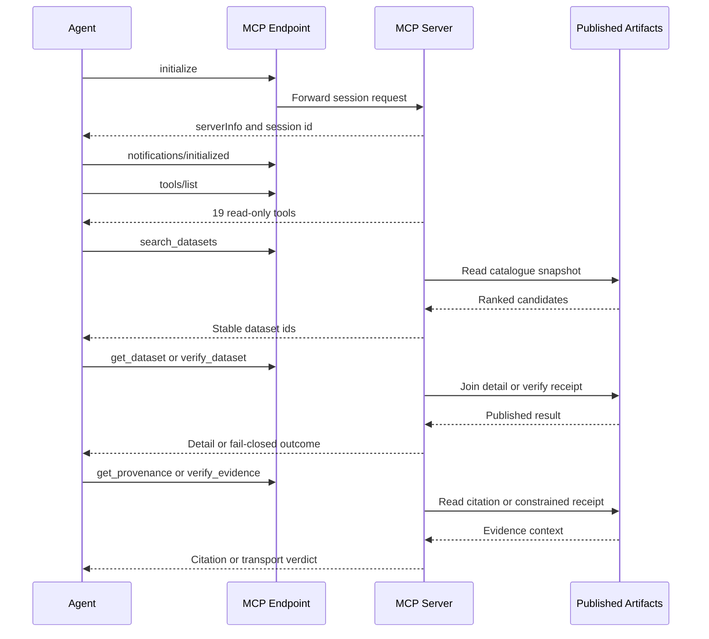
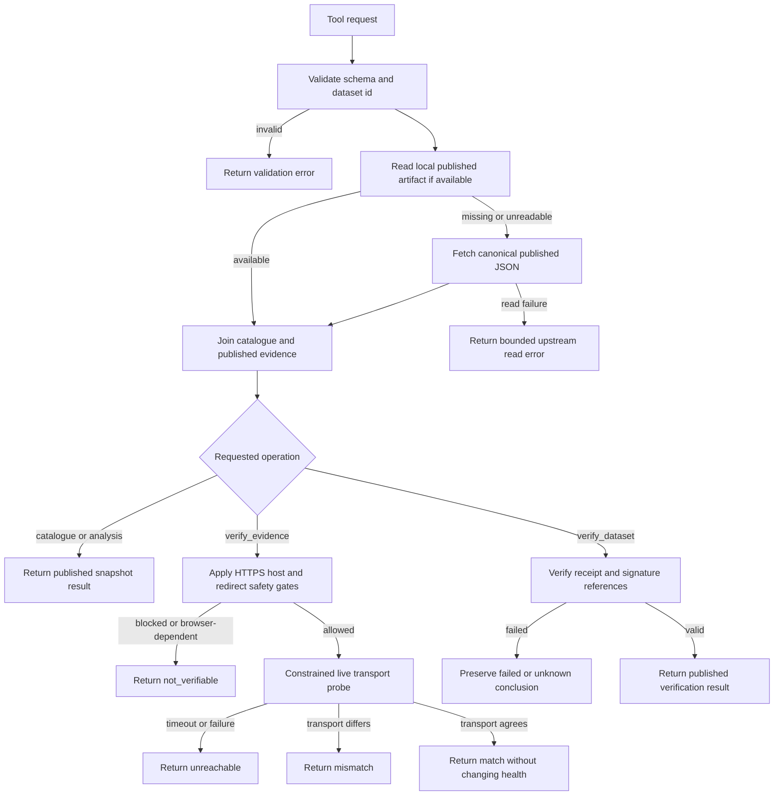

# MCP Server Runtime and Agent Integration

DataPulse publishes a **public, unauthenticated, read-only** MCP surface at **https://mcp.data-pulse.my/mcp**. The canonical website origin for catalogue and published artifacts is **https://www.data-pulse.my**. The live `datapulse.json` catalogue contains **418 datasets**, while the canonical `mcp.json` advertisement defines **19 read-only tools**. These are published-surface counts, not guarantees of availability, semantic truth, or upstream freshness.

## Public contract and session lifecycle

`mcp.json` is the canonical public catalogue: it defines the server identity, endpoint, transport, authentication declaration, taxonomy, tools, schemas, annotations, resources, and templates. `mcp/server.py` is the implementation; deployment and publication checks are separate concerns. The endpoint uses MCP **streamable HTTP** with `POST` and requires no API key. A client should initialize, acknowledge initialization, then discover tools or resources. The initialize metadata carries a source commit and date so an operator can compare the running service with repository source; a successful handshake does not establish artifact freshness.

All advertised tools are annotated `readOnlyHint: true`, `destructiveHint: false`, `idempotentHint: true`, and `openWorldHint: true`. FastMCP also advertises a five-minute cache hint for discovery and cacheable resources. Hints describe intended behavior and caching, not a freshness or availability promise.


```mermaid
sequenceDiagram
    participant Agent
    participant Edge as MCP Endpoint
    participant Server as MCP Server
    participant Artifacts as Published Artifacts
    Agent->>Edge: initialize
    Edge->>Server: Forward session request
    Server-->>Agent: serverInfo and session id
    Agent->>Edge: notifications/initialized
    Agent->>Edge: tools/list
    Server-->>Agent: 19 read-only tools
    Agent->>Edge: search_datasets
    Server->>Artifacts: Read catalogue snapshot
    Artifacts-->>Server: Ranked candidates
    Server-->>Agent: Stable dataset ids
    Agent->>Edge: get_dataset or verify_dataset
    Server->>Artifacts: Join detail or verify receipt
    Artifacts-->>Server: Published result
    Server-->>Agent: Detail or fail-closed outcome
    Agent->>Edge: get_provenance or verify_evidence
    Server->>Artifacts: Read citation or constrained receipt
    Artifacts-->>Server: Evidence context
    Server-->>Agent: Citation or transport verdict
```

*Figure 1. The recommended discovery, dataset-detail, verification, and provenance call flow.*

## Tool taxonomy

Use the stable dataset ID returned by discovery, not a display name. The 19 tools fall into these operational groups:

| Group | Tools | Boundary |
| --- | --- | --- |
| Discovery and detail | `search_datasets`, `get_dataset`, `get_data_passport` | Search ranks catalogue candidates; detail joins manifest and published health; Passport returns a bounded artifact. None alone proves current reachability or semantic truth. |
| Freshness and trend analysis | `find_stale`, `find_anomalies`, `find_deteriorating`, `find_recovering`, `find_unreliable` | Reads published health, anomaly, trend, and reliability observations. Reliability describes timeliness of successful freshness observations, not uptime. |
| Structure and cross-source analysis | `find_schema_drift`, `check_reconciliation` | Reports published structural/record-count drift or cross-source discrepancies. A discrepancy requires review and does not identify which source is wrong. |
| Evidence and trust | `get_provenance`, `get_evidence`, `verify_dataset`, `verify_evidence`, `trust_verdict`, `verify_attestation` | Separates citation context, complete receipt, signed published-evidence verification, constrained live transport comparison, joined trust facts, and Ed25519 attestation checks. These operations do not mutate health. |
| Catalogue and telemetry | `get_freshness_summary`, `find_by_licence`, `usage_summary` | Returns aggregate published counts, licence-filtered summaries, or bounded anonymous usage aggregates; it is not an identity, billing, or mutation system. |

The catalogue also advertises fixed JSON resources such as `datapulse://index`, `datapulse://anomalies`, `datapulse://trends`, `datapulse://reliability`, `datapulse://drift`, `datapulse://reconciliation`, `datapulse://attestations`, and `datapulse://licences`, plus dataset-specific resource templates. These are cached published observations, not live source validation.

## Runtime boundaries and data flow

The server reads published JSON such as `datapulse.json`, `health/latest.json`, and precomputed trend, drift, reconciliation, licence, attestation, and evidence artifacts. It joins catalogue identity to health for detail responses and exposes pipeline-produced observations rather than recomputing health in the request path. Local published artifacts can be used before a remote fallback; the latency tests explicitly protect this colocated-artifact fast path. MCP does not own health generation and does not write the DataPulse data layer. Upstream sources remain authoritative for substantive data.

`get_dataset` reports a missing health row as `unknown`, rather than inferring health. `verify_dataset` validates the published receipt and signed evidence references fail-closed. A valid Ed25519 signature establishes integrity and scope of an attestation, not completeness, certification, semantic truth, or currentness. `trust_verdict` joins existing attestation, score, health, trend, drift, and reconciliation facts; it neither re-probes nor verifies signatures itself.

`verify_evidence` is narrower than health generation: it performs an ephemeral `GET` without downloading the body, uses bounded timeouts, follows at most five redirects, and caches results for 600 seconds under an in-process lock. It compares request/final URL, HTTP status, `Last-Modified`, and content length where available. It does not verify content dates, record counts, first-row hashes, or shape, and never updates health. Browser-dependent sources remain unsupported for this operation.


```mermaid
flowchart TD
    Start[Tool request] --> Validate[Validate schema and dataset id]
    Validate -->|invalid| ValidationError[Return validation error]
    Validate --> Local[Read local published artifact if available]
    Local -->|available| Join[Join catalogue and published evidence]
    Local -->|missing or unreadable| Remote[Fetch canonical published JSON]
    Remote -->|read failure| ReadError[Return bounded upstream read error]
    Remote --> Join
    Join --> Operation{Requested operation}
    Operation -->|catalogue or analysis| Snapshot[Return published snapshot result]
    Operation -->|verify_dataset| Receipt[Verify receipt and signature references]
    Operation -->|verify_evidence| Gate[Apply HTTPS host and redirect safety gates]
    Gate -->|blocked or browser-dependent| NotVerifiable[Return not_verifiable]
    Gate -->|allowed| Probe[Constrained live transport probe]
    Probe -->|timeout or failure| Unreachable[Return unreachable]
    Probe -->|transport differs| Mismatch[Return mismatch]
    Probe -->|transport agrees| Match[Return match without changing health]
    Receipt -->|failed| FailClosed[Preserve failed or unknown conclusion]
    Receipt -->|valid| Verified[Return published verification result]
```

*Figure 2. Published-artifact reads and the fail-closed verification branches.*

## Safety gates, errors, and throttling

Live transport verification rejects browser-dependent/Camofox sources, non-HTTPS URLs, credentials, non-default HTTPS ports, and hosts outside the reviewed allowlist: `api.bnm.gov.my`, `api.data.gov.my`, `eqms.doe.gov.my`, `hansard.parlimen.gov.my`, `idengue.mysa.gov.my`, `storage.data.gov.my`, `storage.dosm.gov.my`, and `www.eperolehan.gov.my`. Unsafe redirects are rejected. Outcomes are explicit: `match`, `mismatch`, `unreachable`, and `not_verifiable`; none proves the upstream values are semantically correct.

Each tool handler has a five-second total upstream budget. Individual upstream timeouts are two seconds for connect, three seconds for read/write, and one second for pool acquisition; chained operations therefore return an explicit “unverified within budget” result instead of allowing a sequence of calls to hold the client indefinitely. The edge applies roughly one request per second with a small burst, as stated in the public tool descriptions. Agents should pace requests and retry transient failures without turning an error or missing result into an inference.

Usage middleware records bounded approved dimensions, truncates values, redacts credential-shaped keys, and stores only query presence rather than free-text query content. Daily JSONL defaults to `/var/lib/datapulse/usage` and can be changed with `DATAPULSE_USAGE_DIR`. Telemetry sink failure is logged and does not reject an otherwise valid tool call. Error records use `validation_error`, `upstream_read_error`, or `internal_error` rather than persisting exception text.

## Agent-safe sequences

For ordinary discovery, verification, and citation:

```text
search_datasets → verify_dataset → get_provenance
```

For a deeper evidence audit:

```text
search_datasets → get_evidence → verify_evidence → verify_attestation
```

`get_dataset` is useful when the agent needs current published detail before citation. Preserve `unknown`, `unknown-freshness`, `stale`, `degraded`, `discontinued`, `unreachable`, and `not_verifiable` as outcomes requiring abstention or qualification. Do not treat search ranking, a healthy snapshot row, `trust_verdict`, or a signature alone as proof of current reachability or semantic truth.

## Deployment, publication, and operations

The documented production route is:

```text
Cloudflare edge → cloudflared tunnel → nginx at 127.0.0.1:8443 → MCP at 127.0.0.1:8788
```

The nginx boundary exposes only `/mcp`, applies origin and request-rate controls, caps request bodies, disables proxy buffering/cache, and permits long-lived sessions. Local defaults are `DATA_BASE=https://www.data-pulse.my`, `MCP_HOST=127.0.0.1`, and `MCP_PORT=8788`. Run the implementation locally with:

```sh
uv run --with fastmcp,httpx python mcp/server.py
```

The publication workflow authenticates to the MCP Registry through GitHub OIDC, stamps release identity, compares the registry distribution with canonical surfaces, refuses unverifiable publication, and serializes duplicate-trigger runs. Duplicate-version publication is treated as a no-op only for the known concurrent case; other publication failures remain failures. This registry lifecycle is distinct from the public `mcp.json` catalogue and from runtime artifact freshness.

`scripts/verify_mcp_deployment.py` performs the protocol-valid `initialize` / `notifications/initialized` / `tools/list` sequence and compares advertised source identity with `git rev-parse HEAD`. It reports `UNREACHABLE` when the endpoint cannot be inspected and `MISMATCH` when deployment and source differ; discovery success is not an artifact-freshness guarantee.

## Focused tests before changing the server

Run the focused suite:

```sh
uv run --with fastmcp,httpx pytest mcp/tests/ -v
```

Prioritize these tests when changing the corresponding boundary:

- `test_server.py` and `test_mcp_accept_header.py`: protocol handling, inventory, schemas, annotations, and accepted request headers.
- `test_mcp_three_call_path.py`: the search-to-verification workflow, stable IDs, signed result shape, and bounded three-call expectation.
- `test_mcp_verify_dataset.py`: receipt construction, signature verification, tamper rejection, and fail-closed dataset conclusions.
- `test_mcp_citation_resource.py`: provenance and citation resource contracts.
- `test_mcp_latency_budget.py`: tight timeout constants, local-artifact reads, slow-upstream behavior, and “unverified within budget” outcomes.

Also run `scripts/verify_mcp_deployment.py` against the intended endpoint after deployment-related changes, and inspect `mcp.json` whenever adding or changing a public tool: implementation changes do not become public contract changes until the canonical advertisement and its tests agree.

## Scope boundary

This page documents the public MCP integration only. It does not claim universal trust, certification, guaranteed availability, prices, tiers, quotas, billing terms, or commercial offers. Verification tools are read-only and do not mutate health; upstream sources remain authoritative for substantive data. For catalogue semantics see `/openwiki/datasets.md`; for health-generation operations see `/openwiki/operations.md`; for a concise client sequence see `/openwiki/quickstart.md`.

**Canonical facts:** https://www.data-pulse.my · **418 datasets** · **19 read-only tools**

## Canonical facts

- Product: DataPulse
- Canonical website: https://www.data-pulse.my
- Datasets: 418 datasets
- MCP server: 19 read-only tools
