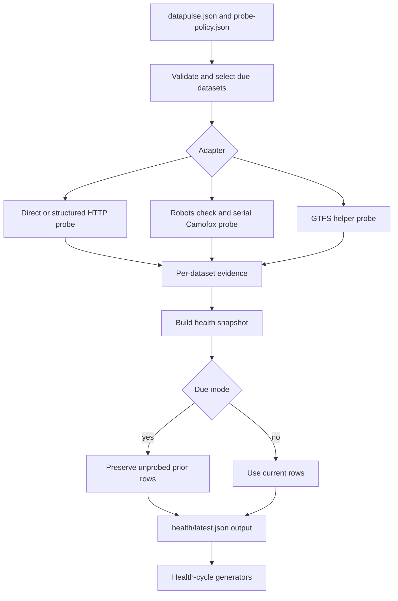
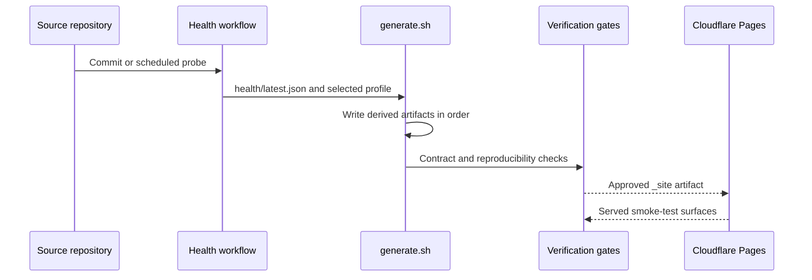
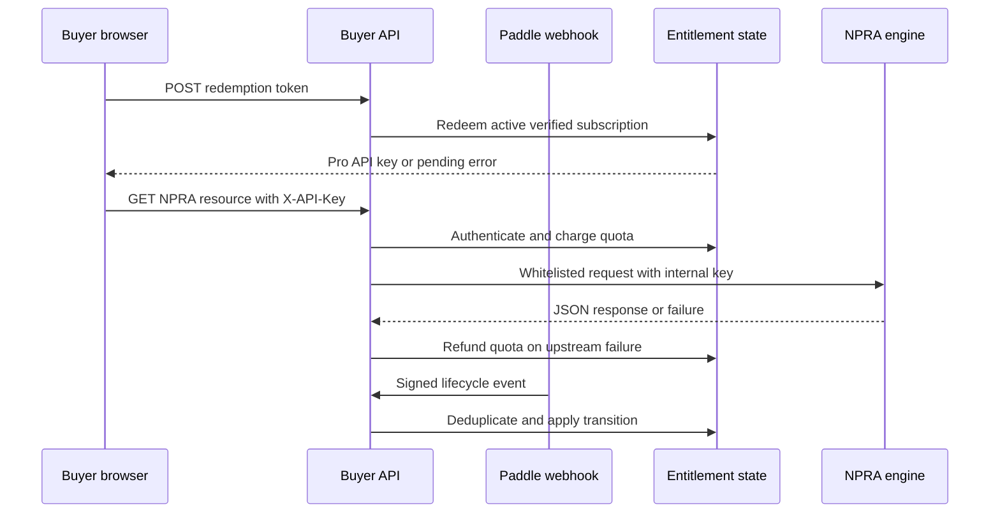

# Generation, health operations, APIs, and verification

This page is the operational map for DataPulse MY. The checked-in workflows and
scripts are the sources of record for behavior: generated files are outputs, while
manifests, probe policy, public-surface configuration, API configuration, and
secrets are inputs or runtime state. Upstream sources remain authoritative for
substantive data; a DataPulse health result is an observation, not a replacement
for the source dataset.

The canonical public website is **https://www.data-pulse.my**. The live catalog
currently publishes **389 datasets derived from datapulse.json** and **16 read-only
tools derived from mcp.json**. These values are verified from the files rather than
hand-maintained page prose.

## Operational planes and ownership

There are four deliberately separate planes:

- **Health cycle:** `scripts/check.sh` probes selected source URLs and emits a
  complete health snapshot to stdout. The caller owns committing it as
  `health/latest.json`; health-cycle generators then derive history, reports,
  badges, RSS, trends, drift, reconciliation, attestations, deltas, evidence
  coverage, and catalog graph outputs.
- **Release build:** `scripts/generate.sh release-build` runs the health-cycle
  generators plus public-surface preflight, MCP and discovery generation, JSON
  envelopes and JSON-LD, dashboard embedding, API reference, URL-drift checks,
  trust snapshot, landing page, and navigation. It never commits, pushes, or
  deploys. Source configuration and generated artifacts must not be edited as if
  they had the same owner; `scripts/contract-scope.json` and the profile output
  lists describe generator ownership.
- **Public MCP:** the read-only MCP server publishes discovery and health access
  over its own boundary. It is not the buyer authentication or payment system.
  See [MCP server & deployment](mcp.md).
- **Authenticated buyer API:** `api/server.py` owns API keys, rate limiting,
  audit records, paid entitlements, and the NPRA proxy boundary. It does not
  import the public FastMCP server. Paid NPRA access is a control plane, not a
  public MCP capability.

The OpenWiki workflow refreshes only `openwiki/` and managed agent pointers. It
must not regenerate human-authored health evidence under `data/`, and its output
is submitted as a pull request rather than committed directly to `main`.

## Health cycle: probe, classify, preserve

`./scripts/check.sh` validates `jq`, `scripts/probe-policy.json`, and the manifest
before probing. Normal mode checks every manifest entry; `--due` selects entries
whose refresh cadence has elapsed, with `--tier` and `--cadence-minutes` overrides.
A previous `health/latest.json` is retained for due-mode merging. A no-op due run
returns the previous snapshot, while `--compare-health` builds a temporary result
and compares it without changing the live file.

Probe policy selects adapters (`direct`, `weather`, GTFS, Hansard, or `browser`)
and carries adapter-specific freshness and parsing rules. Direct and weather probes
use bounded `curl` calls; CSV and Parquet bodies are recognized so binary content
is not mistaken for rows. A failed dataset is data, not a reason to abort the whole
cycle: transport failures become `unreachable`, degraded probes become `degraded`,
and the result still contains one row per selected dataset. The final builder
preserves a previous `last_checked` when a due probe produces no measurement.

Browser-dependent sources are never silently downgraded to a direct request. The
browser pass respects the source `robots.txt`, warms Camofox once, probes browser
sources serially, retries a failed open once, waits for a non-empty DOM snapshot,
extracts configured dates, and closes the tab. Missing Camofox, a missing tab or
snapshot, and close failures are emitted as `browser-dependent` evidence. The
probe policy requires a date pattern and wait time for every browser adapter.

`health_policy.py` is the pure policy used by tests and derived tooling: it maps
refresh frequencies to due tiers, validates content dates and `Last-Modified`
fallbacks, gives browser and transport failures precedence over freshness, and
classifies records as `fresh`, `aging`, `stale`, `degraded`, `unreachable`,
`browser-dependent`, `unknown-freshness`, `unknown`, or `reference` as applicable.
Do not infer a successful browser snapshot means ordinary direct freshness: the
public status remains browser-dependent.

*This flow shows how manifest policy and adapter outcomes become a complete health artifact.*

A health cycle is followed by `scripts/generate.sh health-cycle` (or the equivalent
ordered generators). `gen_health_history.py` upserts observations and compacts
expired raw rows into `health/history_daily.json`, archiving old material under the
configured archive directory. Trends and drift use raw history in preference to an
overlapping compacted day. Dataset deltas are immutable per-cycle records: an
existing cycle is checked for identical bytes and is not overwritten. These
historical artifacts explain the observation lifecycle; they do not alter the
upstream data.

## Deterministic generation and public publication

Use `./scripts/generate.sh --list health-cycle` or `release-build` to inspect the
ordered commands and owned outputs before running them. `--list-owned-outputs`
shows the output contract and `--list-runtime-ownership` reads the runtime-derived
surface contract. Pass controlled environment values with `--env KEY=VAL`; the
script validates variable names and does not perform deployment.

The release profile begins with source-version and public-surface preflight, then
regenerates MCP/discovery material and dashboard sections before the health-derived
outputs and envelopes. It embeds the manifest and health snapshot into dashboard
HTML so the published dashboard can be self-contained. `config/public-surfaces.json`
identifies canonical pages and artifacts; generator-only directories and marker
blocks are enforced by `verify_repository_contract.py`.

Cloudflare Pages classifies a push containing only health-cycle-owned paths when
`[skip deploy]` is present. That fast path validates `health/latest.json`, embeds
only the canonical health payload, and preserves the currently served release-proof
and attestation plane; it fails closed if those served artifacts cannot be fetched
or are inconsistent. Any source, workflow, or other release input forces the full
`release-build`, reproducibility proof, and release invariants. The deploy assembles
`_site/`, uploads it with Wrangler, then fetches the canonical landing page,
dashboard, health snapshot, release proof, and every declared public surface. It
checks embedded `checked_at`, dataset-card count, and served artifact consistency.
Concurrency prevents unsafe overlapping deployments.

*This sequence separates health-cycle input from release-build generation and served-surface verification.*

## API and paid NPRA control plane

`api/config.py` owns runtime paths and bounded settings: API keys default to
`var/api_keys.json`, rate state to `var/rate_limit.json`, entitlements to
`var/entitlements.json`, audit output to `var/log/buyer-api-audit.jsonl`, and the
NPRA engine URL and credential come from `PHARMA_ENGINE_URL` and `PHARMA_API_KEY`.
`PADDLE_SANDBOX_WEBHOOK_SECRET` verifies billing callbacks. `.env.example` is a
reference only; real values must remain outside git.

API keys are stored as salted hashes, not plaintext tokens. The buyer API requires
`X-API-Key` for all GET endpoints, updates last-use state, applies a per-key
atomically persisted token bucket (default 100 requests per minute, bounded to
1000), paginates collection responses, and appends structured audit JSONL for
successes and failures. It returns structured `{ "error": { "code", "message" } }`
responses, including `401` unauthorized, `403` forbidden, `404` not found, `429`
with `Retry-After`, and `503` unavailable responses. CORS is restricted to the
canonical website and its explicitly supported legacy client origin.

Public catalog endpoints expose health, dataset rows and history, deltas, and the
catalog snapshot through the authenticated buyer API. `/api/v1/npra/` is different:
it requires an active Pro entitlement with `npra.read`, charges one quota unit
before an upstream request, and refunds that unit when the NPRA engine fails or
returns a server error. The proxy permits only `health`, `changes`, `product`,
`manufacturer`, and `importer`, uses only the internal credential, rejects unsafe
engine URLs, caps responses at 1 MiB, requires JSON, and bounds the upstream
connection.

Paddle webhook handling is signature- and timestamp-bound (five-minute tolerance),
body-size bounded, and gated to the exact sandbox product and price. Verified
lifecycle events mutate durable entitlement state. State transactions use an
advisory inter-process lock and atomic replacement. Event IDs form a ledger:
replaying the same payload is a duplicate, while the same ID with a different
payload hash is a security failure and returns `409`. Approved refunds and
chargebacks revoke the subscription identity; pending or rejected adjustments do
not. Activation can create a short redemption record, and redemption issues or
recovers a deterministic API key without persisting the nonce in plaintext.
Cancelled identities remain terminal; quota resets at the next billing period.

*This flow keeps payment and entitlement control separate from public read-only MCP discovery.*

## Workflows, gates, and focused verification

- `.github/workflows/pipeline-freshness.yml` runs hourly and fails if the committed
  health JSON is invalid, its last commit is older than 30 minutes, the portfolio
  has fewer than 300 rows, or a status is outside the known taxonomy.
- `.github/workflows/ci.yml` checks shell syntax, JSON schemas, the release-proof
  format, repository and MCP tests, local agent-ready verification, repository
  contract, OpenWiki source contract, URL drift, release invariants, and fact lint.
  The cross-repository dotfiles checkout is intentionally fail-loud; missing token
  permissions must not silently skip safety tests.
- `.github/workflows/deploy-cloudflare-pages.yml` validates both staged and served
  artifacts as described above. Health-only preservation is not permission to
  overwrite a verified release plane with an unbound health snapshot.
- `.github/workflows/publish-mcp.yml` logs into the MCP Registry with GitHub OIDC
  and skips an already-published `server.json` version, making registry publishing
  idempotent rather than treating duplicate-version responses as a release failure.
- `.github/workflows/openwiki-update.yml` runs the locked project-local OpenWiki
  runtime, injects canonical facts, verifies generated pages and changed-path
  ownership, and opens or updates an `openwiki/update` pull request. It is
  concurrency-serialized and does not trigger merely because a workflow file was
  edited.

The focused tests worth running when changing these boundaries are
`scripts/tests/test_check_adapters.sh`, `test_check_comparison.sh`,
`test_health_policy.py`, and `test_health_history.py` for probing and lifecycle;
`test_generate_profiles.py`, `test_generator_harness.py`,
`test_deploy_cloudflare_pages_contract.py`, `test_release_reproducible.py`, and
`test_repository_contract.py` for ownership and release gates; and
`test_npra_paid_control_plane.py` plus `test_buyer_api.py` for webhook replay,
state transitions, authentication, rate limits, structured errors, charging, and
refunds. `requirements.txt` supplies the GTFS bindings and `httpx`; CI installs
additional verification dependencies from `requirements-dev.txt` and the MCP
requirements.

## Safe change checklist

1. Change source configuration first (`datapulse.json`, `scripts/probe-policy.json`,
   `config/public-surfaces.json`, API environment, or the relevant workflow), not
   a generated artifact.
2. For a probe change, test the adapter and policy with an injected date or fixture;
   confirm browser-dependent failures remain visible and due-mode preservation is
   intact.
3. Run the appropriate generation profile and inspect its owned-output list. Do
   not hand-edit generator-owned files or entitlements and API key state.
4. Run repository-contract, release-invariant, reproducibility, and served-surface
   checks appropriate to the change. Treat any verification failure as a stop
   condition rather than publishing a partial plane.
5. Keep public MCP read-only and separate from buyer payment and entitlement logic;
   substantive facts still come from the upstream sources and their committed
   observations.

See [Datasets & schema](datasets.md), [MCP server & deployment](mcp.md), and
[Quickstart](quickstart.md) for the related data, public MCP, and contributor views.

## Canonical facts

- Canonical website: https://www.data-pulse.my
- Datasets: 389 datasets
- MCP server: 16 read-only tools
