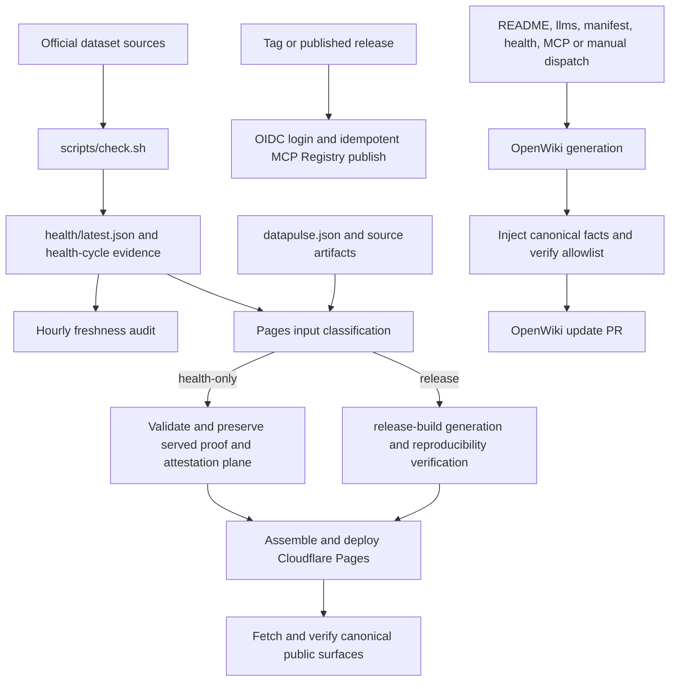

# Health, Publication, and OpenWiki Operations

DataPulse MY publishes a read-only trust layer around official Malaysian public data. The canonical origin is **https://www.data-pulse.my**. The repository currently describes **389 datasets** and **16 read-only tools**; these counts are generated from `datapulse.json` and `mcp.json`, rather than maintained as independent operational configuration.

> **Authority boundary.** DataPulse MY does not replace the official source of record. A health snapshot, badge, MCP response, or OpenWiki page is evidence about an observed publication surface, not a guarantee of availability, verified evidence, certification, reputation, or evidence reference. Consumers should validate the relevant source, licence, timestamp, and evidence for their use case. All MCP operations remain read-only.

## The control loops at a glance

There are four separate loops:

1. **Health evidence:** `scripts/check.sh` probes the manifest and records per-dataset outcomes; the hourly workflow audits that committed evidence.
2. **Artifact generation:** `scripts/generate.sh` distinguishes a health-cycle from a release-build, so health snapshots and generated public surfaces have different ownership and validation expectations.
3. **Public publication:** Cloudflare Pages assembles and verifies the canonical site; tagged releases or published releases publish the MCP server advertisement to the MCP Registry.
4. **Derivative documentation:** the scheduled OpenWiki workflow regenerates only allowlisted documentation and managed instruction markers, then opens a PR.

*This flow shows the repository-backed health, publication, registry, and documentation control paths.*

## 1. Health evidence and freshness

### Probe responsibility

`scripts/check.sh` reads `datapulse.json`, validates the manifest and probe policy, and probes selected or all datasets. It supports full runs and due-only runs with tier/cadence selection. It respects `robots.txt`, uses a DataPulse user agent, and has configurable timeouts and Camofox access through environment variables evidenced by the script, including `CAMOFOX_BASE_URL`.

Adapters are selected through the probe policy. Direct, weather, GTFS static/realtime, browser, and other policy-defined adapters collect different evidence such as HTTP status, headers, content dates, record counts, locations, or feed shape. Browser-dependent sources use Camofox; absence or failure of that dependency is represented in the result rather than hidden.

The invariant is explicit: **dataset failures are data—record them and continue**. A failed dataset must not be converted into a successful run by aborting early or dropping the row. The resulting health record preserves status, message, access method, and whatever transport or content evidence was observed. The public health taxonomy includes `fresh`, `aging`, `stale`, `discontinued`, `degraded`, `browser-dependent`, `unreachable`, `unknown`, `unknown-freshness`, and `reference`.

### Hourly audit

`.github/workflows/pipeline-freshness.yml` runs hourly and can also be dispatched manually. It has `contents: read`, checks out full history, parses `health/latest.json`, requires a datasets list, checks that the file’s latest commit is no more than 30 minutes old, requires at least 300 rows, and rejects statuses outside the known taxonomy. This workflow audits committed health freshness; it is not a substitute for running the probe or for investigating a failing source.

**Diagnostic routing:** first inspect the affected row in `health/latest.json`, its `status`, `message`, `access_method`, and timestamps; then compare the manifest URL and applicable probe-policy adapter. For browser-required failures, inspect the Camofox endpoint/configuration and the browser smoke path. For a stale committed snapshot, determine whether the health cycle or its commit did not complete. Preserve the failure evidence until the cause is understood—do not claim healthy merely because the workflow itself ran.

## 2. Generation profiles and ownership

`scripts/generate.sh` is an orchestrator: it never commits, pushes, or deploys. The two profiles deliberately separate ownership:

- **`health-cycle`** starts from fresh health evidence and regenerates health-derived outputs: dataset reports, badges, README health summary, RSS, history, trends, drift, reconciliation, attestations, deltas, record evidence where opted in, evidence coverage, and catalog graph.
- **`release-build`** includes the health cycle and additionally regenerates public discovery, MCP and agent artifacts, JSON envelopes/JSON-LD, dashboard data and filters, API reference, methodology and landing pages, navigation, and release-oriented checks. It stamps the source identity and validates public-surface inputs before generation.

This distinction is an operational invariant. `health/latest.json` and its evidence are owned by the health pipeline; OpenWiki is not allowed to regenerate `data/` reports or health envelopes. Conversely, a release-build is the route for healing or changing generated public artifacts, not a health-only shortcut.

## 3. Cloudflare Pages deployment and classification

`.github/workflows/deploy-cloudflare-pages.yml` runs on pushes to `main` matching the declared public-artifact/source paths and on `workflow_dispatch`. It grants `contents: read`. Its concurrency separates `[skip deploy]` health traffic from release traffic and cancels overlapping ordinary push deployments, preventing a newer release from waiting behind an obsolete one.

The `classify` job compares the push’s before/after revisions. A push is `health_only=true` only when it contains `health/latest.json` and every changed path belongs to the narrowly defined health-cycle outputs: health files, latest record evidence, latest attestations and chain head, or the catalog/changelog/feed root outputs. Missing history, a non-push event, a missing skip marker, or any source/workflow/public-surface change selects the release profile.

Both paths validate that `health/latest.json` has a non-empty `checked_at` and dataset array. The health-only path embeds that snapshot into the dashboard, fetches and validates the served release proof and attestation plane, and preserves the already-served verified plane when the new health bytes cannot inherit its binding. A signer-down state is reported as failed-closed and stale rather than treated as signed. Inconsistent served health/binding evidence stops deployment and routes to a full release-build deployment.

The release path installs pinned Pandoc and verification dependencies, runs `bash scripts/generate.sh release-build`, then runs reproducibility verification twice (including proof verification) and `verify_release_invariants.sh --local`. The assembled `_site` includes `docs/`, machine-readable discovery and schema files, health and derived evidence, badges, samples, data, and attestations. The workflow requires non-empty dashboard and health files before deploying with `cloudflare/wrangler-action@v3` to the `datapulse-p4b-preview` Pages project on branch `main`.

After deployment, the workflow waits for edge visibility, fetches the landing page, dashboard, health snapshot, release proof, declared pages, artifacts, trends, drift, reconciliation, MCP inventory, and `llms.txt`. It checks dashboard/health timestamps and counts, schema summaries, a non-empty MCP tool inventory, and the OpenWiki-style MCP block. A failed surface comparison is a publication failure: diagnose the staged artifact versus the served response, then use a full release-build deployment to repair release-owned drift. Do not paper over a failed proof or replace a served verified plane with an unverified one.

## 4. MCP Registry publication

`.github/workflows/publish-mcp.yml` runs for `v*` tags, published releases, or manual dispatch. It checks out the repository, downloads `mcp-publisher`, authenticates with GitHub OIDC, and publishes `server.json`. Its permissions are `contents: read` and `id-token: write`; no long-lived registry credential is configured in the workflow.

Publication is idempotency-aware: it reads the server version, queries the MCP Registry, and exits successfully without publishing when that version already exists. Otherwise it publishes the version. A duplicate-version response should therefore be diagnosed as registry/version state, not retried blindly. The public MCP surface remains read-only and is separate from this registry publication step.

## 5. OpenWiki refresh and safety boundary

`.github/workflows/openwiki-update.yml` runs on Monday at `0 8 * * 1`, on manual dispatch, and on pushes to selected source-of-record paths (`config/public-surfaces.json`, `datapulse.json`, `health/latest.json`, `mcp.json`, `README.md`, and `llms.txt`; `openwiki/**` is excluded). Workflow-file edits intentionally do not trigger it automatically, avoiding quota-driven regeneration; manual dispatch is the route when a workflow change needs documentation review.

The job has `contents: write` and `pull-requests: write`, uses Node 22 with the locked project-local OpenWiki installation, and passes the OpenAI Platform API key through step environment variables. It runs `openwiki code --update --print`, then **sequentially** runs `scripts/inject_openwiki_canonical_facts.py --root .` before `scripts/verify_openwiki.py --generated --changed-from HEAD`. The ordering matters: verification must see the deterministic canonical facts, not the model’s raw first pass.

The injector derives the canonical website, dataset count, and MCP tool count from the same repository sources used by verification. The verifier rejects the obsolete apex host, stale counts, unsupported authority claims, missing required pages, and changes outside generated OpenWiki paths or the managed marker regions of `AGENTS.md` and `CLAUDE.md`. It is therefore safe to refresh documentation only after the safety step passes.

The final action opens or updates an `openwiki/update` PR and allowlists only the four wiki pages, `.last-update.json`, and the two managed instruction files. When there is no content diff, no PR is created. OpenWiki is **derivative documentation only**: it does not own dataset health reports, JSON envelopes, attestations, or other `data/` artifacts. Do not hand-edit generated control fields or instruction content outside the managed OpenWiki markers.

## Validation, rollback, and contribution routing

- **Probe failure:** retain the per-dataset failure evidence; inspect URL, policy, access dependency, and source behaviour. A failure is not a successful health cycle.
- **Freshness-audit failure:** check JSON shape, latest health commit age, row count, and taxonomy; repair the health pipeline or commit path before treating publication as current.
- **Pages failure:** compare staged `_site` files with the fetched canonical surfaces and release proof. If trust-plane binding or proof is inconsistent, stop and run a full release-build deployment rather than preserving unverifiable bytes.
- **MCP publication failure:** distinguish an already-published version from authentication/download/publish errors. The workflow’s OIDC path and version lookup are the authoritative diagnostics.
- **OpenWiki failure:** inspect injector/verifier output. Restrict changes to `/openwiki` outputs or managed marker blocks; do not “fix” a wiki failure by editing health data or other generated artifacts.
- **Dataset contribution:** use the repository’s issue/PR process and keep manifest identity, report, envelope, sample, licence evidence, and live-source observations consistent. Never add credentials or fabricated samples, and do not assume an unstated upstream licence.

For every consumer, validation remains actionable: check the canonical manifest and health snapshot, compare timestamps and status, inspect the published evidence or provenance available for the dataset, and consult the official source before relying on a result. Publication and OpenWiki verification can prove repository/control-flow invariants; they cannot guarantee that an upstream publisher is available or correct.

## Canonical facts

- Canonical website: https://www.data-pulse.my
- Datasets: 389 datasets
- MCP server: 16 read-only tools
