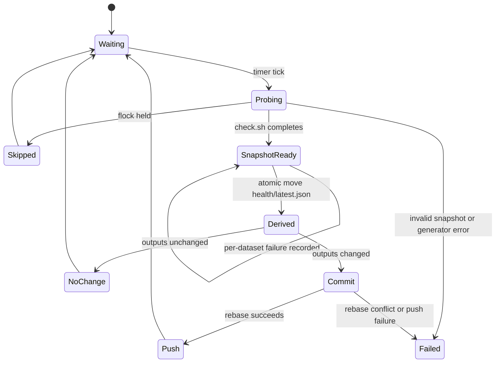
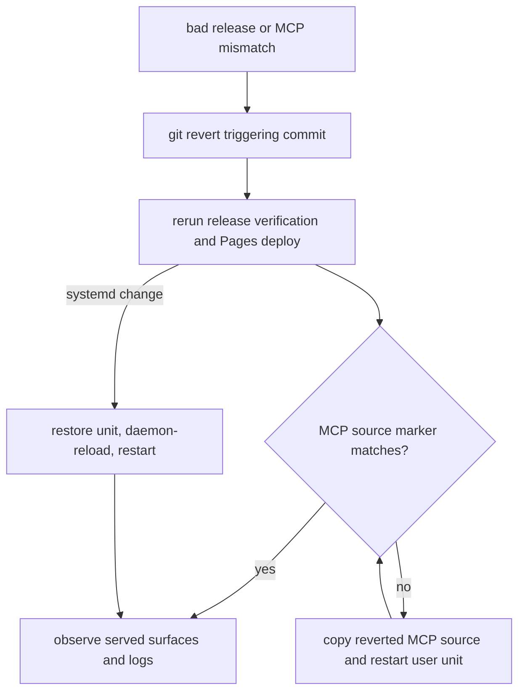

# Health Operations, Release Workflows, and Safe Change Boundaries

DataPulse MY publishes its canonical website at **https://www.data-pulse.my**. The
current catalog contains **389 datasets** and the MCP surface advertises **16
read-only tools**. This page describes repository-backed responsibilities and
verification; a definition, URL, or unit file is not evidence that external
infrastructure is currently running.

## Ownership at a glance

There are two different generation owners:

- The **health cycle** owns observations and artifacts derived from a fresh
  `health/latest.json`. The systemd `datapulse-health.timer` invokes the health
  service every five minutes. The Sunday 00:00 UTC `pipeline-audit.yml` job also
  performs a full probe and a health-cycle fallback.
- The **release build** owns the broader public release: discovery documents,
  envelopes, JSON-LD, MCP metadata, dashboard assets, and release proof. The
  Cloudflare Pages workflow runs it for non-health changes.

`scripts/generate.sh` is an orchestrator: it does not commit, push, or deploy.
Use `bash scripts/generate.sh health-cycle --list` or
`bash scripts/generate.sh release-build --list` to inspect ordered commands and
owned outputs before changing a generator. Change the source or generator, then
run its owning profile rather than hand-editing a derived output.

OpenWiki is a separate documentation refresh. `openwiki-update.yml` runs Monday
at 08:00 UTC, on selected pushes, or by dispatch; it uses the project-local
locked OpenWiki runtime and opens a PR rather than committing directly to
`main`. Its five-file generated output allowlist is `openwiki/quickstart.md`,
`openwiki/datasets.md`, `openwiki/mcp.md`, `openwiki/operations.md`, and
`openwiki/.last-update.json`, with managed marker-only changes allowed in
`AGENTS.md` and `CLAUDE.md`. **`openwiki/quickstart.md` must not be deleted.**
The workflow injects canonical facts and runs `verify_openwiki.py`; the verifier
also rejects unsupported claims and changes outside that boundary. OpenWiki does
not regenerate dataset health or `data/` envelopes.

## Health-cycle lifecycle

The service runs as `redza:redza` in `/home/redza/datapulse-my`, pulls with
`git pull --rebase --autostash`, and takes a non-blocking `flock` on
`/tmp/datapulse-health.lock`. It writes the probe result to a temporary file,
validates JSON, and atomically moves it to `health/latest.json`. Only after that
successful snapshot replacement does it run `bash scripts/generate.sh
health-cycle`. If generated health artifacts changed, it stages the health-cycle
owned paths, commits `chore(health): update due dataset health`, rebases again,
and pushes `HEAD:main`; a no-change cycle exits without a commit. A concurrent
cycle skips rather than racing the snapshot. A rebase conflict stops the unit
for operator resolution.

`check.sh --due` selects datasets by configured refresh tier and cadence. A full
run reads `datapulse.json` and probes every manifest entry. Direct, weather,
GTFS, and browser adapters are policy-controlled; browser checks use Camofox.
`CAMOFOX_BASE_URL` defaults to `http://localhost:9377`, and the browser engine
is warmed once before the serial browser pass. Camofox is an operational
precondition for browser-rendered measurements, not a claim that a browser is
available.

A failed dataset is evidence, not a reason to abort the whole sweep. The probe
records failure status and details and continues. In due mode, unselected rows
and prior `last_checked` values are preserved. Missing or malformed snapshots,
missing generated artifacts, stale health commits, and invalid statuses fail
health/release gates rather than being silently accepted.



*Caption: The health service records individual probe failures while failing the cycle for invalid snapshots, generator errors, or repository conflicts.*

Health-cycle derived ownership includes `data/<id>.md`, badges, the README trust
summary, `feed.xml`, `catalog-snapshot.json` and its deprecated `changelog.json`
alias, history, trends, drift, reconciliation, deltas, record evidence where
opted in, evidence coverage, catalog graph, and attestation outputs. History uses
an archive directory and a compact seven-day retention invocation. Treat these
as derived artifacts, not independent sources.

## Release publication and deployment classification

`.github/workflows/deploy-cloudflare-pages.yml` is the sole canonical website
publisher. It classifies a push as **health-only** only when the commit message
contains `[skip deploy]`, `health/latest.json` changed, and *every* changed path
is a recognized health-cycle output: `health/**`, latest record evidence,
latest attestations, the attestation chain head, or the catalog/changelog/feed
root outputs. Any source, workflow, configuration, or other path is **non-health**
and takes the release profile. Manual dispatch is non-health by default.

Both paths validate `health/latest.json`. The health-only path embeds the current
health payload and preserves the already-served release proof and verified
attestation plane; it must not pretend new health bytes inherit an old binding.
The non-health path installs its pinned verification dependencies, stamps
`DATAPULSE_SOURCE_COMMIT_SHA`, runs `bash scripts/generate.sh release-build`,
verifies reproducibility and release invariants, embeds the dashboard, assembles
`_site`, and deploys it with Wrangler to Cloudflare Pages project
`datapulse-p4b-preview` on branch `main`. The assembled artifact contains docs,
manifest and schemas, health and derived data, samples, badges, attestations,
and declared public surfaces from `config/public-surfaces.json`.

Post-deploy checks fetch the configured website origin with retries, check the
landing page and `/dashboard`, compare embedded health timestamp and row count
to `/health/latest.json`, verify release proof, and fetch every declared page
and artifact. A missing/stale surface, count drift, unsafe path, or proof mismatch
fails the workflow. A health-only deployment can warn for an explicitly
`signer_down` P6 state, but malformed or inconsistent trust material fails
closed.

<!-- openwiki: mermaid parse failed and this diagram was converted to a text fence so it does not break rendering. Fix the diagram source and restore the mermaid fence. Parser error: Heuristic: a semicolon inside a label breaks rendering; rephrase the label. -->
```text
flowchart TD
    A[main push or dispatch] --> B{health-only classification}
    B -->|yes| C[validate health snapshot]
    C --> D[preserve served proof and attestation plane]
    B -->|no| E[run release-build]
    E --> F[verify reproducibility and invariants]
    D --> G[embed and assemble _site]
    F --> G
    G --> H[Cloudflare Pages deploy]
    H --> I{served surface checks}
    I -->|pass| J[publication accepted]
    I -->|fail| K[workflow fails; repair source and redeploy]
```

*Caption: Cloudflare Pages separates health-only publication from non-health release generation, then applies the same served-surface verification.*

## Attestations, secrets, and the P6 boundary

Release generation may sign daily probe facts with the protected Ed25519 key
provided through `DATAPULSE_ATTESTATION_PRIVATE_KEY_FILE`; the private key is
materialized only in a protected temporary file in CI and must remain outside
the checkout and generated assets. Public dated envelopes, `attestations/latest/`,
and `.well-known/datapulse-probe-keys.json` are publishable. An attestation
binding covers the exact health SHA-256, dataset count and identifier-set hash,
observation/publication times, active key, and daily chain head. An Ed25519
signature proves artifact binding; a Rekor reference, when complete, proves only
transparency-log witnessing. Neither proves an upstream source is true.

P6 production and disposable lab stacks are **absent** in the current operational
state, and the real-lab marker is absent. Compose definitions must not be treated
as readiness or permission to provision or sign. If the signer lane explicitly
reports `artifact_signed:false`, deployment can preserve the stale plane and
warn; missing, malformed, superseded, or ambiguous trust material remains a
failure. Do not put API keys, webhook secrets, internal credentials, private
keys, or other secrets in pages, JSON artifacts, logs, or the repository.

## Runtime topology and configuration boundaries

The checked-in systemd/nginx/Tunnel files describe separate boundaries:

- `datapulse-mcp.service` runs the read-only server as a user service on
  `127.0.0.1:8788`, reading the published website data. Nginx limits `/mcp`,
  applies origin checks and a 1 request/second zone with burst, and proxies to
  the service. The Cloudflare Tunnel example terminates at local nginx; its
  tunnel UUID, credentials file, certificates, and actual activation are
  operator-managed, not repository facts.
- `datapulse-api.service` binds the authenticated buyer API to
  `127.0.0.1:8791`. Its environment files are outside the repository; durable
  API keys, rate limits, entitlements, and audit state live under
  `/home/redza/datapulse-my/var/`. The API forwards to the internal
  `127.0.0.1:8001` engine and does not expose that engine directly. State updates
  use locking and atomic replacement, and webhook secrets/internal credentials
  stay environment-only.
- MCP usage and verification telemetry belongs in the user journal
  (`journalctl --user -u datapulse-mcp.service`); `verify_evidence` has a
  process-local ten-minute cache and serialized verification, cleared on restart.
  Add shared limiting/cache before adding workers or replicas.

The configured public origins are website `https://www.data-pulse.my`, MCP
`https://mcp.data-pulse.my`, and API `https://api.data-pulse.my`. These are
configuration and contract values; this page does not assert availability.

## MCP source synchronization and rollback

Every release build stamps the repository SHA into `mcp/server.py` and `mcp.json`.
The runtime exposes it from JSON-RPC `initialize.serverInfo.source_commit_sha`.
`python3 scripts/verify_mcp_deployment.py` then initializes the endpoint, lists
its tools, and compares that marker with local `git rev-parse HEAD`: exit 0 is a
match, 1 is a mismatch, and 2 is unreachable. A mismatch requires redeploying
the source and restarting `datapulse-mcp.service`; it is not safe to infer source
parity from a healthy HTTP response.

Prefer rollback by `git revert <commit>` followed by the normal release/redeploy
workflow; preserve the operational clone rather than resetting it. For an MCP
rollback, restore the prior `mcp/server.py` (and requirements if needed) to
`/home/redza/.local/share/datapulse-mcp/` and restart the user unit. For systemd
changes, restore the prior unit source, reinstall, run `systemctl daemon-reload`,
and restart the affected service/timer. Do not bypass failed release gates or
repair generated output by force-pushing history.



*Caption: Rollback is an auditable revert-and-redeploy path, with independent MCP source synchronization and systemd recovery.*

## Focused verification

Pull-request CI is read-only and protects the contracts that matter: shell syntax,
manifest and health JSON Schema, repository/MCP tests, agent-ready verification,
OpenWiki ownership, URL drift, release invariants, and canonical-fact linting.
Run the focused local checks (with project dependencies installed):

```sh
find . -type f -name '*.sh' -not -path './.git/*' -print0 | xargs -0 -n1 bash -n
python3 -m jsonschema -i datapulse.json datapulse.schema.json
python3 -m jsonschema -i health/latest.json health.schema.json
python3 -m pytest -q scripts/tests/ mcp/tests/
bash scripts/tests/test_verify_agent_ready.sh
python3 scripts/verify_repository_contract.py
python3 scripts/verify_openwiki.py
python3 scripts/check_url_drift.py
bash scripts/verify_release_invariants.sh --local
python3 scripts/fact_lint.py
systemd-analyze verify deploy/systemd/datapulse-health.service
systemd-analyze verify deploy/systemd/datapulse-mcp.service
python3 scripts/verify_mcp_deployment.py
```

For a real served release, omit `--local` from the release invariant check only
when the public origin and full attestation/proof plane are available; local mode
is a source/pre-generation contract and does not claim a current signed binding.

## Canonical facts

- Canonical website: https://www.data-pulse.my
- Datasets: 389 datasets
- MCP server: 16 read-only tools
