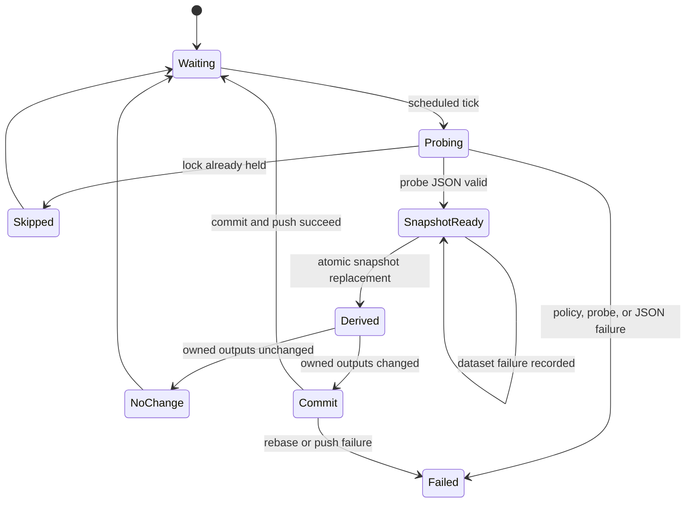
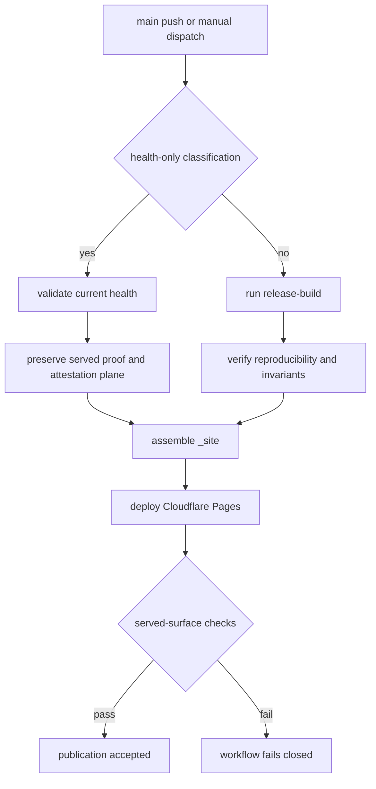

# Health Operations, Release Workflows, and Safe Change Boundaries

DataPulse MY's canonical website origin is **https://www.data-pulse.my**. The checked-in
manifest and health snapshot currently describe **389 datasets**; `mcp.json` advertises
**16 read-only tools**. These are repository contracts and generated public metadata, not
proof that an external endpoint is available. Upstream publishers remain authoritative
for the underlying data.

## Ownership and source boundaries

The repository separates authoritative inputs from profile-owned derivatives:

- `datapulse.json`, its schema, probe policy/code, `config/public-surfaces.json`, and
  `mcp/server.py` are inputs or source/configuration. `health/latest.json` is the
  canonical result of a probe cycle.
- `health-cycle` consumes that snapshot and regenerates health-derived reports, badges,
  the README trust summary, feed, catalog snapshots, history, trends, drift,
  reconciliation, deltas, record evidence, coverage, graph, and attestation outputs.
- `release-build` first stamps source identity and validates public-surface inputs, then
  adds discovery files, MCP metadata, JSON envelopes and JSON-LD, dashboard sections and
  filters, rendered documentation, API reference, trust snapshot, and the website
  bundle. Generated files are not independent sources: change their source or generator
  and rerun the owning profile.

`scripts/generate.sh` is an ordered, local orchestrator. It neither commits nor pushes
nor deploys. Use `bash scripts/generate.sh health-cycle --list` or
`bash scripts/generate.sh release-build --list` to inspect commands and owned outputs
before making a change. The health profile is for a fresh health snapshot; the release
profile is the broader public build.

## Health-cycle lifecycle

The health service runs a due-mode probe, writes to a temporary file, validates JSON, and
atomically replaces `health/latest.json` before invoking `health-cycle`. Its single-
instance lock makes an overlapping tick skip rather than race. Dataset probe failures
are recorded and the sweep continues; due mode preserves unselected rows and prior
`last_checked` values. Invalid policy, manifest, snapshot, or generated output fails the
cycle rather than silently publishing partial state. The operational service may commit
changed health-owned paths and push them to `main`; a no-change cycle does not create a
commit, while a rebase or push failure stops the operation for resolution.

Refresh selection is tiered from manifest frequency (`realtime`, `daily`,
`weekly-monthly`, or `slow`) and can use an explicit due cadence. Probe adapters are
policy-controlled, including direct, weather, GTFS, and browser paths. Browser checks
require the configured Camofox sidecar (`CAMOFOX_BASE_URL`, default
`http://localhost:9377`); without it, browser-dependent sources are reported honestly,
not treated as healthy. Probes respect robots restrictions and do not bypass login,
CAPTCHA, or terms-of-service controls.



*Caption: Individual dataset failures remain in the snapshot, while invalid cycle state or repository publication failure is fail-closed.*

## Publication and release-build control flow

`.github/workflows/deploy-cloudflare-pages.yml` is the sole canonical website publisher.
On a push, it classifies a health-only change only when `[skip deploy]` is present,
`health/latest.json` changed, and every changed path is a recognized health-cycle output.
A source, workflow, configuration, or other unrecognized path takes the non-health
release path; manual dispatch is non-health by default.

Both paths validate the health snapshot and assemble `_site`. The health-only path
embeds the current health bytes but preserves the already-served release proof and
verified historical attestation plane; it must not bind new health bytes to old proof.
The non-health path installs pinned verification dependencies, stamps
`DATAPULSE_SOURCE_COMMIT_SHA`, runs `bash scripts/generate.sh release-build`, verifies
reproducibility and release invariants, embeds the dashboard, and deploys with Wrangler
to Cloudflare Pages project `datapulse-p4b-preview` on branch `main`.

After deployment, the workflow fetches the configured website origin with retries. It
checks the landing page and dashboard, compares embedded health timestamp and row count
to `/health/latest.json`, validates the release proof and health derivative snapshots,
checks the MCP inventory and declared public pages/artifacts, and rejects unsafe paths,
missing surfaces, count drift, stale proof, or inconsistent trust material. A signer-down
state explicitly reporting `artifact_signed:false` may warn on the health-only path; it
does not make malformed, ambiguous, or mismatched trust material acceptable.



*Caption: Publication separates health-only embedding from full release generation, then applies served-surface verification to both.*

## Attestation and trust boundaries

The release proof binds the exact source/build context and current health facts; public
keys, dated attestation envelopes, chain heads, and any verified optional Sigstore
bundle are publishable artifacts. A signature demonstrates a binding to the stated
artifact. A transparency-log reference, when present, demonstrates witnessing only.
Neither establishes that an upstream publisher's data is true, and neither is a
substitute for source provenance.

The Pages workflow treats Sigstore signing as optional only in the explicit unavailable
case: it removes an unverified or stale bundle and warns. It never carries a stale
bundle forward as if it signed new health bytes. Private keys and credentials remain in
protected CI temporary files or environment-only configuration; they must not enter
pages, JSON artifacts, logs, or the repository. The current repository does not prove
that a production signer or external deployment is provisioned.

## Release automation and MCP publication

Pull-request CI is a read-only deterministic safety net with `contents: read`. It checks
shell syntax, manifest and health schemas, legacy proof format, repository/MCP tests,
agent readiness, repository and OpenWiki contracts, URL drift, local release invariants,
and documentation facts. The hourly freshness workflow separately fails when the
committed health snapshot is malformed, its latest commit is older than 30 minutes, the
catalog has fewer than 300 rows, or a status is outside the known taxonomy.

`release-please.yml` runs on non-health main changes with cancellation of superseded runs;
when it creates a release, it verifies and records the attestation chain head in the
release notes. `publish-mcp.yml` runs for version tags, published releases, or dispatch,
authenticates to the MCP Registry with GitHub OIDC, and skips an already-published
`server.json` version rather than treating registry idempotency as a failure.

`openwiki-update.yml` is separate documentation automation: it runs Monday at 08:00 UTC,
on selected source pushes, or dispatch, uses the locked project-local OpenWiki runtime,
injects canonical facts, verifies the generated pages, and opens a pull request. It does
not regenerate health or data envelopes. Its write boundary is the five OpenWiki pages
and update marker, plus managed marker blocks in `AGENTS.md` and `CLAUDE.md`; it must not
be used to edit workflows, manifests, health artifacts, public HTML, or arbitrary
repository files.

## Safe rollback and MCP identity

Every release build stamps the repository SHA into `mcp/server.py` and `mcp.json`; the
runtime exposes it through JSON-RPC `initialize.serverInfo.source_commit_sha`.
`python3 scripts/verify_mcp_deployment.py` compares the deployed marker with local
`git rev-parse HEAD`: exit `0` means match, `1` means mismatch, and `2` means the
endpoint is unreachable. A healthy HTTP response alone is not source parity.

Prefer an auditable `git revert <commit>` followed by the normal release-build,
verification, and deployment path. Do not force-push history or bypass a failed gate.
For a deployed MCP mismatch, restore the corresponding source and restart the managed
user service; systemd changes require restoring the prior unit, reloading systemd, and
restarting the affected service. These are recovery boundaries described by the checked-
in operational configuration, not a claim that those services are currently running.

## Focused local verification

With project dependencies installed, the focused checks corresponding to CI and release
contracts are:

```sh
find . -type f -name '*.sh' -not -path './.git/*' -print0 | xargs -0 -n1 bash -n
python3 -m jsonschema -i datapulse.json datapulse.schema.json
python3 -m jsonschema -i health/latest.json health.schema.json
python3 -m pytest -q scripts/tests/ mcp/tests/
bash scripts/tests/test_verify_agent_ready.sh
python3 scripts/verify_repository_contract.py
python3 scripts/verify_openwiki.py
python3 scripts/check_url_drift.py
bash scripts/verify_release_invariants.sh --local
python3 scripts/fact_lint.py
python3 scripts/verify_mcp_deployment.py
```

`--local` release-invariant verification checks the checked-in/pre-generation contract;
it does not claim a current signed binding. Served verification additionally requires
the configured public origin and complete proof plane. A failed gate should be repaired
at its authoritative source and rerun through the same owning profile; generated output
should not be hand-patched.

## Canonical facts

- Canonical website: https://www.data-pulse.my
- Datasets: 389 datasets
- MCP server: 16 read-only tools
