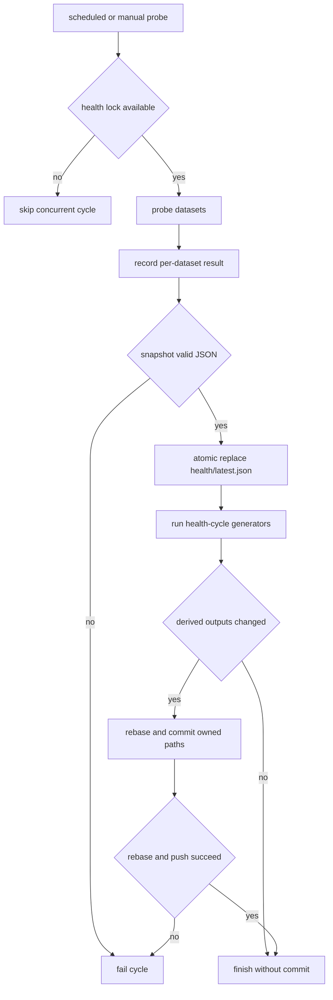
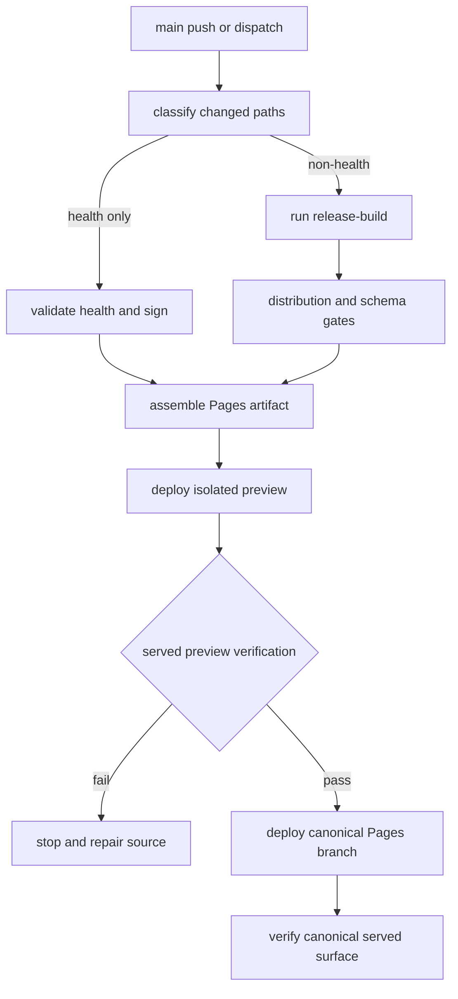

# Pipelines, Attestations, Publication, and Safe Changes

DataPulse publishes its canonical website at **https://www.data-pulse.my**. The
current manifest/discovery publication contains **418 datasets**, and MCP
publication describes **19 read-only tools**. These are repository-backed
publication facts, not a guarantee that an external surface is available.
Upstream sources remain authoritative: a health result, observation receipt,
attestation, or signature records what this pipeline observed and bound; it does
not semantically validate that an upstream fact is true.

## Which workflow owns what

The workflows are the operational source of truth for scheduling, permissions,
gates, retries and continuation behavior, generated artifacts, and deployment
boundaries:

| Area | Entry point and cadence | Operational boundary |
| --- | --- | --- |
| Pull-request safety | `.github/workflows/ci.yml`, on push, pull request, or dispatch | Read-only verification with `contents: read`; validates schemas, repository/MCP tests, distribution synchronization, attestation lineage, release invariants, and OpenWiki contracts. Health-only pushes use the health-integrity lane. |
| Health audit | `.github/workflows/pipeline-audit.yml`, Sunday 00:00 UTC or dispatch | Audits committed health, reprobes for comparison, and checks reproducibility of derived artifacts. |
| Freshness audit | `.github/workflows/pipeline-freshness.yml`, hourly or dispatch | Requires a parseable health snapshot, a recent `health/latest.json` commit, at least 300 rows, and known status vocabulary. |
| Daily signed envelopes | `.github/workflows/datapulse-attest-daily.yml`, daily at 03:17 UTC or dispatch | Main-only, write-capable attestation job. It creates a machine-owned branch and pull request, then requests auto-merge; it does not directly push generated envelopes to `main`. |
| Website publication | `.github/workflows/deploy-cloudflare-pages.yml`, selected `main` pushes or dispatch | The canonical Pages publisher. It classifies health-only versus non-health input, builds and verifies a Pages artifact, deploys a staging branch, verifies the served preview, then deploys `main` and verifies the canonical origin. |
| MCP registry publication | `.github/workflows/publish-mcp.yml`, version tags, published releases, or dispatch | OIDC-authenticates to the MCP Registry, verifies current distribution, publishes only when needed, and treats a same-version duplicate as a no-op. |
| OpenWiki | `.github/workflows/openwiki-update.yml`, Monday 08:00 UTC or dispatch | Manual/weekly derivative documentation refresh. It opens or updates a PR and is **not a production-push dependency**. |

`bash scripts/generate.sh` is the reviewed local orchestrator. It never commits,
pushes, or deploys. Use `bash scripts/generate.sh health-cycle --list` or
`bash scripts/generate.sh release-build --list` to inspect command order and
owned outputs, then regenerate through the owning profile rather than editing a
derived artifact.

## Observation and health lifecycle

A health probe writes a temporary result, validates JSON, and atomically
replaces `health/latest.json`; generation follows only after the replacement
succeeds. The deployed health service uses a non-blocking lock, so a concurrent
cycle skips rather than races. A failed dataset is recorded and the sweep
continues, while malformed snapshots, invalid statuses, generator errors, or
repository conflicts fail the cycle. Due-mode probing preserves unselected rows
and prior `last_checked` values.

The health-cycle profile generates reports, badges, README summaries, feeds,
catalog/history/trend/drift/reconciliation artifacts, attestations, deltas,
record evidence where enabled, coverage, and the catalog graph. These are
outputs of the current health snapshot, not independent sources. A changed
health output may be committed by the service after a rebase; a no-change cycle
needs no commit. A rebase conflict stops rather than force-pushing.

Observation receipts have a separate truth boundary. `scripts/observation_capture.py`
records `observed_at` when DataPulse files the observation, `retrieved_at` when
the transfer ends, and `source_content_date` only when asserted by the source.
They are not interchangeable. Capture policy is an explicit allow-list and
fails closed: denied capture is `not_captured`, incomplete transfer is `failed`
or `partial`, raw-byte refusal is `metadata_only`, oversized content is not
stored, and only complete retained bytes can be `captured`. Receipt capture
sets verification to `unverified`; it does not certify the source.



*Caption: Health generation records individual probe failures but fails closed for invalid snapshots, generator errors, or repository update conflicts.*

## Attestation lifecycle, keys, and Rekor degradation

Attestation generation is deliberately staged. `scripts/refresh_chain_head.sh`
requires `DATAPULSE_ATTESTATION_PRIVATE_KEY_FILE`, refreshes the legitimate
attestation writer, mirrors the fresh head into `.attestations/chain_head.json`,
and checks that its dataset count matches `health/latest.json`. The daily
workflow first provisions the Ed25519 key from the
`DATAPULSE_ATTESTATION_PRIVATE_KEY_FILE` secret into a mode-600 temporary file;
it refuses to generate unsigned evidence when the secret is absent and removes
the file in an `always()` cleanup step.

The deployment workflow similarly requires the private key to refresh the chain
head before Sigstore signing. The key must remain outside the checkout, generated
assets, logs, and wiki. Never place API keys, OIDC credentials, webhook secrets,
private keys, or internal credentials in repository files or public artifacts.

The daily job attempts pinned Cosign/Rekor witnessing. It reuses an existing
same-day Rekor reference and bundle; otherwise it generates a DSSE statement,
asks Cosign to attest it, verifies the bundle identity and issuer, and requires
one Rekor entry with inclusion proof and signed entry timestamp. If Cosign
installation or Rekor upload/verification is unavailable, the job warns and can
continue with the local Ed25519 binding; this is an explicit degradation, not a
claim of transparency witnessing.

For Pages, `signer_down` is permitted only for a classifier-scoped health-only
publication. That path preserves the currently served verified attestation and
release-proof planes after fetching and validating them, and fails if they are
inconsistent. A full non-health release requires `attestation_state=signed`.
Invalid signer output, failed bundle verification, missing publication files, or
ambiguous trust material fail closed. New health bytes must not inherit an old
binding: preservation keeps the historical plane rather than claiming it binds
the new snapshot.

A signature proves that the exact artifact binding was signed. A Rekor reference,
when complete, proves log witnessing. Neither establishes the truth of upstream
content, universal trust, or availability.

## Release build, distribution gates, and deployment boundary

The Pages workflow uses one non-cancelable `cloudflare-pages-production`
concurrency lane. It classifies a push with `scripts/classify_change.py`; manual
dispatch defaults to non-health. Health-only publication validates the current
health snapshot, embeds it, and preserves the verified proof/attestation plane
when signer degradation is explicitly allowed. Any source, workflow,
configuration, or other non-health change takes the release path.

The non-health path stamps `DATAPULSE_SOURCE_COMMIT_SHA`, runs
`bash scripts/generate.sh release-build`, generates per-dataset evidence,
validates the DataPulse contract, and verifies reproducibility and release
invariants. The release profile owns discovery, JSON-LD, MCP metadata, dashboard
assets, health-derived outputs, envelopes, and public navigation. It assembles
`_site`, creates a deterministic artifact manifest, verifies it before and after
preview serving, deploys an isolated Cloudflare Pages preview, checks the
preview, then deploys the canonical Pages project and checks the served origin.
The configured project is `datapulse-p4b-preview`; this page does not assert its
availability.

Publication gates include parseable schemas, source identity, expected health
and dataset counts, safe public paths, release proof, attestation consistency,
and every declared page/artifact. `scripts/verify_distribution_sync.py` reads
canonical counts from `datapulse.json`, `health/latest.json`, and `mcp.json`,
then checks current README, discovery, MCP, directory-listing, and configured
public surfaces. Historical notes and dated audit material are excluded from
current-surface count checks. Stale claims are repaired through their generator
or by correcting the hand-authored current surface; they are not hidden by
rewriting canonical evidence.

MCP publication is independent of website deployment. Its registry workflow
uses GitHub OIDC, stamps the Release Please version into `server.json`, runs
`verify_registry_distribution.py`, and refuses to publish when distribution is
unverifiable. A same-version duplicate caused by a concurrent trigger is treated
as a no-op; other publish errors fail. The published MCP posture remains
read-only and advertises 19 read-only tools.



*Caption: Pages promotion is gated by classification, signing state, generation or preservation rules, deterministic artifact checks, preview verification, and a final served-surface check.*

## Safe change points and focused verification

Safe changes begin with ownership: change the probe, policy, generator, workflow,
or source contract, then run the owning profile and its gates. Do not hand-edit
`health/latest.json`, attestations, discovery manifests, MCP metadata, dashboard
embeds, or other generated outputs. Do not bypass a failed gate, force-push a
health or attestation history, or treat a systemd, nginx, Tunnel, or Compose file
as proof that external infrastructure is provisioned or ready.

For a focused local check with dependencies installed:

```sh
find . -type f -name '*.sh' -not -path './.git/*' -print0 | xargs -0 -n1 bash -n
python3 -m jsonschema -i datapulse.json datapulse.schema.json
python3 -m jsonschema -i health/latest.json health.schema.json
python3 -m pytest -q scripts/tests/ mcp/tests/
python3 scripts/verify_repository_contract.py
python3 scripts/verify_attestation_workflow_contract.py
python3 scripts/verify_distribution_sync.py
python3 scripts/verify_chain_linearity.py
python3 scripts/verify_openwiki.py
python3 scripts/check_url_drift.py
bash scripts/verify_release_invariants.sh --local
python3 scripts/fact_lint.py
```

CI also checks public internal references, release identity, OpenWiki ownership,
and the legacy release-proof format. A local release-invariant check is a
source/pre-generation contract; it does not claim that a current public
signature or deployment exists.

## OpenWiki boundary

OpenWiki runs with the locked project-local runtime, writes credentials with
mode 600, and uses the configured ChatGPT OAuth secrets rather than exposing
credentials in the generated pages. The workflow runs canonical-fact injection
before `verify_openwiki.py`, limits generated changes to the four wiki pages and
control metadata, and opens or updates `openwiki/update`. A 429 plan-limit error
is a workflow failure to resolve operationally, not a reason to weaken facts or
verification. OpenWiki documentation is manual/weekly and derivative; it does
not regenerate dataset health or `data/` envelopes and never gates a production
push.

## Canonical facts

- Product: DataPulse
- Canonical website: https://www.data-pulse.my
- Datasets: 418 datasets
- MCP server: 19 read-only tools
