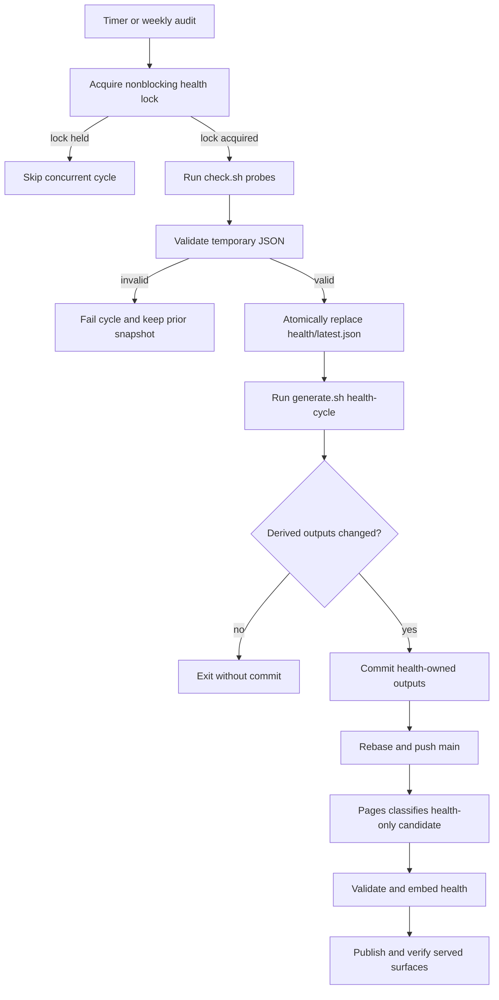

# Pipeline, Attestations, Deployment, and Verification Operations

DataPulse publishes its canonical website at **https://www.data-pulse.my**. At
this generation, `datapulse.json` contains **418 datasets** and `mcp.json`
advertises **19 read-only tools**. These counts are generated from the checked-in
canonical files, not from an operational availability claim. DataPulse remains
read-only: upstream custodians and source systems remain authoritative for
substantive data. An observation, signature, Rekor witness, or successful
publication proves properties of an artifact and its generation path; it does
not prove that an upstream value is semantically true.

## Operational ownership

There are three related but distinct owners:

- The **health cycle** probes datasets and owns health-derived outputs. The
  systemd health timer runs the service every five minutes; the weekly audit also
  performs a full probe and a health-cycle regeneration.
- The **release build** owns the broader public release: discovery documents,
  envelopes, JSON-LD, MCP metadata, dashboard assets, and release proof. The
  Cloudflare Pages workflow runs this profile for non-health changes.
- The **attestation workflow** signs the daily health binding and commits dated
  evidence through a machine-owned branch and pull request. It may add a Rekor
  witness, but it does not take ownership of pipeline-generated health files.

`scripts/generate.sh` is an orchestrator, not a deployment mechanism. Inspect
ordered work with:

```sh
bash scripts/generate.sh health-cycle --list
bash scripts/generate.sh release-build --list
```

Change the source or generator and run its owning profile; do not hand-edit a
derived artifact. The OpenWiki refresh is separate: its workflow uses the
project-local locked runtime, opens a PR, restricts generated output to the
OpenWiki pages and update marker, and runs `scripts/verify_openwiki.py`. It does
not regenerate health or `data/` envelopes.

## Scheduled probe-to-publication lifecycle

The health service pulls with rebase/autostash, takes a non-blocking lock, and
writes probe output to a temporary file before JSON validation and atomic
replacement of `health/latest.json`. Only a valid replacement starts the
health-cycle generator. A failed individual probe is recorded and does not abort
the sweep; malformed snapshots, generator errors, conflicts, and failed pushes
fail the cycle.



*Caption: Scheduled probing becomes a published health snapshot only after validation, derived generation, repository update, deployment classification, and served-surface checks.*

The service runs as `redza:redza` in `/home/redza/datapulse-my`, uses
`/tmp/datapulse-health.lock`, and pushes `HEAD:main` only when health-cycle
outputs changed. A concurrent run skips rather than races. A rebase conflict
stops the unit for operator resolution. In due mode, `scripts/check.sh --due`
selects datasets by configured refresh tier and cadence, preserving unselected
rows and prior `last_checked` values. A full run reads `datapulse.json` and
probes every manifest entry. Direct, weather, GTFS, and browser adapters are
policy-controlled; browser checks use Camofox, whose default
`CAMOFOX_BASE_URL` is `http://localhost:9377`.

Health-cycle outputs include `data/<id>.md`, badges, README trust summary,
`feed.xml`, catalog and changelog aliases, history, trends, drift,
reconciliation, deltas, optional record evidence, coverage, catalog graph, and
attestation outputs. These are derived artifacts and must be regenerated from
inputs rather than edited independently. History uses an archive directory and
a compact seven-day retention invocation.

## Daily Ed25519 and Rekor evidence

The daily workflow runs at 03:17 UTC or by dispatch on `main`. It requires the
`DATAPULSE_ATTESTATION_PRIVATE_KEY_FILE` secret, writes it to a mode-600 file in
runner temporary storage, exports only its path, and removes the temporary file
in an `always()` cleanup step. A missing key fails closed; unsigned daily
attestation is not an implicit fallback.

`refresh_chain_head.sh` is the sole chain-head refresh entrypoint. It either
regenerates the dated attestation set through `gen_attestations.py` or refreshes
`attestations/latest` from an existing dated set, mirrors the latest head into
`.attestations/chain_head.json`, and checks that its dataset count equals the
canonical health count. `gen_sigstore_bundle.py` then creates a deterministic
in-toto statement whose subject is the exact SHA-256 of `health/latest.json`.
The predicate binds the health time, dataset count, methodology version, source
commit, signed manifest digest, and legacy Ed25519 chain head.

The workflow checks whether the day's Rekor reference and Sigstore bundle
already exist. If not, it installs the pinned Cosign version and attempts
`cosign attest-blob` with the canonical statement. The produced bundle must have
one Rekor entry, an inclusion proof, and a signed entry timestamp before a
reference is written. Cosign installation or Rekor upload/verification failure
is explicitly warned and the Ed25519 binding can still be generated without an
external witness. That is a witness-availability state, not evidence that the
Rekor plane succeeded.

The attestation workflow allowlist permits dated attestations, latest indexes,
chain heads, chain index, the legacy head, and its deliberate exclusions for
pipeline-owned `datapulse.json` and `attestations/latest/scores.json`. Any
unexpected working-tree path refuses the commit. The branch is
`attestation/anchor-<date>` and is updated or created from `origin/main` using a
GitHub App token.

An Ed25519 signature authenticates the signed artifact binding. A Rekor
reference, when complete, adds transparency-log witnessing. Neither establishes
universal trust, certification, reputation, payment capability, prices, tiers,
paid quotas, billing terms, commercial offers, or semantic correctness of an
upstream source. Never place private keys, API keys, webhook secrets, internal
credentials, or other secrets in pages, generated JSON, logs, or the repository.

## Cloudflare Pages classification and gates

`.github/workflows/deploy-cloudflare-pages.yml` is the canonical website
publisher. Its classifier treats a push as **health-only** only when the commit
message contains `[skip deploy]`, `health/latest.json` changed, and every changed
path is a recognized health-cycle output. Source, workflow, configuration, and
other changes take the non-health release path; manual dispatch is non-health by
default. A non-cancelable concurrency group prevents an older candidate from
promoting after a newer source release.

Both paths validate the health snapshot. Health-only publication embeds the
current health and preserves the already-served release proof and verified
attestation plane; it does not claim that new health bytes inherit an old
binding. The non-health path installs pinned verification dependencies, stamps
`DATAPULSE_SOURCE_COMMIT_SHA`, runs `bash scripts/generate.sh release-build`,
validates data contracts and reproducibility, assembles `_site`, and deploys
with Wrangler to Cloudflare Pages project `datapulse-p4b-preview` on branch
`main`.

A full release requires `attestation_state=signed`; `signer_down` is permitted
only for classifier-scoped health-only publication. Invalid signer output,
failed bundle verification, incomplete publication, or malformed trust material
fails closed. After deployment, the workflow fetches the configured website
origin with retries, checks the landing page and `/dashboard`, compares embedded
health timestamp and row count with `/health/latest.json`, verifies release
proof, and fetches declared pages and artifacts. Missing or stale surfaces,
count drift, unsafe paths, or proof mismatch fail the workflow.

## MCP deployment boundary

The MCP service is a read-only server on `127.0.0.1:8788` that reads published
website data. Nginx limits `/mcp`, applies origin checks, and proxies through a
1-request/second zone with burst. The Cloudflare Tunnel example terminates at
local nginx; its UUID, credentials, certificates, and activation are
operator-managed configuration, not proof of availability. The repository does
not define an authenticated API service, and MCP has no write or payment
operation.

Each release build stamps the repository SHA into `mcp/server.py` and `mcp.json`.
The runtime exposes it from JSON-RPC
`initialize.serverInfo.source_commit_sha`. Run:

```sh
python3 scripts/verify_mcp_deployment.py
```

The verifier initializes the endpoint, lists tools, and compares the marker with
local `git rev-parse HEAD`: exit 0 means match, 1 means mismatch, and 2 means
unreachable. A healthy HTTP response alone is not source parity. The
`verify_evidence` path uses a process-local ten-minute cache and serialized
verification, cleared on restart; add shared limiting/cache before adding
workers or replicas.

Configured origins are `https://www.data-pulse.my`,
`https://mcp.data-pulse.my`, and `https://api.data-pulse.my`. They are contract
values, not availability assertions.

## Invariants and failure handling

- **Snapshot integrity:** health JSON must parse, match its schema, contain a
  non-empty dataset array, and be atomically replaced only after validation.
- **Identity integrity:** the manifest and health identifiers must match; the
  Sigstore statement rejects duplicate or mismatched identities and methodology
  versions.
- **Chain seed:** `verify_chain_linearity.py` requires
  `attestations/latest/chain_head.json` to equal the newest dated head. It
  verifies the forward-linearity seed and intentionally does not retroactively
  assert that every historical envelope forms one chain.
- **Publication integrity:** generated artifacts, proof, counts, URLs, declared
  surfaces, and trust material are checked before acceptance. Health-only
  preservation keeps prior proof rather than binding it silently to new bytes.
- **Failure isolation:** an unreachable dataset becomes an observation with
  status and details; it does not erase other rows. Signer outage is represented
  explicitly; malformed or inconsistent signer output remains fatal.
- **Safe recovery:** prefer `git revert <commit>` followed by normal generation
  and deployment. For an MCP rollback restore the prior `mcp/server.py` and
  requirements under `/home/redza/.local/share/datapulse-mcp/`, then restart the
  user unit. For systemd changes restore the unit source, run
  `systemctl daemon-reload`, and restart the affected service or timer. Do not
  force-push or repair derived output by hand.

## Focused checks after changes

Run the smallest relevant checks, then the complete contract set for release or
workflow changes. CI is read-only and checks shell syntax, schemas, repository
and MCP tests, agent readiness, attestation workflow shape, public/internal
reference boundaries, distribution synchronization, release identity, chain
linearity, OpenWiki ownership, URL drift, release invariants, and fact linting.

```sh
find . -type f -name '*.sh' -not -path './.git/*' -print0 | xargs -0 -n1 bash -n
python3 -m jsonschema -i datapulse.json datapulse.schema.json
python3 -m jsonschema -i health/latest.json health.schema.json
python3 -m pytest -q scripts/tests/ mcp/tests/
bash scripts/tests/test_verify_agent_ready.sh
python3 scripts/verify_repository_contract.py
python3 scripts/verify_attestation_workflow_contract.py
python3 scripts/verify_chain_linearity.py
python3 scripts/verify_openwiki.py
python3 scripts/check_url_drift.py
bash scripts/verify_release_invariants.sh --local
python3 scripts/fact_lint.py
systemd-analyze verify deploy/systemd/datapulse-health.service
systemd-analyze verify deploy/systemd/datapulse-mcp.service
python3 scripts/verify_mcp_deployment.py
```

For workflow or attestation changes, specifically run
`python3 scripts/verify_attestation_workflow_contract.py` and inspect both
`.github/workflows/datapulse-attest-daily.yml` and
`.github/workflows/deploy-cloudflare-pages.yml`. For generator or health changes,
run the owning `generate.sh --list` profile and schema checks before regenerating.
For a real served release, omit `--local` from release-invariant verification
only when the public origin and complete attestation/proof plane are available.
Local mode verifies source and pre-generation contracts; it does not claim a
current signed binding.

## Canonical facts

- Product: DataPulse
- Canonical website: https://www.data-pulse.my
- Datasets: 418 datasets
- MCP server: 19 read-only tools
