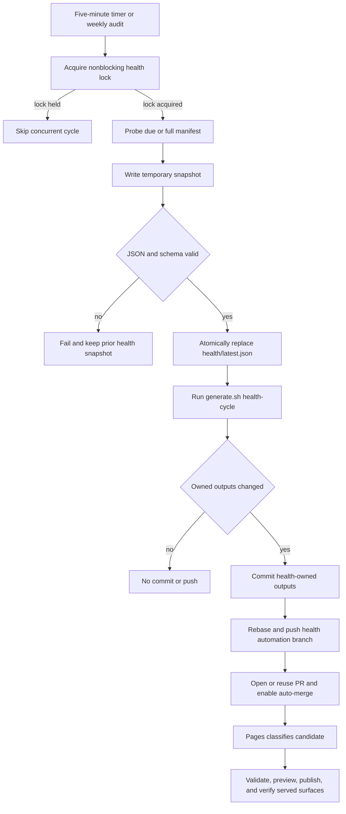
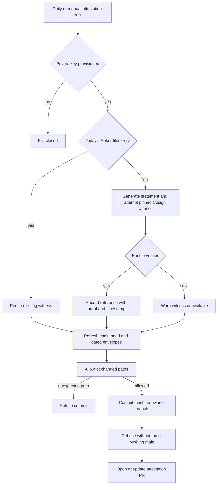

# Operations, Publication, and Failure Handling

DataPulse publishes its canonical website at **https://www.data-pulse.my**. The
current `datapulse.json` manifest contains **418 datasets** and `mcp.json`
advertises **19 read-only tools**. These are checked-in discovery counts, not
availability guarantees. DataPulse is read-only: upstream custodians remain
authoritative for substantive data, while health observations and signatures
describe the artifact and generation path rather than proving upstream semantic
truth.

## Ownership and entrypoints

Operational ownership is deliberately split:

- The health cycle probes and regenerates health-derived artifacts.
- The release build regenerates the broader public site, discovery surfaces,
  JSON-LD, MCP metadata, dashboard assets, and release proof.
- The daily attestation workflow signs health evidence and proposes dated
  attestation changes; it does not take ownership of pipeline-owned health
  files.
- Cloudflare Pages publishes the assembled public artifact. MCP publication is
  a separate read-only service boundary.
- OpenWiki is derivative documentation, triggered manually or weekly. It is
  limited to its allowed `openwiki/` outputs and is never a production-push
  dependency.

`scripts/generate.sh` orchestrates generation but never commits, pushes, or
deploys. Inspect a profile before changing inputs or generators:

```sh
bash scripts/generate.sh health-cycle --list
bash scripts/generate.sh release-build --list
bash scripts/generate.sh --list-owned-outputs health-cycle
```

Use the owning profile rather than editing generated artifacts. `health-cycle`
regenerates reports, badges, README health summaries, RSS, history, trends,
drift, reconciliation, attestations, deltas, evidence coverage, and the catalog
graph. `release-build` adds public discovery, MCP and agent references, JSON
artifacts, dashboard embedding, navigation, methodology, trust snapshots, and
URL-drift checks. Attestation generation requires an operator-provided private
key file when a published key registry is present; a missing key must not become
an unsigned binding silently.

## Scheduled health lifecycle

The VPS health service runs as `redza:redza` in
`/home/redza/datapulse-my`, uses `/tmp/datapulse-health.lock`, and pushes only
health-owned changes. A non-blocking lock makes a concurrent run skip instead
of racing. The checker supports cadence-aware `--due` selection and full
manifest probing; due mode preserves unselected rows and their prior
`last_checked` values. Adapter policy covers direct, weather, GTFS, and browser
checks; browser checks use Camofox, whose default base URL is
`http://localhost:9377`.


```mermaid
flowchart TD
    A[Five-minute timer or weekly audit] --> B[Acquire nonblocking health lock]
    B -->|lock held| C[Skip concurrent cycle]
    B -->|lock acquired| D[Probe due or full manifest]
    D --> E[Write temporary snapshot]
    E --> F{JSON and schema valid}
    F -->|no| G[Fail and keep prior health snapshot]
    F -->|yes| H[Atomically replace health/latest.json]
    H --> I[Run generate.sh health-cycle]
    I --> J{Owned outputs changed}
    J -->|no| K[No commit or push]
    J -->|yes| L[Commit health-owned outputs]
    L --> M[Rebase and push health automation branch]
    M --> N[Open or reuse PR and enable auto-merge]
    N --> O[Pages classifies candidate]
    O --> P[Validate, preview, publish, and verify served surfaces]
```

*Caption: A health observation becomes public only after snapshot validation, derived generation, branch promotion, deployment classification, and served-surface verification.*

Individual probe failures become observations with status and details; they do
not erase other rows or abort the sweep. Malformed JSON, schema failure,
generator failure, rebase conflict, or push failure stops the cycle. Health
telemetry can be appended with `scripts/check_heartbeat.py append`; stage names
are closed-vocabulary values, statuses are `success`, `fail`, or `skipped`, and
entries older than one day are rotated into dated JSONL files.

The health-automation workflow opens or reuses the `health-automation` to
`main` pull request and enables auto-merge after required CI succeeds. It never
writes directly to `main`; repeated pushes reuse the open PR and repeated
merge requests are idempotent.

## Attestation and secret preflight

The daily Ed25519 workflow runs at **03:17 UTC** or by manual dispatch on
`main`. It fails closed when `DATAPULSE_ATTESTATION_PRIVATE_KEY_FILE` is not
provisioned, writes the secret only to a mode-600 temporary file, exports its
path, and removes the file in an `always()` cleanup step. Private keys, API
keys, OAuth material, webhook secrets, and internal credentials must never be
committed, printed, or placed in generated pages. `.env.example` is a template,
not a credential store.

The workflow is idempotent around Rekor: if the day's reference and bundle are
already present, it skips upload; if the dated attestation exists without its
witness, it produces the missing evidence. Cosign is pinned. The generated
statement binds the exact SHA-256 of `health/latest.json`, health time, dataset
count, methodology version, source commit, manifest digest, and legacy chain
head. A valid Rekor bundle must contain one entry, an inclusion proof, and a
signed entry timestamp. Cosign or Rekor outage is explicitly represented as
witness unavailable; Ed25519 binding may still be generated, but that is not a
successful Rekor result.


```mermaid
flowchart TD
    A[Daily or manual attestation run] --> B{Private key provisioned}
    B -->|no| C[Fail closed]
    B -->|yes| D{Today's Rekor files exist}
    D -->|yes| E[Reuse existing witness]
    D -->|no| F[Generate statement and attempt pinned Cosign witness]
    F --> G{Bundle verifies}
    G -->|yes| H[Record reference with proof and timestamp]
    G -->|no| I[Warn witness unavailable]
    E --> J[Refresh chain head and dated envelopes]
    H --> J
    I --> J
    J --> K[Allowlist changed paths]
    K -->|unexpected path| L[Refuse commit]
    K -->|allowed| M[Commit machine-owned branch]
    M --> N[Rebase without force-pushing main]
    N --> O[Open or update attestation PR]
```

*Caption: Attestation retries are safe because existing daily evidence is reused, missing witness material is isolated, and an allowlist prevents pipeline-owned files from being committed by the signer workflow.*

`refresh_chain_head.sh` is the sole chain-head refresh entrypoint. Chain
linearity checks that `attestations/latest/chain_head.json` equals the newest
dated head and verifies the forward-linearity seed; it does not retroactively
claim every historical envelope forms one chain.

## Cloudflare Pages publication

`.github/workflows/deploy-cloudflare-pages.yml` has one non-cancelable
concurrency group, so an older candidate cannot promote after a newer source
release. A push is health-only only when its commit message contains
`[skip deploy]`, `health/latest.json` changed, and every changed path is a
recognized health-cycle output. Manual dispatch and source, workflow,
configuration, MCP, or other changes use the non-health release path.

Both paths validate the health snapshot. Health-only publication embeds the
current health and preserves the already-served release proof and verified
attestation plane; it does not bind new health bytes to an old proof. Full
releases require `attestation_state=signed`, run
`bash scripts/generate.sh release-build`, validate data contracts and
reproducibility, create `_site`, and deploy with pinned Wrangler to Cloudflare
Pages project `datapulse-p4b-preview` on `staging` before promoting the same
artifact to `main`. A rate-limit response (`10429`) is retried up to four
attempts with increasing delays; non-rate-limit errors are not retried.

Before production promotion, the deterministic artifact manifest and served
staging release are checked. After promotion, `scripts/verify_served_release.sh`
checks the canonical origin, landing and dashboard surfaces, embedded health,
counts, release proof, declared pages and artifacts, trust material, and
optional Sigstore evidence. Missing, stale, unsafe, inconsistent, or
mismatched content fails closed. The canonical website origin remains
`https://www.data-pulse.my`.

## MCP publication and health checks

The MCP service is a read-only server on `127.0.0.1:8788` reading published
website data. Nginx protects `/mcp`, performs origin checks, and applies a
one-request-per-second zone with burst. A Cloudflare Tunnel terminates at local
nginx when configured; its UUID, credentials, certificates, and activation are
operator-managed configuration, not an availability assertion. MCP exposes no
write or payment operation.

Each release stamps the repository SHA into `mcp/server.py` and `mcp.json`.
The runtime exposes it through JSON-RPC
`initialize.result.serverInfo.source_commit_sha`. The deployment verifier
initializes the endpoint, lists tools, and compares that marker with local
`git rev-parse HEAD`:

```sh
python3 scripts/verify_mcp_deployment.py
```

Exit status 0 means the short SHA matches, 1 means mismatch, and 2 means the
endpoint is unreachable. An HTTP response alone is not source parity. The
`verify_evidence` path uses a process-local ten-minute cache and serialized
verification; add shared limiting and cache before adding workers or replicas.

## Invariants, monitoring, and recovery

The following are operational invariants:

- **Snapshot integrity:** `health/latest.json` must parse, satisfy its schema,
  contain a non-empty dataset array, and be atomically replaced only after
  validation.
- **Identity integrity:** manifest and health identifiers must agree; signed
  statements reject duplicate identities and methodology mismatches.
- **Publication integrity:** generated outputs, artifact manifest, proof,
  counts, URLs, declared surfaces, and trust material must agree before
  acceptance. `scripts/verify_distribution_sync.py` derives counts from the
  canonical manifest and MCP advertisement and rejects stale current-surface
  claims while excluding historical notes.
- **Freshness monitoring:** the hourly freshness workflow requires a parseable
  health file, a health-file commit within 30 minutes, at least 300 rows, and
  only known status taxonomy values. This audits committed freshness; it is not
  a universal availability guarantee.
- **Failure isolation:** unreachable sources are recorded as observations;
  signer outage is explicit; malformed signer output, inconsistent bindings,
  unsafe paths, and failed verification remain fatal.

For a rollback, prefer `git revert <commit>` followed by the normal generation
and deployment path. Do not force-push or repair derived output by hand. For an
MCP rollback, restore the prior `mcp/server.py` and requirements under
`/home/redza/.local/share/datapulse-mcp/` and restart the user unit. For systemd
changes, restore the unit source, run `systemctl daemon-reload`, and restart the
affected service or timer.

## OpenWiki change procedure

OpenWiki runs manually or weekly on Monday at 08:00 UTC with a locked,
project-local Node runtime. The workflow preflights all six required ChatGPT
OAuth-related secret names without printing values, writes a mode-600 local
configuration, generates derivative pages, injects canonical facts, and runs
`python3 scripts/verify_openwiki.py --generated --changed-from HEAD` before
opening or updating the `openwiki/update` PR. It publishes only the five
allowed OpenWiki artifacts and enables auto-merge; it never dispatches or
blocks production publication.

For immutable local regeneration, `scripts/run_openwiki_snapshot.sh` creates a
detached worktree, generates against one revision, discards unowned changes,
checks source drift, promotes only the owned paths, and restores the prior
files if post-promotion verification fails. OpenWiki documentation is
therefore derivative and bounded: substantive data and operational truth remain
owned by the checked-in workflows, scripts, schemas, and upstream sources.

## Focused verification commands

Run the smallest relevant checks first, then the full contract set for release
or workflow changes:

```sh
find . -type f -name '*.sh' -not -path './.git/*' -print0 | xargs -0 -n1 bash -n
python3 -m jsonschema -i datapulse.json datapulse.schema.json
python3 -m jsonschema -i health/latest.json health.schema.json
python3 -m pytest -q scripts/tests/ mcp/tests/
python3 scripts/verify_repository_contract.py
python3 scripts/verify_distribution_sync.py
python3 scripts/verify_openwiki.py
python3 scripts/verify_mcp_deployment.py
bash scripts/verify_release_invariants.sh --local
python3 scripts/fact_lint.py
```

For generator or health changes, inspect and run the owning `generate.sh --list`
profile before regeneration. For workflow or attestation changes, also inspect
and verify `.github/workflows/datapulse-attest-daily.yml` and
`.github/workflows/deploy-cloudflare-pages.yml`. For an actual served release,
run release verification against the canonical origin only when the public
origin and complete proof plane are available; local mode checks source and
pre-generation contracts and does not claim a current signed binding.

## Canonical facts

- Product: DataPulse
- Canonical website: https://www.data-pulse.my
- Datasets: 418 datasets
- MCP server: 19 read-only tools
