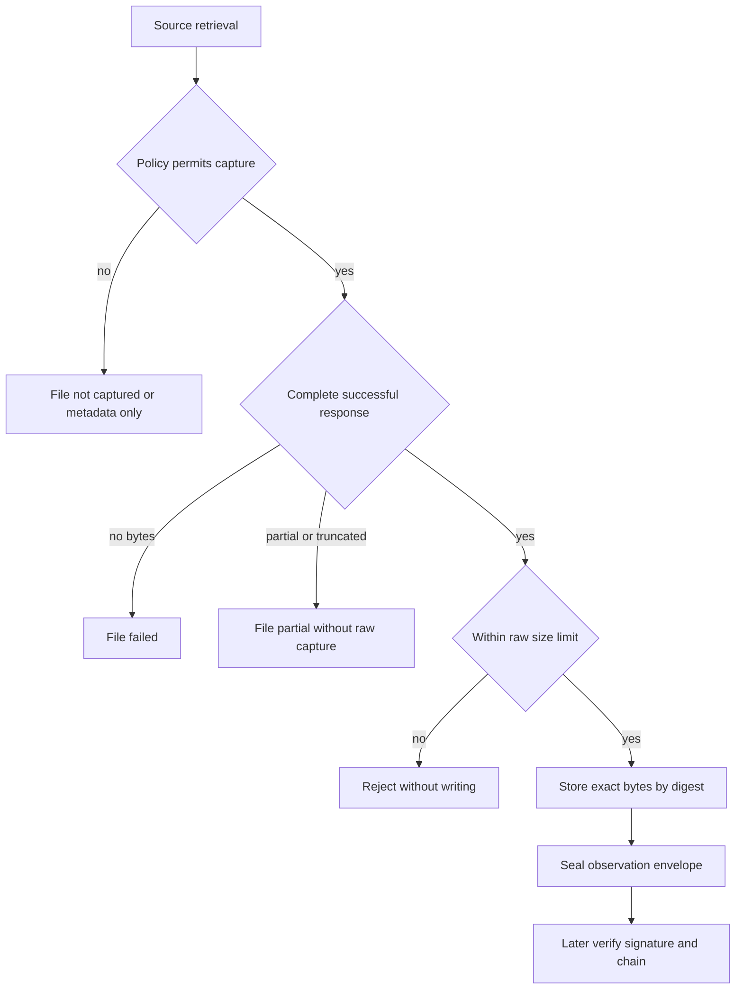
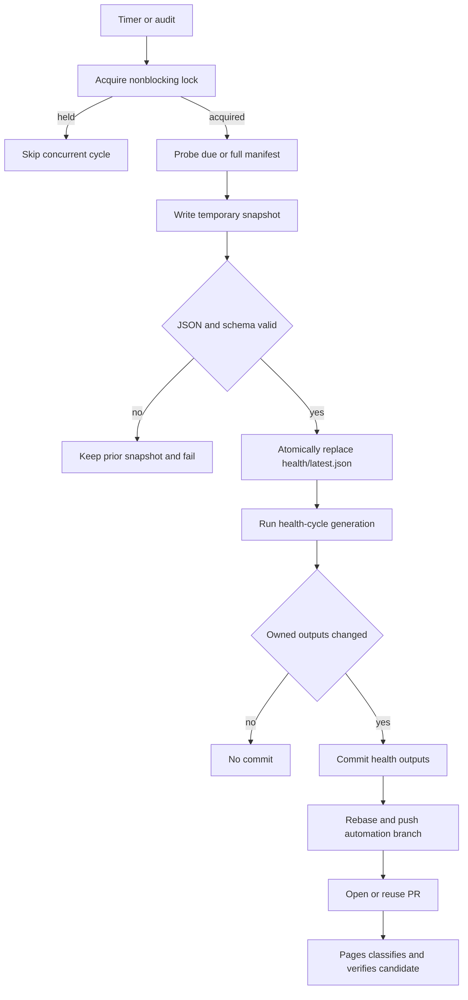
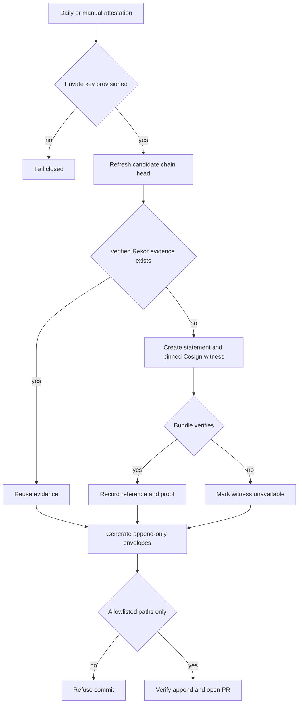

# Observation, Attestation, Publication, and Operations

DataPulse publishes its canonical website at **https://www.data-pulse.my**. The
current checked-in discovery surfaces contain **425 datasets** and advertise **19
read-only tools**. These are repository facts, not uptime, freshness, trust,
certification, or availability guarantees. Upstream custodians remain
authoritative for substantive data; observations, signatures, and deployment
checks describe captured bytes and the generation path rather than proving the
meaning or truth of upstream data.

## Ownership and entrypoints

The system has separate owners and promotion boundaries:

- Observation and health automation probes sources, records health, and owns
  health-cycle outputs.
- `scripts/generate.sh` runs named generation profiles but does not commit, push,
  or deploy. Inspect ownership before changing a generator:

  ```sh
  bash scripts/generate.sh health-cycle --list
  bash scripts/generate.sh release-build --list
  bash scripts/generate.sh --list-owned-outputs health-cycle
  ```

- The daily attestation workflow prepares and signs an exact health binding and
  opens an append-only attestation pull request. It does not silently convert a
  missing key or failed witness into successful evidence.
- Cloudflare Pages assembles and promotes the public site. MCP is a separate
  read-only service boundary. OpenWiki is derivative documentation and is not a
  production publication dependency.

The health profile regenerates health reports, badges, README summaries, RSS,
history, trends, drift and reconciliation outputs, attestations, deltas,
evidence coverage, and the catalog graph. The release profile additionally
builds public discovery, MCP and agent references, JSON artifacts, dashboard
assets, navigation, methodology, trust snapshots, and URL-drift checks. Generated
files should be changed through their owning profile, not by hand.

## Observation capture and storage

The historical-observation plane is deliberately truthful and policy-controlled.
`observation_capture.py` distinguishes `captured`, `partial`, `failed`,
`metadata_only`, and `not_captured`; it never labels bytes captured unless the
store retained the exact response bytes. Non-200 or truncated transfers do not
become replayable captures. A policy can allow full vintage bytes, evidence
capture, health-only metadata, or no capture, and a preview (`store=False`) is
reported as metadata-only rather than pretending to have archived data.

The content-addressed store resolves an explicit absolute root, then
`DATAPULSE_OBSERVATION_ROOT`, then `/home/redza/runtime/datapulse-observations`.
It uses `sha256:<64 lowercase hex>` identities, atomic temporary-file plus fsync
and replace writes, mandated directory/file modes, and bounded payload checks.
Identical blobs are idempotent no-ops. It does not fetch upstream sources, and
retention, pruning, budget enforcement, and read-time checksum verification are
not responsibilities of this store.

Capture seals an envelope in a defined order: an inner digest over the envelope,
a single-leaf cycle root, then the final observation digest covering the cycle
root and all filed members. `source_digest` is present only for retained bytes;
verification is initially `unverified`; observed time, retrieval completion time,
and source-declared content vintage remain distinct. A failed or denied capture
cannot be replayable.


```mermaid
flowchart TD
    A[Source retrieval] --> B{Policy permits capture}
    B -->|no| C[File not captured or metadata only]
    B -->|yes| D{Complete successful response}
    D -->|no bytes| E[File failed]
    D -->|partial or truncated| F[File partial without raw capture]
    D -->|yes| G{Within raw size limit}
    G -->|no| H[Reject without writing]
    G -->|yes| I[Store exact bytes by digest]
    I --> J[Seal observation envelope]
    J --> K[Later verify signature and chain]
```

*Caption: Capture decisions preserve the difference between an observation, retained source bytes, and later cryptographic verification.*

## Scheduled health lifecycle

The VPS health service runs as `redza:redza` in `/home/redza/datapulse-my`, uses
`/tmp/datapulse-health.lock`, and skips a concurrent run rather than racing. It
supports cadence-aware `--due` selection and full-manifest probing; due mode
preserves unselected rows and their previous `last_checked` values. Direct,
weather, GTFS, and browser adapters are supported; browser checks use Camofox,
whose default base URL is `http://localhost:9377`.

Individual probe failures remain observations and do not erase other rows or
abort the sweep. Malformed JSON, schema failure, generator failure, rebase
conflict, or push failure stops promotion. A validated snapshot is atomically
replaced into `health/latest.json`, then the health profile derives its outputs.
Health telemetry appended with `scripts/check_heartbeat.py append` uses closed
stage names and `success`, `fail`, or `skipped` statuses; entries older than one
day rotate into dated JSONL files.

The health-automation workflow pushes only health-owned changes, opens or reuses
the `health-automation` to `main` pull request, and enables auto-merge only after
required checks. It never writes directly to `main`; repeated pushes and merge
requests are idempotent.


```mermaid
flowchart TD
    A[Timer or audit] --> B[Acquire nonblocking lock]
    B -->|held| C[Skip concurrent cycle]
    B -->|acquired| D[Probe due or full manifest]
    D --> E[Write temporary snapshot]
    E --> F{JSON and schema valid}
    F -->|no| G[Keep prior snapshot and fail]
    F -->|yes| H[Atomically replace health/latest.json]
    H --> I[Run health-cycle generation]
    I --> J{Owned outputs changed}
    J -->|no| K[No commit]
    J -->|yes| L[Commit health outputs]
    L --> M[Rebase and push automation branch]
    M --> N[Open or reuse PR]
    N --> O[Pages classifies and verifies candidate]
```

*Caption: Health becomes publishable only after validation, derived generation, branch promotion, and deployment checks.*

## Attestation, signing, and Rekor evidence

The daily Ed25519 workflow runs at **03:17 UTC** or by manual dispatch on `main`.
It fails closed when `DATAPULSE_ATTESTATION_PRIVATE_KEY_FILE` is absent, writes
the secret to a mode-600 temporary file, and removes it in an `always()` cleanup
step. Secrets and private keys must not be committed, printed, or embedded in
pages; `.env.example` is a template, not a credential store.

Before witnessing, the workflow refreshes the candidate chain head and checks
whether existing Rekor evidence is already verified for the selected health
digest. Existing accepted evidence is reused. A new candidate is immutable and
uses pinned Cosign; the generated Sigstore statement binds the exact SHA-256 of
`health/latest.json`, health time, dataset count, methodology/source metadata,
and legacy chain head. The bundle must contain exactly one Rekor entry, an
inclusion proof, and a signed entry timestamp. Cosign installation or Rekor
upload/verification failure is explicitly a witness-unavailable condition: the
Ed25519 binding may still be generated, but this is not a successful Rekor result.
Partial witness files are reconciled rather than blindly overwritten.

Append verification then protects the attestation history. `refresh_chain_head.sh`
is the chain-head entrypoint; chain checks require the latest head to equal the
newest dated head and verify the forward-linearity seed, without claiming that
all historical envelopes form one retroactive chain. The workflow commits only
its allowlisted machine-owned paths through an append pull request.


```mermaid
flowchart TD
    A[Daily or manual attestation] --> B{Private key provisioned}
    B -->|no| C[Fail closed]
    B -->|yes| D[Refresh candidate chain head]
    D --> E{Verified Rekor evidence exists}
    E -->|yes| F[Reuse evidence]
    E -->|no| G[Create statement and pinned Cosign witness]
    G --> H{Bundle verifies}
    H -->|yes| I[Record reference and proof]
    H -->|no| J[Mark witness unavailable]
    F --> K[Generate append-only envelopes]
    I --> K
    J --> K
    K --> L{Allowlisted paths only}
    L -->|no| M[Refuse commit]
    L -->|yes| N[Verify append and open PR]
```

*Caption: Signing separates the local Ed25519 binding from optional external Rekor evidence while preventing unsigned or unsafe path changes.*

Host-side observation receipts are independently verifiable offline. The
receipt verifier recomputes payload hashes, Ed25519 signatures, registry validity
windows, receipt identity, and—when supplied—the within-day predecessor chain
and chain head. Supplying `--health` additionally checks the claimed artifact
digest, dataset count, and freshness counts; without it, those claims are
reported as unverified, not inferred. Verification needs no network or private
key and returns failure for malformed or inconsistent evidence.

## Cloudflare Pages publication

`deploy-cloudflare-pages.yml` uses one non-cancelable
`cloudflare-pages-production` concurrency group, so a stale candidate cannot
promote after a newer source release. A push is classified health-only only when
its message contains `[skip deploy]`, `health/latest.json` changed, and every
changed path is a recognized health-cycle output. Manual dispatch and source,
workflow, configuration, MCP, or other changes take the full release path.

Both paths validate health. Health-only publication embeds current health while
preserving the already-served release proof and attestation plane; it does not
claim that new health bytes are covered by an old proof. Full releases require a
signed attestation state, run `bash scripts/generate.sh release-build`, validate
contracts and reproducibility, build `_site`, and deploy with pinned Wrangler to
Cloudflare Pages project `datapulse-p4b-preview` on `staging` before promoting
the same artifact to `main`. A `10429` rate-limit response is retried up to four
times with increasing delays; other errors are not retried.

Before production promotion, the deterministic artifact manifest and served
staging release are checked. After promotion, served-release verification checks
the canonical origin, landing and dashboard surfaces, embedded health, counts,
release proof, declared pages and artifacts, trust material, and optional
Sigstore evidence. Missing, stale, unsafe, inconsistent, or mismatched content
fails closed. The canonical origin remains `https://www.data-pulse.my`.

## MCP publication and drift audits

The MCP service is a read-only server on `127.0.0.1:8788` reading published
website data. Nginx protects `/mcp`, checks the origin, and applies a one-request-
per-second zone with burst. A Cloudflare Tunnel, when configured, terminates at
local nginx; its credentials and activation are operator-managed configuration,
not an availability assertion. MCP exposes no write or payment operation.

Each release stamps repository provenance into `mcp/server.py` and `mcp.json`.
The runtime exposes it as JSON-RPC
`initialize.result.serverInfo.source_commit_sha`. The verifier initializes the
endpoint, lists tools, and compares the marker with the expected repository
revision:

```sh
python3 scripts/verify_mcp_deployment.py
```

Exit status 0 means matching provenance, 1 means mismatch, and 2 means the
endpoint is unreachable. An HTTP response alone is not source parity. The hourly
provenance-drift workflow reports a mismatch and maintains one owner issue; an
unreachable endpoint is a warning and does not establish a mismatch. The
`verify_evidence` path has a process-local ten-minute cache and serialized
verification; shared limiting and cache are required before adding workers or
replicas.

## Audits, invariants, and failure handling

Key gates are:

- **Snapshot integrity:** `health/latest.json` must parse, satisfy its schema,
  contain a non-empty dataset collection, and be atomically replaced only after
  validation.
- **Identity and binding integrity:** manifest and health identifiers agree;
  signed statements reject duplicate identities and methodology mismatches; a
  receipt's claimed artifact is checked against the supplied health bytes.
- **Publication integrity:** generated outputs, artifact manifest, proof, counts,
  URLs, declared surfaces, and trust material agree before acceptance.
- **Freshness audit:** the hourly workflow requires parseable health, a health
  file commit within 30 minutes, at least 300 rows, and only the known status
  taxonomy. This audits committed freshness, not universal availability.
- **Local consistency:** the hourly main audit runs repository-side tests, fact
  lint, and MCP reference-stamp checks without depending on the live origin.
- **Failure isolation:** unreachable sources become observations; signer and
  witness outages are explicit; malformed output, unsafe paths, inconsistent
  bindings, and failed verification remain fatal.

For rollback, prefer `git revert <commit>` followed by the normal generation and
deployment path. Do not force-push or hand-repair derived output. For MCP,
restore the prior `mcp/server.py` and requirements under
`/home/redza/.local/share/datapulse-mcp/` and restart the user unit. For systemd
changes, restore the unit source, run `systemctl daemon-reload`, and restart the
affected service or timer.

## Focused verification commands

Run the smallest relevant checks first, then the broader contract set:

```sh
find . -type f -name '*.sh' -not -path './.git/*' -print0 | xargs -0 -n1 bash -n
python3 -m jsonschema -i datapulse.json datapulse.schema.json
python3 -m jsonschema -i health/latest.json health.schema.json
python3 -m pytest -q scripts/tests/ mcp/tests/
python3 scripts/verify_repository_contract.py
python3 scripts/verify_distribution_sync.py
python3 scripts/verify_openwiki.py
python3 scripts/verify_mcp_deployment.py
bash scripts/verify_release_invariants.sh --local
python3 scripts/fact_lint.py
```

For observation changes, test capture decisions, policy denial, size limits,
atomic placement, envelope validation, receipt signature/chain verification, and
artifact binding with the focused scripts tests. For generator or health changes,
inspect and run the owning `generate.sh --list` profile. For workflow or
attestation changes, inspect the attestation and Pages workflows and verify both
local contracts and the append/reproducibility gates. A local release check does
not claim a current signed binding or served-state parity.

## Canonical facts

- Product: DataPulse
- Canonical website: https://www.data-pulse.my
- Datasets: 425 datasets
- MCP server: 19 read-only tools
