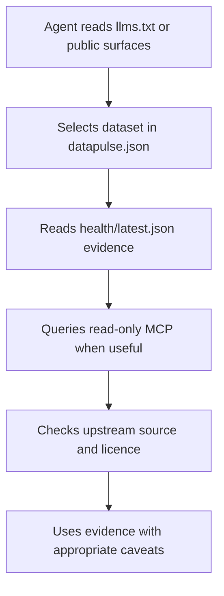

# DataPulse MY OpenWiki Quickstart

DataPulse MY is a public **metadata and evidence layer** for Malaysian public data. It publishes discovery metadata, health observations, and reproducibility context; it does not replace the substantive upstream datasets. The upstream steward or publisher remains authoritative for the data itself, licence terms, interpretation, and any decision based on it. This page is a route into the repository, not a certification or guarantee of trust, reputation, availability, or evidence reference.

The canonical human origin is **https://www.data-pulse.my**. The current registry contains **389 datasets**. The public MCP advertisement describes **16 read-only tools** over that catalogue.

## Start here: the agent path

1. **Discover.** Fetch [`llms.txt`](../llms.txt) for the compact agent index, or inspect [`config/public-surfaces.json`](../config/public-surfaces.json) for the canonical website, MCP origin, pages, and published artifact paths.
2. **Identify.** Use [`datapulse.json`](../datapulse.json), the canonical manifest. An entry supplies an ID, name, source, steward, URL, licence, cadence, geographic coverage, and a health-report path. Treat those fields as DataPulse metadata, not as the upstream record.
3. **Assess.** Read [`health/latest.json`](../health/latest.json) for the aggregate and per-dataset published health evidence. As checked at `2026-08-29T10:45:29Z`, its summary covers 389 datasets: 94 `fresh`, 134 `aging`, 144 `stale`, 1 `discontinued`, 5 `browser-dependent`, and 11 `reference`; the other defined statuses currently have zero entries. These are observations with explicit signal limits, not a universal quality verdict.
4. **Query, read-only.** Use `https://mcp.data-pulse.my/mcp` with Streamable HTTP POST. [`mcp.json`](../mcp.json) is the machine-readable contract: authentication is not required, and advertised operations are annotated read-only and idempotent. Prefer the MCP resource `datapulse://index` for a lightweight catalogue, then search and inspect a dataset or its evidence.
5. **Verify before relying.** Compare the published health, provenance, freshness, anomaly, drift, reconciliation, and attestation evidence with the upstream source's own documentation and licence. A response, badge, or MCP result does not make the upstream source authoritative through DataPulse.

*This flow shows discovery through evidence-assisted use; the final authority remains the upstream publisher.*

## Compact task-routing map

| If your task is to… | Go to | Read-only boundary |
|---|---|---|
| Find a dataset, understand manifest fields, or interpret health and freshness evidence | [Dataset Manifest and Health Evidence](datasets.md) | Discovery and evidence only; fetch substantive data from the upstream URL in the manifest. |
| Search or inspect datasets through an agent interface, use resources, or understand MCP results | [Read-Only MCP Discovery and Evidence Surface](mcp.md) | MCP exposes catalogue/evidence queries; it does not provide a write or mutation workflow. |
| Change a dataset entry, refresh generated artifacts, diagnose health publication, or validate a release | [Health, Publication, and OpenWiki Operations](operations.md) | Contributions change repository inputs through review and CI; public MCP remains read-only. |

## Canonical artifacts and safe interpretation

- **Manifest:** [`datapulse.json`](../datapulse.json) is the registry to resolve IDs and upstream URLs. Do not infer a dataset's substantive truth from its presence in the registry.
- **Aggregate health:** [`health/latest.json`](../health/latest.json) records the checked time, status taxonomy, and evidence-derived signals. Freshness can come from a `Last-Modified` header or a parsed content date; absence of a signal is materially different from proof of staleness.
- **Agent index:** [`llms.txt`](../llms.txt) points agents to the manifest, health snapshot, MCP endpoint, and public discovery paths.
- **MCP contract:** [`mcp.json`](../mcp.json) advertises the endpoint, transport, authentication posture, ten-status taxonomy, tools, and read-only annotations. Its evidence-returning tools report published or ephemeral observations; they do not turn DataPulse into an upstream data API.
- **Public surfaces:** [`config/public-surfaces.json`](../config/public-surfaces.json) is the source of record for the canonical origins and artifact inventory. Use its website origin exactly as published: `https://www.data-pulse.my`.

A useful minimum check is: resolve the ID in the manifest, inspect the latest health status and check time, follow the upstream URL, and apply the upstream licence and attribution. A `discontinued`, `stale`, `aging`, `browser-dependent`, or `reference` result needs its documented interpretation; a `fresh` result still does not certify the underlying data.

## How changes become published

The repository separates an hourly freshness control loop from publication and documentation refresh:

- [`pipeline-freshness.yml`](../.github/workflows/pipeline-freshness.yml) runs hourly or manually with read-only repository permission. It parses `health/latest.json`, requires a valid dataset collection, checks that the health snapshot commit is no more than 30 minutes old, requires at least 300 rows, and rejects statuses outside the ten-value taxonomy.
- [`deploy-cloudflare-pages.yml`](../.github/workflows/deploy-cloudflare-pages.yml) runs on relevant pushes or manually. It validates the health snapshot. Health-only changes take the dashboard embedding and served-proof preservation path; other changes run the release-build generation and reproducibility/invariant verification profile before deployment. A `[skip deploy]` push is eligible for the health-only classification only when all changed paths are health-cycle outputs.
- [`openwiki-update.yml`](../.github/workflows/openwiki-update.yml) runs on Mondays, manually, or when the named source-of-record files change (excluding `openwiki/**`). It installs the locked project-local OpenWiki runtime, generates derivative pages, injects canonical facts, verifies them, and proposes the permitted wiki outputs in a pull request. Workflow-file edits do not auto-trigger this job; use a manual run when appropriate.

For contribution shape, failure handling, generated artifacts, and the PR boundary, use [Operations](operations.md) rather than copying those procedures here.

## Read-only and evidence boundary

MCP is an agent-facing query surface, not an ingestion or write API. Its advertised endpoint is `https://mcp.data-pulse.my/mcp`, with `streamable-http`, `POST`, and `auth_required: false`. The tools can search, return manifest and evidence records, expose published trend/drift/reconciliation information, and perform bounded verification operations; results remain evidence about the catalogue or an observation, not a substitute for the upstream publisher.

In particular, health status measures declared checks and available signals. It can identify freshness risk, browser dependence, missing signals, or publication differences; it cannot establish that every upstream value is correct. When sources disagree, treat reconciliation output as a prompt for human review, not proof that either source is wrong. Always preserve the upstream source's licence and attribution requirements.

## Source-of-record quick reference

The OpenWiki generation contract names these repository sources of record: [`config/public-surfaces.json`](../config/public-surfaces.json), [`datapulse.json`](../datapulse.json), [`health/latest.json`](../health/latest.json), [`mcp.json`](../mcp.json), [`README.md`](../README.md), [`llms.txt`](../llms.txt), and the checked-in workflows. The three linked domain pages provide the deeper dataset, MCP, and operations models; this quickstart intentionally routes to them instead of duplicating their catalogues or contracts.

## Canonical facts

- Canonical website: https://www.data-pulse.my
- Datasets: 389 datasets
- MCP server: 16 read-only tools
