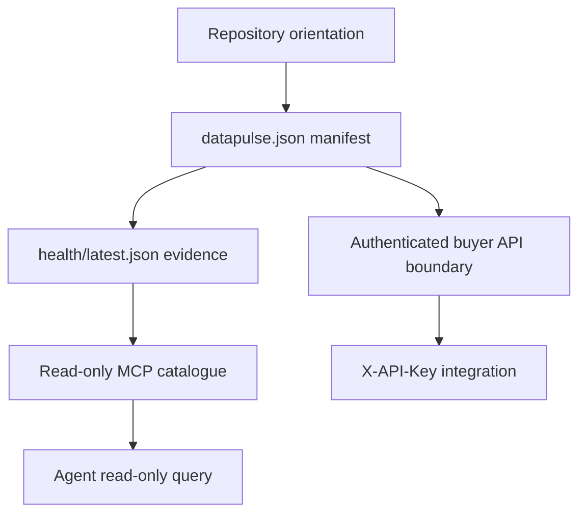

# DataPulse MY coding-agent quickstart

DataPulse MY is a read-only catalogue and evidence layer for Malaysian public
datasets. Begin at the canonical website: **https://www.data-pulse.my**. The
current manifest contains **389 datasets**; upstream sources remain authoritative
for substantive data. DataPulse records discovery metadata and health evidence,
but does not replace the publisher or guarantee that a source is available or
usable for every purpose.

## The shortest route

1. **Orient.** Read this page, then inspect [`README.md`](../README.md),
   [`llms.txt`](../llms.txt), and [`config/public-surfaces.json`](../config/public-surfaces.json).
   The public-surfaces file is the map of the website, repository, MCP, and API
   origins plus published artifacts.
2. **Find the data.** Treat [`datapulse.json`](../datapulse.json) as the canonical
   registry. Start with an `id`, `name`, `source`, `steward`, `url`, `licence`,
   `refresh_frequency`, `namespace`, and `health_report`; follow the linked
   report only after locating the manifest entry.
3. **Check evidence.** Read [`health/latest.json`](../health/latest.json) for
   the current aggregate and per-dataset health evidence. A status is a signal
   to investigate, not a certification of the underlying data.
4. **Choose an integration.** Use the public, unauthenticated MCP endpoint for
   read-only catalogue queries. Use the separately versioned buyer API only
   where an authenticated integration boundary is required; do not treat the
   MCP endpoint as that API.
5. **Verify before relying.** Run the focused local checks below, and repeat
   the relevant check after changing a manifest, health, MCP, or workflow input.



*This flow separates catalogue and health evidence from the two serving
boundaries; it does not imply that either boundary republishes upstream data.*

## Manifest and data model

The manifest is the starting point for dataset identity and provenance. Keep the
canonical `id` when moving between the registry, health snapshot, health report,
MCP calls, and citations. `source` and `steward` identify the published source
context; `url`, `licence`, attribution, geographic coverage, cadence, and
expected record count describe how to approach the upstream resource. Some
entries also carry custodian, attestation, or methodology metadata. Do not infer
that these fields make DataPulse the official publisher.

The live health snapshot is an aggregate companion to the manifest. Its current
summary covers all 389 datasets and distinguishes statuses such as `fresh`,
`aging`, `stale`, `discontinued`, `degraded`, `browser_dependent`, `unreachable`,
`unknown`, `unknown_freshness`, and `reference`. It also exposes freshness-signal
and record-count gaps. In particular, `unknown-freshness` means the available
transport and shape evidence do not prove a content date; it is not evidence of
freshness. Read [Dataset manifest, health evidence, and trust model](datasets.md)
for field-level interpretation, namespaces, schema/record evidence, and
limitations.

## Read-only MCP: the agent-facing path

The public MCP endpoint is `https://mcp.data-pulse.my/mcp`. It uses Streamable
HTTP with POST and requires no authentication. The advertised surface is **16
read-only tools** over the 389-dataset catalogue. The catalogue is described by
[`mcp.json`](../mcp.json), while [`llms.txt`](../llms.txt) provides a one-fetch
agent discovery index.

A minimal client configuration is:

```json
{
  "mcpServers": {
    "datapulse-my": {
      "transport": "streamable-http",
      "url": "https://mcp.data-pulse.my/mcp"
    }
  }
}
```

A practical agent loop is:

- call `search_datasets` for natural-language discovery, optionally filtering by
  `licence` or `source`;
- call `get_dataset` with the canonical ID for manifest, status, provenance, and
  freshness-signal detail;
- use `find_stale`, `find_anomalies`, `find_deteriorating`,
  `find_recovering`, `find_unreliable`, or `find_schema_drift` when the question
  is about published health evidence;
- use `get_evidence`, `get_provenance`, `trust_verdict`, or
  `verify_attestation` when the task needs evidence or attestation context;
- use `verify_evidence` only as an ephemeral, rate-limited transport check: it
  does not update health artifacts; and
- use `find_by_licence`, `check_reconciliation`, or `usage_summary` for their
  explicitly described catalogue, comparison, or local usage-reporting tasks.

The tools and resources remain read-only. A discrepancy or risk signal calls for
human review and, for substantive values, consultation of the upstream source.
See [Read-only MCP server and agent integration](mcp.md) for typed inputs,
resources, annotations, errors, local execution, and deployment publication.

## Operational path: health and generated artifacts

The operational source of evidence is the checked-in health snapshot, not an
agent's assumption about current reachability. The repository's probe entrypoint
is `scripts/check.sh`; the README documents the browser-dependent path as
`check.sh` → Camofox sidecar → DOM snapshot → content-date extraction. The
resulting `health/latest.json` is consumed by published surfaces and should be
validated before use.

For a code change, first determine whether it affects the manifest, health
inputs, MCP advertisement, or a generated public surface. The scheduled OpenWiki
workflow regenerates derivative wiki pages with the project-local locked runtime,
then injects and verifies canonical facts. It is triggered manually, weekly, or
by changes to the named source-of-record files; edits to workflow files alone do
not trigger it automatically.

The operational and lifecycle details belong in
[Generation, health operations, APIs, and verification](operations.md). That
page is the handoff for probe/generation ordering, state ownership, failure
handling, publication, and deployment checks rather than a reason to edit a
workflow or generated artifact directly.

## Authenticated buyer API boundary

The buyer API is separate from the public MCP surface. Its public origin is the
`api` origin in [`config/public-surfaces.json`](../config/public-surfaces.json),
with the versioned boundary `/api/v1/`. The README describes `X-API-Key`
authentication, durable per-key request limits, and audit logs. The public MCP
endpoint remains intentionally unauthenticated and read-only.

Keep these concerns separate when changing code or designing an agent:

- MCP is the public read-only catalogue/evidence interface; it is not an
  authentication, entitlement, or payment surface.
- The buyer API is the authenticated integration boundary; consult the published
  buyer API reference from the public artifact map for its exact routes and
  request contract.
- Neither interface makes DataPulse the authoritative publisher of the
  substantive dataset. Follow the manifest's upstream `url`, licence, and
  attribution requirements.

## Focused verification commands

Run the smallest relevant check first, then the repository gate when the change
crosses boundaries:

```sh
# Probe/inspect health output locally
bash scripts/check.sh

# Repository schemas
python3 -m jsonschema -i datapulse.json datapulse.schema.json
python3 -m jsonschema -i health/latest.json health.schema.json

# MCP and generator contracts
python3 -m pytest -q scripts/tests/ mcp/tests/
bash scripts/tests/test_verify_agent_ready.sh

# Repository/public-surface invariants
python3 scripts/verify_repository_contract.py
python3 scripts/verify_openwiki.py
python3 scripts/check_url_drift.py
bash scripts/verify_release_invariants.sh --local
python3 scripts/fact_lint.py
```

The CI workflow runs these checks as the deterministic safety net, including
shell syntax validation and the contract/MCP test suites. If the change is only
wiki generation, the OpenWiki workflow's final verification is:

```sh
python3 scripts/inject_openwiki_canonical_facts.py --root .
python3 scripts/verify_openwiki.py --generated --changed-from HEAD
```

## Further reading and safe-change map

- [Dataset manifest, health evidence, and trust model](datasets.md) — identity,
  provenance, namespaces, status taxonomy, freshness, schema/record evidence,
  drift, and reconciliation.
- [Read-only MCP server and agent integration](mcp.md) — MCP contract, tools,
  resources, local runtime, and deployment verification.
- [Generation, health operations, APIs, and verification](operations.md) —
  probing, generated artifacts, publication, authenticated API control, and
  release/CI operations.

For source-of-record orientation, prefer `README.md`, `llms.txt`,
`config/public-surfaces.json`, `datapulse.json`, `health/latest.json`, and
`mcp.json`. Do not edit generated public artifacts or treat derivative wiki prose
as a replacement for those records.

## Canonical facts

- Canonical website: https://www.data-pulse.my
- Datasets: 389 datasets
- MCP server: 16 read-only tools
