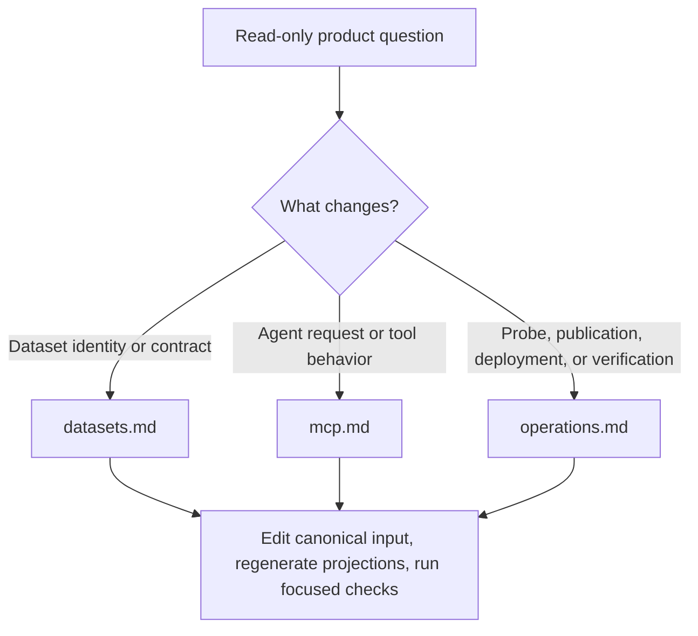

# DataPulse Wiki Quickstart

DataPulse is a read-only metadata and evidence layer around upstream public
 datasets. It records catalogue metadata, declared licence and provenance,
access and freshness observations, and evidence; it is **not the official
publisher**. Upstream sources remain authoritative for substantive data,
content, licensing, and attribution.

The canonical website origin is **https://www.data-pulse.my**. The current
manifest contains **418 datasets**, and the public MCP catalogue exposes **19
read-only tools**. Derive these facts from `datapulse.json` and `mcp.json` when
regenerating documentation; do not hand-maintain a copied count.

## Start here: route the task



*The route from a task to its conceptual page and safe change boundary.*

| Task | Read first | Source of record and safe boundary |
|---|---|---|
| Find a dataset, or change its identity, licence, steward, URL, cadence, expected count, schema, or provenance | [Dataset catalogue and health contract](datasets.md) | `datapulse.json`, `datapulse.schema.json`, the matching health row, and the dataset report/envelope. Change canonical metadata, then regenerate derived outputs. |
| Discover tools, call MCP, understand resources, provenance, evidence, or verification behavior | [Read-only MCP integration](mcp.md) | `mcp.json` is the advertised wire contract; `mcp/server.py` and `mcp/tests/` define runtime behavior. Keep the boundary read-only. |
| Change probes, health publication, attestations, deployment, release packaging, or operational checks | [Pipeline, attestations, deployment, and verification](operations.md) | The checked-in workflows and `scripts/generate.sh` profiles define ownership. Distinguish `health-cycle` from `release-build`; do not patch generated artifacts as sources. |
| Refresh this documentation | [OpenWiki instructions](INSTRUCTIONS.md) | OpenWiki may update only its permitted documentation outputs. It documents source-of-record artifacts; it does not regenerate dataset or health data. |

## Contract model

`datapulse.json` is the registry input: its `datasets` entries join stable IDs
to official URLs, stewards, custodians, licences, attribution, cadence,
geography, namespace, expected record counts, and health-report paths.
`health/latest.json` is a complete published snapshot, not merely a log of the
latest probes: a health cycle probes due rows and merges unchanged observations.
Its statuses classify freshness, reachability, browser dependency, degradation,
discontinuation, and missing evidence. Reports, envelopes, feeds, catalogues,
badges, attestations, and discovery indexes are generated projections; change
their inputs and regenerate them together.

A health status is evidence classification, not endorsement. In particular,
`unknown-freshness` means no defensible freshness signal was found,
`browser-dependent` records an access limitation, and `reference` is for
versioned lookup data where date freshness does not apply. The snapshot’s
current status distribution and checked timestamp belong to
`health/latest.json`, not this routing page.

## Agent entrypoints and request posture

For machine-readable discovery, fetch `https://www.data-pulse.my/llms.txt`.
The advertised MCP endpoint is Streamable HTTP at
`https://mcp.data-pulse.my/mcp`, with no authentication required by the
catalogue advertisement:

```json
{
  "mcpServers": {
    "datapulse-my": {
      "transport": "streamable-http",
      "url": "https://mcp.data-pulse.my/mcp"
    }
  }
}
```

Initialize an MCP session before discovery. A safe read sequence is
`search_datasets` then `get_dataset`; use `get_provenance` or `get_evidence`
when citation or pipeline evidence matters. Risk-oriented published queries
include `find_stale`, `find_anomalies`, `find_deteriorating`, `find_recovering`,
`find_unreliable`, and `find_schema_drift`. `verify_attestation` checks an
attestation; `verify_evidence` is a constrained, ephemeral transport check and
does not update `health/latest.json`. MCP reads published repository artifacts
and does not make DataPulse authoritative for upstream content.

## Ownership and failure rules

1. **Separate inputs from projections.** Manifest and source metadata belong to
   the dataset contract; probe observations belong to the health cycle; public
   discovery, MCP metadata, envelopes, and dashboard packaging belong to the
   release build. `scripts/generate.sh` orchestrates profiles but does not
   commit, push, or deploy.
2. **Fail closed at contract boundaries.** Individual source failures may be
   recorded while a probe continues, but malformed snapshots, generator errors,
   missing artifacts, stale health commits, URL drift, and contract violations
   must fail verification. Concurrent health cycles skip on the lock rather than
   racing.
3. **Respect access limits.** Browser-dependent sources use the configured
   Camofox sidecar. Probes do not bypass authentication, CAPTCHAs, or terms of
   service; contributions must not add credentials, cookies, personal data, or
   copied source records.
4. **Do not infer availability from configuration.** A declared website or
   endpoint is not proof that external infrastructure is currently available.
   Health-only changes and source/configuration changes follow separate CI and
   publication paths.

## Focused verification

Inspect ownership without running generators:

```bash
bash scripts/generate.sh health-cycle --list
bash scripts/generate.sh release-build --list
```

The repository CI gates include schema, repository-contract, MCP, OpenWiki,
URL-drift, release-invariant, and fact checks:

```bash
python3 -m pytest -q scripts/tests/ mcp/tests/
bash scripts/tests/test_verify_agent_ready.sh
python3 scripts/verify_repository_contract.py
python3 scripts/verify_openwiki.py
python3 scripts/check_url_drift.py
bash scripts/verify_release_invariants.sh --local
python3 scripts/fact_lint.py
```

For a local published-surface check, run
`bash scripts/verify_agent_ready.sh --local`. Without `--local`, the command
fetches canonical public surfaces with retries and rejects non-canonical
discovery hosts. Treat failures as evidence to investigate the owning source or
workflow, not as a reason to hand-edit derived JSON.

## Sources of record

- [`config/public-surfaces.json`](../config/public-surfaces.json) — canonical origins and declared public artifacts.
- [`datapulse.json`](../datapulse.json) — dataset registry and metadata contract input.
- [`health/latest.json`](../health/latest.json) — aggregate health evidence.
- [`mcp.json`](../mcp.json) — advertised MCP endpoint, taxonomy, tools, and schemas.
- [`README.md`](../README.md) — public purpose, trust posture, and consumer guidance.
- [`llms.txt`](../llms.txt) — agent discovery index.
- [`openwiki/INSTRUCTIONS.md`](INSTRUCTIONS.md) — documentation generation contract.
- [Dataset catalogue and health contract](datasets.md), [read-only MCP integration](mcp.md), and [operations](operations.md) — conceptual routes for deeper work.

## Canonical facts

- Product: DataPulse
- Canonical website: https://www.data-pulse.my
- Datasets: 418 datasets
- MCP server: 19 read-only tools
