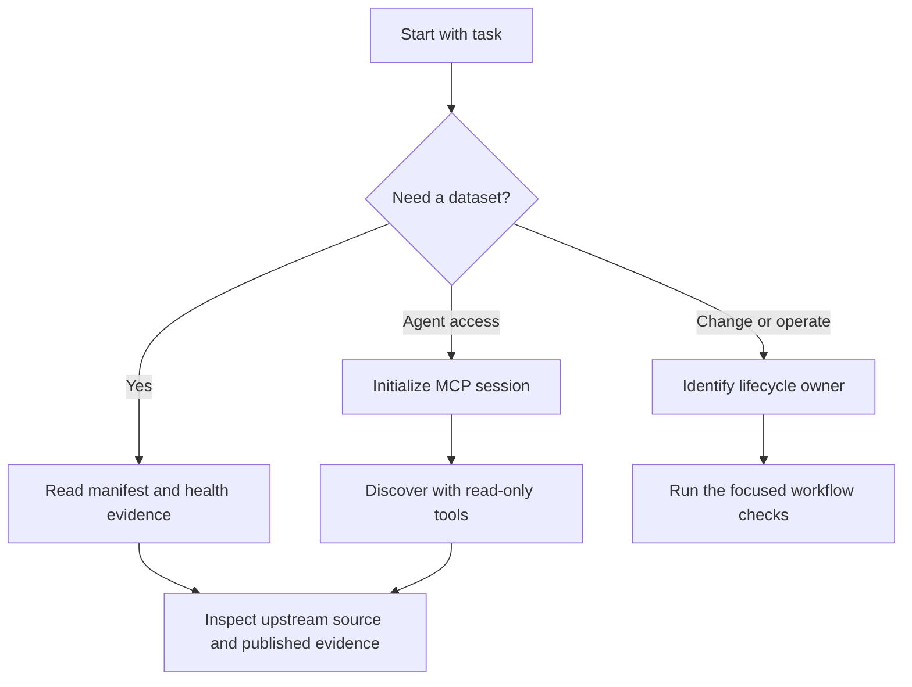

# DataPulse Wiki Quickstart

DataPulse is a **read-only metadata and evidence layer** around upstream public
 datasets. It publishes dataset identity, provenance, licences, access and
freshness observations, schema or record evidence, and known quirks; it is **not
the official publisher**. Upstream sources remain authoritative for substantive
data, content, licensing, and attribution.

The canonical website origin is **https://www.data-pulse.my**. The live manifest
contains **418 datasets**, and the public MCP catalogue exposes **19 read-only
tools**. These are source-of-record facts, not values to infer from an older page.
The MCP endpoint is distinct: **https://mcp.data-pulse.my/mcp**.

## Route the task

| Task | Read next | Boundary to preserve |
|---|---|---|
| Find a dataset or understand its identity, licence, steward, URL, cadence, expected count, schema, health row, or evidence | [Dataset Catalogue, Health, and Evidence](datasets.md) | Start with `datapulse.json` and join the stable dataset ID to `health/latest.json` and the published report or evidence. Change canonical inputs, not a derived projection. |
| Discover through an agent, inspect tool/resource behavior, retrieve provenance, or verify published evidence | [Read-Only MCP Surface and Agent Workflows](mcp.md) | Use the advertised contract and the read-only endpoint. Discovery is not trust verification; `verify_evidence` is a constrained, temporary check and does not update health. |
| Understand probes, generated artifacts, attestations, publication, deployment, rollback, or contribution checks | [Pipelines, Attestations, Publication, and Safe Changes](operations.md) | Identify the owning lifecycle before changing anything. Health observations, source metadata, and release packaging have different owners and failure boundaries. |
| Refresh this documentation or decide whether a claim is publishable | This page, then the three pages above | Derive facts from the repository sources of record and checked-in workflows. OpenWiki documents the system; it does not regenerate health or dataset evidence. |

A compact discovery-to-verification route is:



This flow distinguishes discovery, evidence review, and operational change; it does not make DataPulse the authority for upstream data.

## Source-of-record model

- `datapulse.json` is the canonical registry: its `datasets` array carries stable
  IDs, official URLs, stewards or custodians, licences, attribution, cadence,
  geography, namespace, expected record counts, and health-report references.
- `health/latest.json` is the complete published health snapshot, checked at
  `2026-09-23T10:03:50Z` in the current artifact. It aggregates observations for
  all **418 datasets**; it is not merely a log of rows probed in the latest run.
  Its taxonomy distinguishes freshness, reachability, browser dependency,
  degradation, discontinued upstream lifecycle, unknown freshness, and reference
  data. Current counts are 144 `fresh`, 94 `aging`, 153 `stale`, 1
  `discontinued`, 2 `degraded`, 5 `browser_dependent`, 1 `unreachable`, 0
  `unknown`, 4 `unknown_freshness`, and 14 `reference`.
- Reports, envelopes, badges, feeds, catalogues, attestations, and indexes are
  generated projections. Regenerate them from their owning inputs; do not patch
  one projection in isolation.
- `config/public-surfaces.json`, `llms.txt`, and `mcp.json` describe public
  origins, artifacts, discovery, and declared capabilities. They do not grant
  DataPulse authority over upstream content.

A health status is evidence classification, not an endorsement. In particular,
`unknown-freshness` means no defensible freshness signal was found,
`browser-dependent` records an access limitation, and `reference` is for
versioned lookup data where date freshness does not apply.

## Agent entrypoints

For a machine-readable starting point, fetch
`https://www.data-pulse.my/llms.txt`; it indexes the manifest, health snapshot,
MCP advertisement, and dataset reports. For native agent access, use Streamable
HTTP with no authentication:

```json
{
  "mcpServers": {
    "datapulse-my": {
      "transport": "streamable-http",
      "url": "https://mcp.data-pulse.my/mcp"
    }
  }
}
```

Initialize the MCP session before requesting discovery. A practical read-only
sequence is `search_datasets` → `get_dataset`, followed by `get_provenance` or
`get_evidence` when citation or pipeline evidence matters. Use the published
risk tools (`find_stale`, `find_anomalies`, `find_deteriorating`,
`find_recovering`, `find_unreliable`, and `find_schema_drift`) for signals rather
than live trust judgments. `verify_attestation` checks an attestation;
`verify_evidence` performs only its constrained transport check, is ephemeral,
and never updates `health/latest.json`.

## Safe change rules

1. **Locate ownership first.** Dataset contract and source metadata, health
   observations, and release/publication packaging are separate concerns. The
   scheduled OpenWiki workflow is documentation-only and is not a production-push
   dependency.
2. **Keep the read-only boundary.** Do not imply that MCP writes data, repairs
   upstream sources, or turns an observation into a guarantee. Do not bypass
   authentication, CAPTCHAs, terms of service, or browser-access restrictions.
3. **Treat derived artifacts as projections.** If a manifest, health snapshot,
   MCP advertisement, or public index disagrees with its input, investigate the
   owning pipeline rather than hand-editing the output.
4. **Fail closed on publication discrepancies.** A public URL or endpoint
   definition is not proof that external infrastructure is currently available;
   verify the published artifact and its evidence before relying on it.

## Contribution and documentation checks

The checked-in OpenWiki workflow runs on manual dispatch or weekly schedule,
serializes updates with an `openwiki-update` concurrency group, generates only
derivative OpenWiki documentation, injects canonical facts, and verifies the
changed pages before opening a pull request. Keep this page and the three linked
domain pages aligned with the live source-of-record artifacts; do not add new
generated page paths.

When a source fact changes, update the relevant domain page as well as this task
map. Preserve the explicit distinction between the canonical website origin,
`https://www.data-pulse.my`, and the MCP endpoint,
`https://mcp.data-pulse.my/mcp`.

## Canonical sources

- [`config/public-surfaces.json`](../config/public-surfaces.json) — public origins and declared artifacts.
- [`datapulse.json`](../datapulse.json) — dataset registry and metadata contract.
- [`health/latest.json`](../health/latest.json) — aggregate health evidence.
- [`mcp.json`](../mcp.json) — MCP endpoint, taxonomy, tools, and schemas.
- [`README.md`](../README.md) — public purpose, trust posture, and consumer guidance.
- [`llms.txt`](../llms.txt) — agent discovery index.
- [OpenWiki operations](operations.md), [dataset evidence](datasets.md), and [MCP workflows](mcp.md) — the permitted domain routes for deeper guidance.

## Canonical facts

- Product: DataPulse
- Canonical website: https://www.data-pulse.my
- Datasets: 418 datasets
- MCP server: 19 read-only tools
