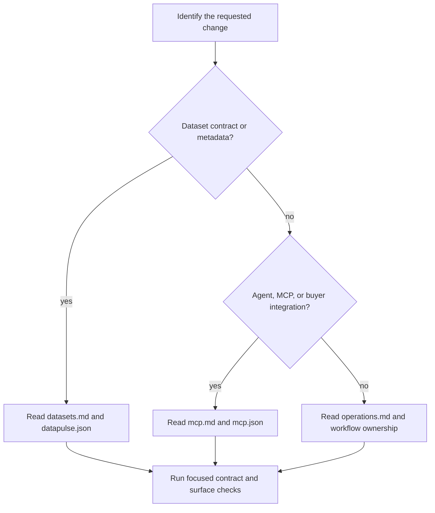

# DataPulse MY Wiki Quickstart

DataPulse MY is a read-only metadata and evidence layer around upstream public
datasets. It records publisher metadata, declared licence and provenance,
access and freshness observations, schema and record evidence, and known quirks;
it is **not the official publisher**. Upstream sources remain authoritative for
substantive data, content, licensing, and attribution.

The canonical website origin is **https://www.data-pulse.my**. The current
manifest contains **389 datasets**, and `mcp.json` advertises **16 read-only tools**. These are derived facts from the current sources of record,
not values to copy from an older page.

## Start here: route the task



*The routing flow maps a change request to its source of record and verification owner.*

| If the task is about… | Start with | Safe investigation / change boundary |
|---|---|---|
| Dataset identity, licence, steward, custodian, namespace, URL, cadence, expected count, or schema contract | [Dataset Manifest, Health Evidence, and Schema](datasets.md) | Inspect `datapulse.json` and `datapulse.schema.json`; follow the dataset ID into its health row and report, envelope, or sample. Change the canonical input, then regenerate and verify its derived surfaces. |
| Agent discovery, tool/resource behaviour, MCP sessions, provenance, live evidence checks, or the buyer boundary | [Read-only MCP and Buyer API Integrations](mcp.md) | Use `mcp.json` for the advertised wire contract and the MCP implementation/tests for behaviour. Keep public, unauthenticated MCP reads separate from the authenticated buyer API at `https://api.data-pulse.my`; do not infer evidence reference or guaranteed service availability from an endpoint definition. |
| Health probes, generated artifacts, scheduled jobs, deployment, attestations, rollback, or release testing | [Health Operations, Release Workflows, and Safe Change Boundaries](operations.md) | Identify the `health-cycle` versus `release-build` owner. Inspect commands with `bash scripts/generate.sh <profile> --list`; treat generated artifacts as projections, not independent sources of truth. |
| OpenWiki wording or canonical fact refresh | [OpenWiki instructions](INSTRUCTIONS.md) | Derive prose from current repository sources of record. Only permitted OpenWiki outputs and managed pointer blocks may change; documentation does not regenerate health or dataset envelopes. |

## The trust-layer model

The main join is stable dataset identity to published observations:

- `datapulse.json` is the canonical registry. Its `datasets` array supplies
  IDs, official URLs, stewards, custodians, licences, attribution, cadence,
  geography, namespace, expected record counts, and health-report paths.
- `health/latest.json` is the complete published health snapshot. Its
  `_trust_summary` currently records 389 datasets and the checked timestamp;
  statuses distinguish freshness, reachability, browser dependency, degradation,
  discontinued upstream lifecycle, and missing evidence. A status is evidence
  classification, not an endorsement.
- Reports, JSON envelopes, badges, feeds, catalogues, attestations, and discovery
  indexes are generator-owned projections. Regenerate them from their inputs;
  do not patch one projection in isolation.
- `llms.txt`, `config/public-surfaces.json`, and `mcp.json` describe public entry
  points and declared capabilities. They do not give DataPulse authority over
  upstream content.

In particular, `unknown-freshness` means no defensible freshness signal was found,
`browser-dependent` records an access limitation, and `reference` is for
versioned lookup data where date freshness does not apply. The current health
snapshot reports 90 `fresh`, 138 `aging`, 144 `stale`, 1 `discontinued`, 5
`browser_dependent`, and 11 `reference` datasets; consult `health/latest.json`
for the checked timestamp and per-dataset details.

## Agent entrypoints

For a first machine-readable pass, fetch `https://www.data-pulse.my/llms.txt`.
It links the manifest, health snapshot, MCP advertisement, and dataset reports.
For native agent access, connect to `https://mcp.data-pulse.my/mcp` using
Streamable HTTP without authentication:

```json
{
  "mcpServers": {
    "datapulse-my": {
      "transport": "streamable-http",
      "url": "https://mcp.data-pulse.my/mcp"
    }
  }
}
```

Initialize the MCP session before requesting tool or resource discovery. A
practical read path is `search_datasets`, then `get_dataset`; use
`get_provenance` or `get_evidence` when citation and pipeline evidence matter.
Risk-oriented consumers can use the `find_*` tools advertised in `mcp.json`,
and `verify_attestation` for attestation verification. `verify_evidence` is a
constrained, temporary transport check: it does not update `health/latest.json`.

## Safe change and failure rules

1. **Locate ownership first.** Manifest and source metadata changes belong to the
   dataset contract; probe observations belong to the health cycle; public
   discovery, MCP metadata, envelopes, and dashboard packaging belong to the
   release build. `scripts/generate.sh` orchestrates profiles but never commits,
   pushes, or deploys.
2. **Preserve complete snapshots.** A probe may record an individual source
   failure and continue, but malformed snapshots, generator errors, missing
   artifacts, stale health commits, URL drift, and contract violations fail
   closed. Concurrent health cycles skip on the lock rather than racing.
3. **Respect access and legal boundaries.** Browser-dependent sources require the
   configured Camofox sidecar. Probes do not bypass authentication, CAPTCHAs, or
   terms of service, and contributions must not add credentials, cookies,
   personal data, or copied source records.
4. **Separate publication from observation.** The Pages workflow classifies a
   change as health-only only when `health/latest.json` and health-cycle outputs
   are the changed paths; source, configuration, workflow, or other changes use
   the release path. A URL or endpoint definition is not proof that external
   infrastructure is currently available.

## Focused verification

Before changing a contract or generated surface, inspect ownership without
running generators:

```bash
bash scripts/generate.sh health-cycle --list
bash scripts/generate.sh release-build --list
```

The CI-focused checks are:

```bash
python3 -m pytest -q scripts/tests/ mcp/tests/
bash scripts/tests/test_verify_agent_ready.sh
python3 scripts/verify_repository_contract.py
python3 scripts/verify_openwiki.py
python3 scripts/check_url_drift.py
bash scripts/verify_release_invariants.sh --local
python3 scripts/fact_lint.py
```

For a local published-surface check, run
`bash scripts/verify_agent_ready.sh --local`. Without `--local`, it fetches the
canonical public surfaces with retries and rejects non-canonical discovery
hosts. Interpret failures as evidence to investigate the owning source or
workflow, not as a reason to patch a derived JSON file manually.

## Sources of record

- [`config/public-surfaces.json`](../config/public-surfaces.json) — canonical origins and declared public artifacts.
- [`datapulse.json`](../datapulse.json) — dataset registry and metadata contract input.
- [`health/latest.json`](../health/latest.json) — current aggregate health evidence.
- [`mcp.json`](../mcp.json) — advertised MCP endpoint, taxonomy, tools, and schemas.
- [`README.md`](../README.md) — public purpose, trust posture, and consumer guidance.
- [`llms.txt`](../llms.txt) — agent discovery index.
- [`openwiki/INSTRUCTIONS.md`](INSTRUCTIONS.md) — documentation generation contract.

## Canonical facts

- Canonical website: https://www.data-pulse.my
- Datasets: 389 datasets
- MCP server: 16 read-only tools
