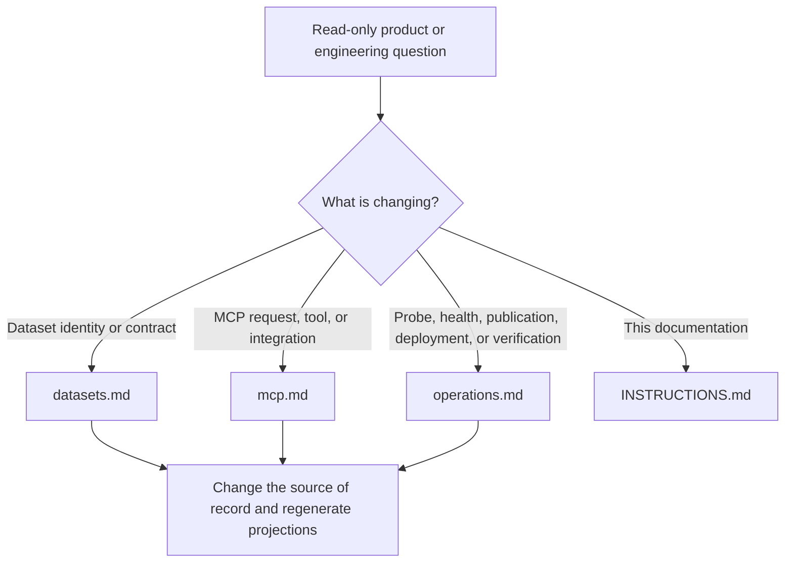

# DataPulse Wiki Quickstart

DataPulse is a read-only metadata and evidence layer around upstream public
 datasets. It publishes catalogue metadata, licence and provenance declarations,
access and freshness observations, and evidence; it is not the official
publisher. Upstream sources remain authoritative for substantive data, content,
licensing, and attribution.

The canonical website origin is **https://www.data-pulse.my**. The live manifest
contains **418 datasets**, and the advertised MCP catalogue contains **19
read-only tools**. These values come from `datapulse.json` and `mcp.json`, not
from a hand-maintained count.

## Start here: route the task


```mermaid
flowchart TD
    A["Read-only product or engineering question"] --> B{"What is changing?"}
    B -->|"Dataset identity or contract"| D["datasets.md"]
    B -->|"MCP request, tool, or integration"| M["mcp.md"]
    B -->|"Probe, health, publication, deployment, or verification"| O["operations.md"]
    B -->|"This documentation"| I["INSTRUCTIONS.md"]
    D --> R["Change the source of record and regenerate projections"]
    M --> R
    O --> R
```

*Route a change to its conceptual page and owning boundary; the arrows do not
imply that generated artifacts are edited directly.*

| Task | Read first | Owning source and safe boundary |
|---|---|---|
| Find a dataset, or change its identity, URL, steward, custodian, licence, attribution, cadence, expected count, schema, or provenance | [Dataset catalogue, health, and evidence contract](datasets.md) | `datapulse.json` and `datapulse.schema.json` define the manifest contract; `health/latest.json` supplies the published health snapshot. Update canonical metadata, then regenerate dependent reports and projections. |
| Discover tools, change an MCP tool or schema, understand request sequencing, evidence, provenance, or failure behavior | [MCP server runtime and agent integration](mcp.md) | `mcp.json` is the advertised wire contract; `mcp/server.py` and `mcp/tests/` define runtime behavior. Keep every operation read-only. |
| Change probes, health publication, attestations, deployment, release packaging, or public-surface verification | [Operations, publication, and failure handling](operations.md) | Checked-in workflows and `scripts/generate.sh` define lifecycle and ownership. Separate `health-cycle` from `release-build`; do not patch generated JSON or HTML as sources. |
| Refresh this wiki | [`openwiki/INSTRUCTIONS.md`](INSTRUCTIONS.md) | OpenWiki documents current repository sources of record; it does not make upstream data authoritative or replace the dataset and health generation pipeline. |

## Source-of-record model

`datapulse.json` is the registry input: dataset entries connect stable IDs to
official URLs, publishers and stewards, licences, attribution, cadence,
geography, namespace, expected record counts, and health-report paths.
`health/latest.json` is a complete published snapshot rather than only a log of
the latest probes: a health cycle probes due rows and merges unchanged
observations. Its status taxonomy describes evidence conditions such as
freshness, reachability, browser dependency, degradation, discontinuation, and
missing evidence. Reports, envelopes, feeds, catalogues, badges, attestations,
discovery indexes, and MCP metadata are projections; change their inputs and
regenerate them together.

A health status is evidence classification, not endorsement. For example,
`unknown-freshness` means that no defensible freshness signal was found,
`browser-dependent` records an access limitation, and `reference` is for
versioned lookup data where date freshness does not apply. The current snapshot
and checked timestamp belong to `health/latest.json`, not this routing page.

## Agent entrypoints and read sequence

For machine-readable discovery, fetch
`https://www.data-pulse.my/llms.txt`. The advertised MCP endpoint is Streamable
HTTP at `https://mcp.data-pulse.my/mcp`; `mcp.json` currently declares no
authentication requirement:

```json
{
  "mcpServers": {
    "datapulse-my": {
      "transport": "streamable-http",
      "url": "https://mcp.data-pulse.my/mcp"
    }
  }
}
```

Initialize an MCP session before discovery. A conservative read sequence is
`search_datasets` followed by `get_dataset`; use `get_provenance` or
`get_evidence` when citation or pipeline evidence matters. Risk-oriented
published queries include `find_stale`, `find_anomalies`, `find_deteriorating`,
`find_recovering`, `find_unreliable`, and `find_schema_drift`.
`verify_attestation` checks a published attestation. `verify_evidence` is a
constrained, ephemeral transport check and does not update
`health/latest.json`. MCP reads published repository artifacts and does not make
DataPulse authoritative for upstream content.

## Change and failure rules

1. **Separate inputs from projections.** Manifest and source metadata belong to
   the dataset contract; probe observations belong to the health cycle; public
   discovery, MCP metadata, envelopes, and dashboard packaging belong to the
   release build. `scripts/generate.sh` orchestrates profiles but never commits,
   pushes, or deploys.
2. **Fail closed at contract boundaries.** Individual source failures can be
   recorded while a probe continues, but malformed snapshots, generator errors,
   missing artifacts, stale health commits, URL drift, and contract violations
   must fail verification. Concurrent health cycles skip on the lock instead of
   racing.
3. **Respect access limits.** Browser-dependent sources use the configured
   Camofox sidecar. Probes do not bypass authentication, CAPTCHAs, or terms of
   service; changes must not add credentials, cookies, personal data, or copied
   source records.
4. **Do not infer availability from configuration.** A declared website or
   endpoint is not proof that external infrastructure is currently available.
   Health-only changes and source/configuration changes follow separate CI and
   publication paths.
5. **Treat OpenWiki as derivative documentation.** The scheduled/manual
   `openwiki-update.yml` workflow checks out the repository, runs the locked
   project-local OpenWiki runtime, injects canonical facts, verifies generated
   pages, and proposes an app-authored pull request. Its concurrency group avoids
   overlapping updates; credential preflight fails explicitly when required
   repository secrets are absent.

## Focused verification

Inspect profile ownership without running generators:

```bash
bash scripts/generate.sh health-cycle --list
bash scripts/generate.sh release-build --list
```

The repository’s focused gates cover schema and repository contracts, MCP,
OpenWiki, URL drift, release invariants, and fact consistency:

```bash
python3 -m pytest -q scripts/tests/ mcp/tests/
bash scripts/tests/test_verify_agent_ready.sh
python3 scripts/verify_repository_contract.py
python3 scripts/verify_openwiki.py
python3 scripts/check_url_drift.py
bash scripts/verify_release_invariants.sh --local
python3 scripts/fact_lint.py
```

For a local published-surface check, run
`bash scripts/verify_agent_ready.sh --local`. Without `--local`, it fetches
canonical public surfaces with retries and rejects non-canonical discovery
hosts. Investigate failures in the owning source or workflow; do not hand-edit
derived JSON.

## Sources and deeper routes

- [`config/public-surfaces.json`](../config/public-surfaces.json) — canonical origins and declared public artifacts.
- [`datapulse.json`](../datapulse.json) — dataset registry and metadata contract input.
- [`health/latest.json`](../health/latest.json) — aggregate health evidence.
- [`mcp.json`](../mcp.json) — advertised MCP endpoint, taxonomy, tools, and schemas.
- [`README.md`](../README.md) — public purpose, read-only posture, and consumer guidance.
- [`llms.txt`](../llms.txt) — agent discovery index.
- [`openwiki/INSTRUCTIONS.md`](INSTRUCTIONS.md) — documentation-generation contract.
- [Dataset catalogue, health, and evidence contract](datasets.md), [MCP server runtime and agent integration](mcp.md), and [operations, publication, and failure handling](operations.md) — major conceptual routes.

## Canonical facts

- Product: DataPulse
- Canonical website: https://www.data-pulse.my
- Datasets: 418 datasets
- MCP server: 19 read-only tools
